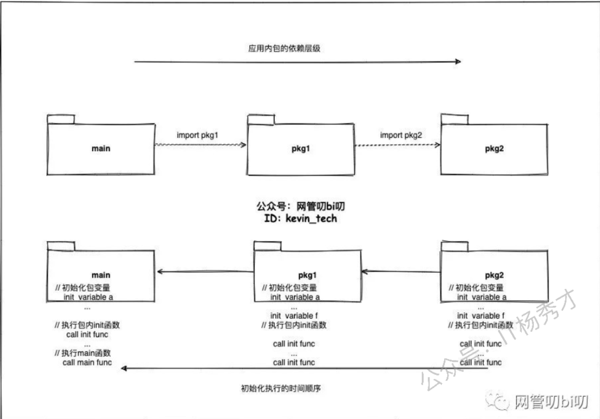
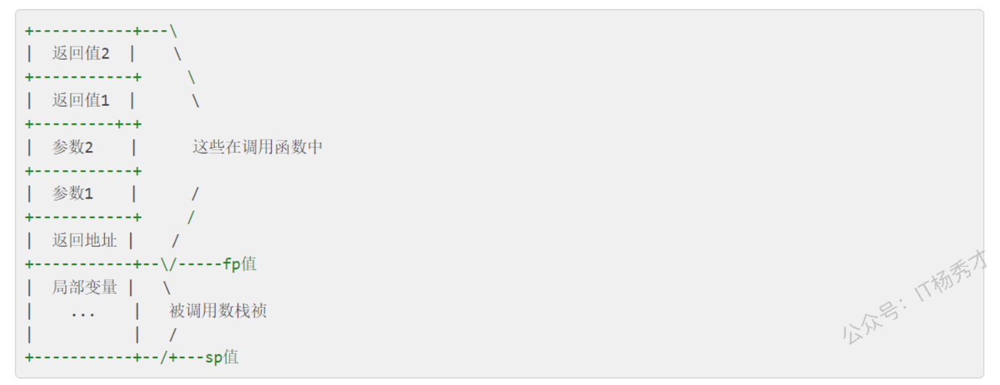
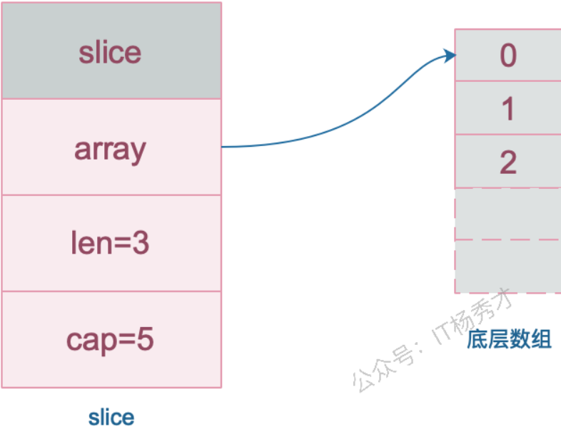
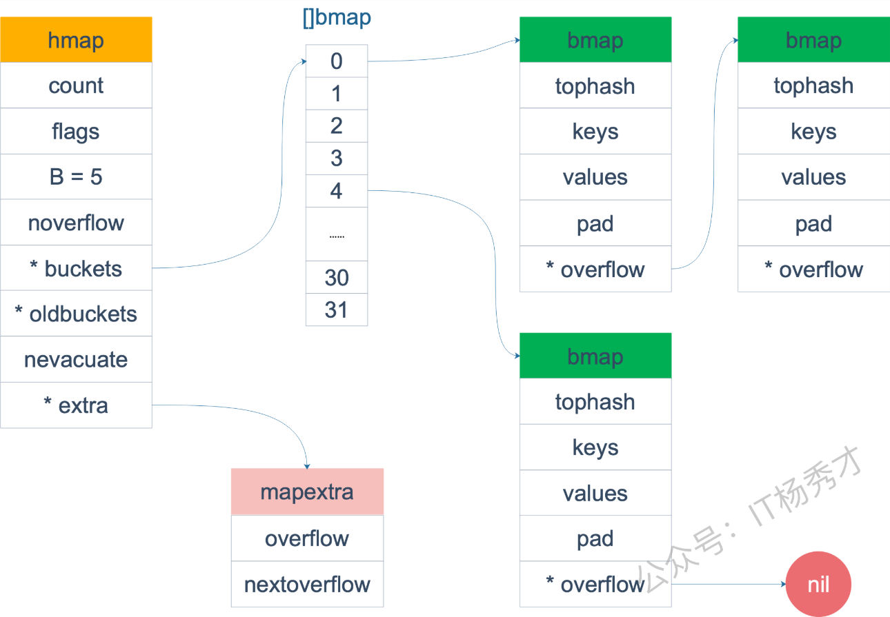
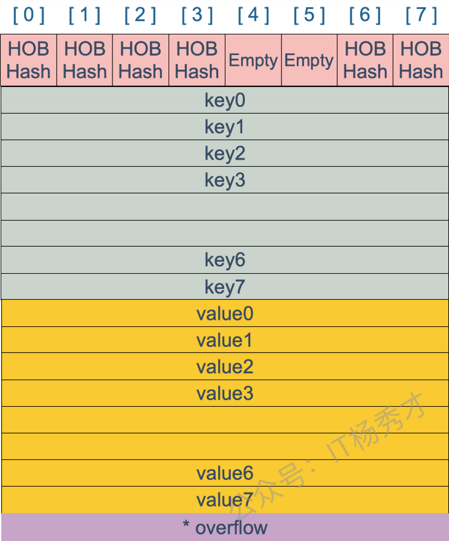
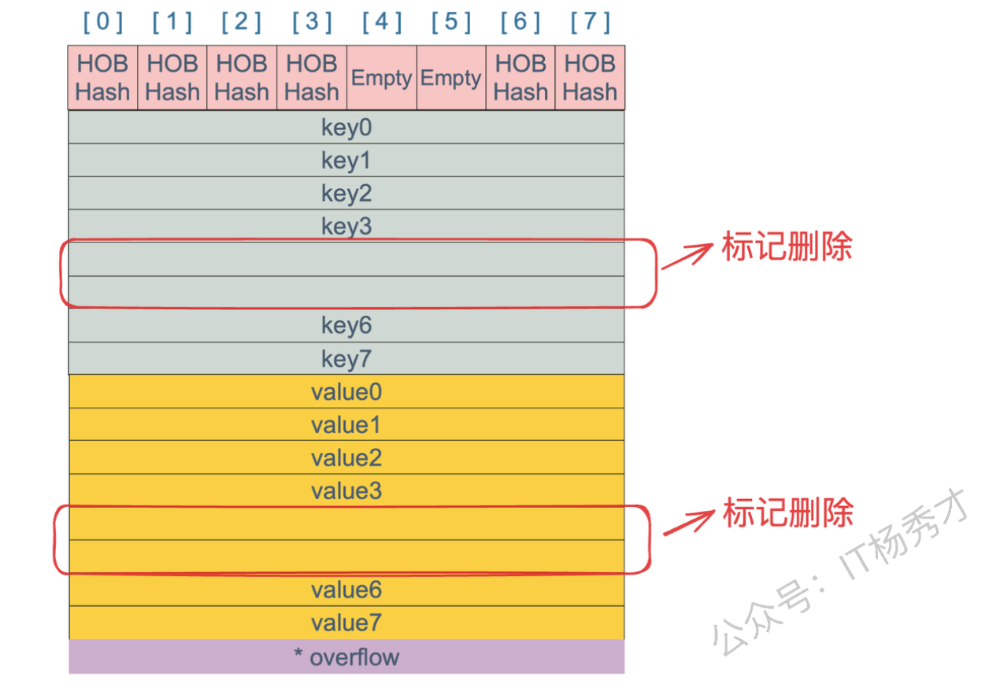
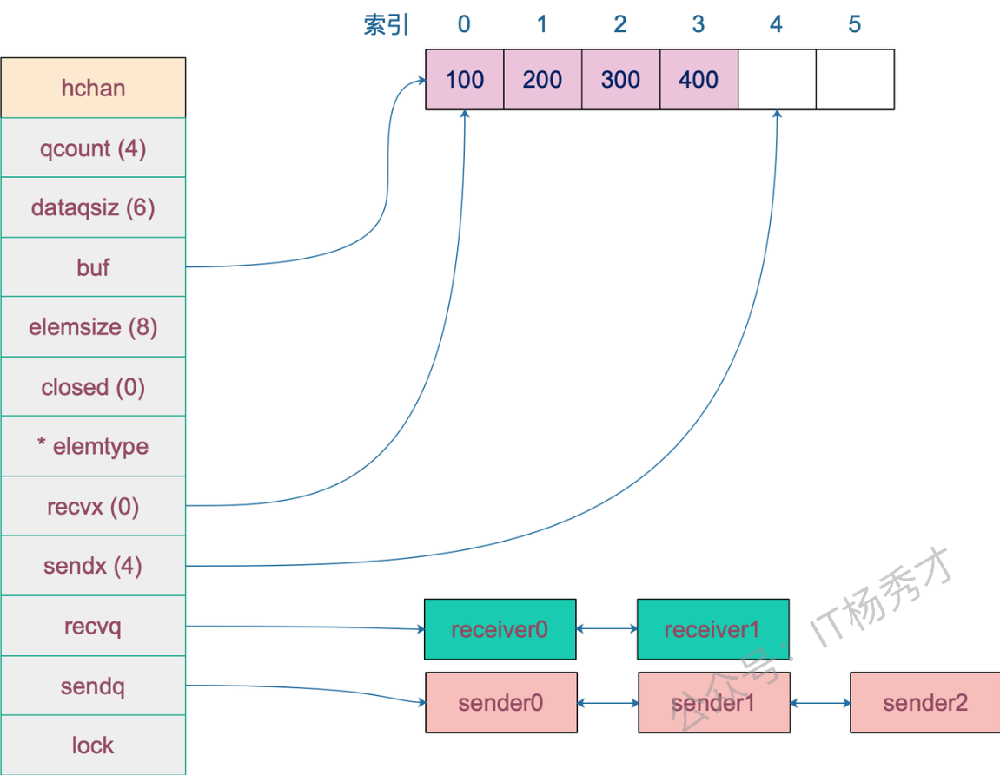

## 1. 基础面试题

### 1.1 与其他语言相比，使用 Go 有什么好处?

- 语法更简洁。
- 并发实现简单，支持协程，并且有高效的GMP调度模型。
- 有高效的垃圾回收机制，支持**并行垃圾回收**，垃圾回收效率比 Java 和 Python 更高

### 1.2 什么是协程？

协程是用户态轻量级线程，它是**线程调度的基本单位**。通常在函数前加上go关键字就能实现并发。一个Goroutine会以一个很小的栈启动2KB或4KB，当遇到**栈空间不足时，栈会自动伸缩**， 因此可以轻易实现成千上万个goroutine同时启动。

### 1.3 协程、线程、进程的区别？

- **进程：**进程是具有一定独立功能的程序，**进程是系统资源分配的基本单位**。 每个进程都有自己的独立内存空间，不同进程通过进程间通信来通信。由于进程比较重量，占据独立的内存，所以上下文进程间的切换开销（栈、寄存器、虚拟内存、文件句柄等）比较大，但相对比较稳定安全。

- **线程：**线程是进程的一个实体，线程是内核态，**线程是 CPU 调度（执行）的基本单位**，它是比进程更小的能独立运行的基本单位。线程间通信主要通过**共享内存**，上下文切换很快，资源开销较少，但相比进程不够稳定容易丢失数据。

- **协程：**协程是一种**用户态的轻量级线程**，协程的调度完全是由用户来控制的。协程拥有自己的寄存器上下文和栈。 协程调度切换时，将寄存器上下文和栈保存到其他地方，在切回来的时候，恢复先前保存的寄存器上下文和栈，直接操作栈则基本没有内核切换的开销，可以不加锁的访问全局变量，所以上下文的切换非常快。

  **协程需要绑定到线程上才能运行。**

### 1.4 Golang 中 make 和 new 的区别？

**回答：**

`make` 和 `new` 都是用于内存分配的内建函数，但它们的使用场景和功能有所不同：

1. **`make`**：
   - **用于分配内存并初始化**，只能用于创建 `slice`、`map` 和 `channel` 三种类型。
   - 返回的是初始化后的数据结构，而不是指针。
2. **`new`**：
   - **仅用于分配内存，但不初始化**，返回的是指向该内存的指针。
   - 可以用于任何类型的内存分配。

**分析：**

```go
// 使用 make 创建 slice
s := make([]int, 5) // 创建一个长度为 5 的 slice
fmt.Println(s)      // 输出: [0 0 0 0 0]// 使用 new 创建 int 指针
p := new(int)       // 分配内存给 int 类型
fmt.Println(*p)     // 输出: 0 (初始值)
```

`make` 函数创建的是数据结构（`slice`、`map`、`channel`）本身，且返回初始化后的值。而`new` 函数创建的是可以指向任意类型的指针，返回指向未初始化零值的内存地址。

### 1.5 Golang 中数组和切片的区别？

- **数组：**数组的长度固定。数组长度是数组类型的一部分，所以[3]int 和[4]int 是两种不 同的数组类型数组需要指定大小，不指定也会根据初始化，自动推算出大小， 大小不可改变。数组是通过值传递的
- **切片：**切片可以改变长度。切片是轻量级的数据结构，**包含三个属性：指向底层数组的指针、长度、容量。**不需要指定大小切片是地址传递(引用传递)可以通过数组来初始化，也可以通过内置函数 make()来初始化，初始化的时候 len=cap，然后进行扩容。

**分析：**

slice 的底层数据其实也是数组，slice 是对数组的封装，它描述一个数组的片段。slice 实际上是一个结构体，**包含三个字段：长度、容量、指向底层数组的指针。**

```go
// runtime/slice.go
type slice struct {
    len   int // 长度 
    cap   int // 容量
    array unsafe.Pointer // 元素指针
}
```


### 1.6 使用for range 的时候，它的地址会发生变化吗？

在Go1.22之前，对于 `for range` 循环中的迭代变量，其内存地址是不会发生变化的。但是，**Go1.22之后的地址是临时的，是变化的，**不一样的，不再是共享内存了。

**分析：**

Go1.22之前：

```go
for index, value := range collection {
    // ...
}
```

这里 `value` 是一个**副本**。在每次迭代中，`collection` 中的当前元素值会被**复制**到 `value` 这个变量中。Go 编译器通常会为 `value` 分配一块固定的内存地址，然后在每次迭代时，将当前元素的值覆盖到这块内存中。所以，当你打印 `&value` 时，你会发现它的内存地址在整个循环过程中都是保持不变的。

但是在Go1.22及以后，使用 `for range` 遍历一个集合时，**迭代变量的地址会发生变化**。这是因为 `for range` 每次迭代时都会重新生成迭代变量（如 `value`），**这些变量在内存中是不同的地址。**

### 1.7 如何高效地拼接字符串？

拼接字符串的方式有：`+` , `fmt.Sprintf` , `strings.Builder`, `bytes.Buffer`, `strings.Join`

1. **"+号"**：使用`+`操作符进行拼接时，会对字符串进行遍历，计算并开辟一个新的空间来存储原来的两个字符串。

2. **fmt.Sprintf**：由于采用了接口参数，必须要用反射获取值，因此有性能损耗。

3. **strings.Builder：**用WriteString()进行拼接，内部实现是指针+切片，同时String()返回拼接后的字符串，它是直接把[]byte转换为string，从而避免变量拷贝。

4. **bytes.Buffer：**`bytes.Buffer`是一个一个缓冲`byte`类型的缓冲器，这个缓冲器里存放着都是`byte`，`bytes.buffer`底层也是一个`[]byte`切片。

5. **strings.join：**`strings.join`也是基于`strings.builder`来实现的,并且可以自定义分隔符，在join方法内调用了b.Grow(n)方法，这个是进行初步的容量分配，而前面计算的n的长度就是我们要拼接的slice的长度，因为我们传入切片长度固定，所以提前进行容量分配可以减少内存分配，很高效。

**性能比较：**

**strings.join** ≈ strings.Builder > bytes.Buffer > "+" > fmt.Sprintf

5种拼接方法的实例代码

```go
func main() {
	a := []string{"a", "b", "c"}
	// 方式1：+
	ret := a[0] + a[1] + a[2]

	// 方式2：fmt.Sprintf
	ret := fmt.Sprintf("%s%s%s", a[0], a[1], a[2])

	// 方式3：strings.Builder
	var sb strings.Builder
	sb.WriteString(a[0])
	sb.WriteString(a[1])
	sb.WriteString(a[2])
	ret := sb.String()

	// 方式4：bytes.Buffer
	buf := new(bytes.Buffer)
	buf.Write(a[0])
	buf.Write(a[1])
	buf.Write(a[2])
	ret := buf.String()

	//方式5：strings.Join
	ret := strings.Join(a, "")
}
```

### 1.8 defer 的执行顺序是怎样的？defer 的作用或者使用场景是什么?

**defer执行顺序和调用顺序相反，类似于栈后进先出(LIFO)。**

defer 的作用是：当 defer 语句被执行时，跟在 defer 后面的函数会被延迟执行。直到 包含该 defer 语句的函数执行完毕时，defer 后的函数才会被执行，不论包含 defer 语句的函数是通过 return 正常结束，还是由于 panic 导致的异常结束。 你可以在一个函数中执行多条 defer 语句，它们的执行顺序与声明顺序相反。

defer 的常用场景:

- defer语句经常被用于处理**成对的操作**，如打开/关闭、连接/断开连接、 加锁/释放锁。
- 通过defer机制，不论函数逻辑多复杂，都能保证在任何执行路径下，资源被释放。
- 释放资源的defer应该直接跟在请求资源的语句后。

**分析：**

```go
func test() int {
	i := 0
	defer func() {
		fmt.Println("defer1")
	}()
	defer func() {
		i += 1
		fmt.Println("defer2")
	}()
	return i
}

func main() {
	fmt.Println("return", test())
}

// 输出：
// defer2
// defer1
// return 0
```

> **执行流程分析**
>
> 1. `i := 0`
>    现在 `i = 0`。
> 2. 遇到 `defer func(){ fmt.Println("defer1") }()`
>    注册 defer1。
> 3. 遇到 `defer func(){ i += 1; fmt.Println("defer2") }()`
>    注册 defer2。
> 4. 执行 `return i`
>    - Go 会先把 **返回值保存**（这里是 `0`）。
>    - 注意此时 **返回值已经固定为 0**（因为返回值是非命名返回值，`return i` 直接保存了值 0，而不是绑定变量 `i`）。
> 5. 执行 defer（后进先出 LIFO）：
>    - `defer2` → `i += 1`，此时 `i = 1`，打印 `"defer2"`。
>    - `defer1` → 打印 `"defer1"`。
> 6. 函数真正返回，返回的是 **步骤 4 保存的值 0**。

上面这个例子中，test返回值并没有修改，这是由于Go的返回机制决定的，执行Return语句后，Go会创建一个临时变量保存返回值。如果是**具名返回**（也就是指明返回值`func test() (i int)`）,那么会是如下的情况。

```go
func test() (i int) { // 命名返回值 i
    i = 0
    defer func() {
        fmt.Println("defer1")
    }()
    defer func() {
        i += 1
        fmt.Println("defer2")
    }()
    return i
}

// 输出：
// defer2
// defer1
// return 1

```

这个例子中，返回值被修改了。对于有名返回值的函数，执行 return 语句时，并**不会再创建临时变量保存**，因此，defer 语句修改了 i，即对返回值产生了影响。

### 1.8 延申：defer和return的执行顺序？

在Go语言中，**defer**和**return**的执行顺序是一个常见的讨论点。它们的执行逻辑可以总结为以下步骤：

1. **return语句先执行**，将返回值赋值给返回变量。
2. **defer语句随后执行**，按照“后进先出”的顺序执行所有的defer语句。
3. **函数退出**，携带最终的返回值。

**匿名返回值与具名返回值的区别**

- **匿名返回值**

当函数的返回值未命名时，**return**会创建一个临时变量来保存返回值。在执行defer时，defer对返回值的修改不会影响最终的返回结果，因为defer操作的是局部变量，而非返回值本身。

示例：

```go
func main() {
	fmt.Println("return:", test())
}

func test() int {
	var i int
	defer func() {
		i++
		fmt.Println("defer1", i)
	}()
	defer func() {
		i++
		fmt.Println("defer2", i)
	}()
	return i
}
```

输出：

```
defer2 1
defer1 2
return: 0
```

解释：*return*先将*i=0*赋值给临时变量，defer修改的*i*不会影响返回值。

- **具名返回值**

当函数的返回值是具名的，defer可以直接访问并修改返回值变量。因此，**defer的修改会影响最终的返回结果。**

示例：

```go
func main() {
    fmt.Println("return:", test())
}

func test() (i int) {
    defer func() {
       i++
       fmt.Println("defer1", i)
    }()
    defer func() {
       i++
       fmt.Println("defer2", i)
    }()
    return i
}
```

输出：

```
defer2 1
defer1 2
return: 2
```

解释：*return*先将*i=0*赋值，随后defer修改了*i*，最终返回值为*2*。

总结

- **defer的执行顺序**是“后进先出”。
- **return的执行顺序**分为两步：先赋值返回值，再执行defer，最后退出函数。
- 匿名返回值不会被defer修改，而具名返回值会受到defer的影响。

理解这些机制可以帮助开发者避免在使用defer和return时的潜在问题。

### 1.9 什么是 rune 类型？

rune的底层类型是 `int32`，占用 4 个字节。

**Go 语言的字符**有以下两种：

- uint8 类型，或者叫 byte 型，代表了 **ASCII 码的一个字符。**
- rune 类型，代表一个 UTF-8 字符，当需要处理中文、日文或者其他复合字符时，则需要用到 rune 类型。**rune 类型等价于 int32 类型。**

```go
func main() {
	var str = "hello 你好" //思考下 len(str) 的长度是多少？

	//golang中string底层是通过byte数组实现的，直接求len 实际是在按字节长度计算  
	//所以一个汉字占3个字节算了3个长度
	fmt.Println("len(str):", len(str))  // len(str): 12
	//通过rune类型处理unicode字符
	fmt.Println("rune:", len([]rune(str))) //rune: 8
}
```

### 1.10 Go 语言 tag 有什么用？

tag可以**为结构体成员提供属性**。常见的：

1. json序列化或反序列化时字段的名称
2. db: sqlx模块中对应的数据库字段名
3. form: gin框架中对应的前端的数据字段名
4. binding: 搭配 form 使用, 默认如果没查找到结构体中的某个字段，则不报错，值为空。binding为 required 代表没找到需要返回错误给前端。

### 1.11 go 打印时 %v %+v %#v 的区别？

- %v 只输出所有的值；
- %+v 先输出字段名字，再输出该字段的值；
- %#v 先输出**结构体名字值**，再输出结构体（字段名字+字段的值）；

```go
type student struct {
	id   int32
	name string
}

func main() {
	a := &student{id: 1, name: "微客鸟窝"}

	fmt.Printf("a=%v  \n", a) // a=&{1 微客鸟窝}  
	fmt.Printf("a=%+v  \n", a) // a=&{id:1 name:微客鸟窝}  
	fmt.Printf("a=%#v  \n", a) // a=&main.student{id:1, name:"微客鸟窝"}
}
```

### 1.12 Go语言中空 struct{} 占用空间吗？

可以使用 unsafe.Sizeof 计算出一个数据类型实例需要占用的字节数，**空struct{}不占用任何空间。**

```go
func main() {
	fmt.Println(unsafe.Sizeof(struct{}{}))  // 0
}
```

### 1.13 Go语言中，空 struct{} 有什么用？

- 用map模拟一个set，那么就要把值置为struct{}，struct{}本身不占任何空间，可以**避免任何多余的内存分配。**

```go
type Set map[string]struct{}

func main() {
	set := make(Set)
	for _, item := range []string{"A", "A", "B", "C"} {
		set[item] = struct{}{}
	}
	fmt.Println(len(set)) // 3
	if _, ok := set["A"]; ok {
		fmt.Println("A exists") // A exists
	}
}
```

- **作为信号传递：**有时候给通道发送一个空结构体，channel<-struct{}{}，可以节省空间

```go
func main() {
	ch := make(chan struct{}, 1)
	go func() {
		<-ch
		// do something
	}()
	ch <- struct{}{}
	// ...
}
```

- 表示仅有方法的结构体

```go
type Lamp struct{}
```

### 1.14 init() 函数是什么时候执行的？

**简答：** 在main函数之前执行。

**详细：**init()函数是go初始化的一部分，由runtime初始化每个导入的包，初始化不是按照从上到下的导入顺序，而是按照解析的依赖关系，**没有依赖的包最先初始化。**

每个包首先初始化包作用域的常量和变量（常量优先于变量），然后执行包的`init()`函数。同一个包，甚至是同一个源文件可以有多个`init()`函数。`init()`函数没有入参和返回值，不能被其他函数调用，同一个包内多个`init()`函数的执行顺序不作保证。

**执行顺序：**import –> const –> var –>`init()`–>`main()`

一个文件可以有多个`init()`函数！



### 1.15 2 个 interface 可以比较吗？

Go 语言中，interface 的内部实现包含了 2 个字段，类型 `T` 和 值 `V`，interface 可以使用 `==` 或 `!=` 比较。2 个 interface 相等有以下 2 种情况：

1. 两个 interface 均等于 nil，此时 V 和 T 都处于 unset 状态。
2. 类型 T 相同，且对应的值 V 相等。

```go
type Stu struct {
	Name string
}

type StuInt interface{}

func main() {
	var stu1, stu2 StuInt = &Stu{"Tom"}, &Stu{"Tom"}
	var stu3, stu4 StuInt = Stu{"Tom"}, Stu{"Tom"}
	fmt.Println(stu1 == stu2) // false
	fmt.Println(stu3 == stu4) // true
}
```

`stu1` 和 `stu2` 对应的类型是 `*Stu`，值是 Stu 结构体的地址，两个地址不同，因此结果为 false。
`stu3` 和 `stu4` 对应的类型是 `Stu`，值是 Stu 结构体，且各字段相等，因此结果为 true。

### 1.16 2 个 nil 可能不相等吗？

**可能不等**。interface在运行时绑定值，只有值为nil接口值才为nil，但是与指针的nil不相等。举个例子：

```go
var p *int = nil
var i interface{} = nil
if(p == i){
    fmt.Println("Equal")
}
```

两者并不相同。总结：**两个nil只有在类型相同时才相等。**

### 1.17 Go 语言函数传参是值类型还是引用类型？

- **在 Go 语言中，所有的参数传递都是值传递**，要么是值的副本，要么是指针的副本。无论是值类型的变量还是引用类型的变量，亦或是指针类型的变量，作为参数传递**都会发生值拷贝**，开辟新的内存空间。
- 另外，（值传递、引用传递）和（值类型、引用类型）是两个不同的概念，不要混淆了。引用类型作为变量传递可以影响到函数外部是因为发生值拷贝后新旧变量指向了相同的内存地址。

这个问题很关键，经常会被面试官问到。答案是：

👉 **Go 语言的函数传参，统一都是值传递（pass by value）。**但是！因为 **值可能是一个指针或者引用类型（slice、map、channel、interface、function）**，所以看起来像是“引用传递”。

------

**1️⃣ 普通类型：值传递**

```go
func change(x int) {
    x = 100
}

func main() {
    a := 10
    change(a)
    fmt.Println(a) // 10，不会被修改
}
```

原因：`a` 的值（10）被复制到函数的参数 `x`，修改 `x` 不影响外部 `a`。

------

**2️⃣ 指针：传递的是指针的副本**

```go
func change(p *int) {
    *p = 100
}

func main() {
    a := 10
    change(&a)
    fmt.Println(a) // 100，被修改
}
```

原因：传递的是 `&a`（地址）的副本，但副本仍然指向同一块内存，所以可以修改外部值。

------

**3️⃣ Slice、Map、Channel：内部结构带指针**

这三种是 **引用类型**，但本质上仍然是值传递。
 只不过它们的底层结构里含有指针，**复制后多个副本共享同一底层数据。**

##### Slice 示例

```go
func change(s []int) {
    s[0] = 100
}

func main() {
    a := []int{1, 2, 3}
    change(a)
    fmt.Println(a) // [100 2 3]，被修改
}
```

虽然 slice 作为参数是值传递（复制了 `SliceHeader`：指针、长度、容量），但它的底层数组共享，所以修改元素会影响外部。

如果在函数里 **append 超过容量**，就会触发底层数组扩容，新数组不再共享，外部就不会受影响。

------

**4️⃣ Map 示例**

```go
func change(m map[string]int) {
    m["a"] = 100
}

func main() {
    a := map[string]int{"a": 1}
    change(a)
    fmt.Println(a) // map[a:100]，被修改
}
```

Map 本质是一个指向底层哈希表的指针结构，复制后多个 map 变量共享同一个底层哈希表。

------

**✅ 总结**

- Go 函数参数传递 **一律是值传递**。
- 如果参数本身是 **值类型（int、struct、array）** → 复制一份，互不影响。
- 如果参数是 **引用类型（slice、map、channel、指针、interface、func）** → 复制的是**“引用的副本”**，它们指向同一份底层数据，看起来像“引用传递”。

------

要不要我帮你画一张图，把 **值类型 vs 引用类型** 的传递过程（栈上参数副本 + 指向堆上数据）直观展示出来？

### 1.18 如何知道一个对象是分配在栈上还是堆上？

在 Go 语言中，栈和堆是程序运行时内存分配的两大核心区域。“逃逸” 特指编译器通过逃逸分析判定**变量的生命周期**超出当前函数栈帧范围，从而将变量从栈分配转移到堆分配的过程。

函数栈帧 是指函数调用时，在 goroutine 专属栈上为该函数分配的一块**连续内存区域。**

| 维度         | 栈（Stack）                                       | 堆（Heap）                                   |
| ------------ | ------------------------------------------------- | -------------------------------------------- |
| **分配方式** | 自动分配（编译器控制），按 “栈帧” 顺序分配 / 释放 | 手动 / 自动分配（Go 靠 GC 回收），无序分配   |
| **内存结构** | 连续的内存块，遵循 “后进先出（LIFO）”             | 非连续的内存块，碎片化存储                   |
| **生命周期** | 与函数调用绑定（栈帧随函数入 / 出栈销毁）         | 不受函数作用域限制，直到 GC 回收             |
| **访问效率** | 极高（仅需移动栈指针，无内存查找开销）            | 较低（需通过指针间接访问，GC 有额外开销）    |
| **空间大小** | 固定且较小（默认几 MB，超出会栈溢出）             | 动态且极大（受限于系统内存）                 |
| **分配开销** | 无开销（栈指针加减操作）                          | 有开销（需查找空闲内存块，GC 标记 / 清理）   |
| **线程安全** | 每个 goroutine 独立栈，无竞争                     | 全局共享，需同步（Go 编译器自动规避）        |
| **溢出风险** | 栈溢出（stack overflow）                          | 内存泄漏 / GC 压力，无溢出（OOM 是系统层面） |

**Go局部变量会进行逃逸分析**。如果变量离开作用域后没有被引用，则优先分配到栈上，否则分配到堆上。那么如何判断是否发生了逃逸呢？关键词“gcflags”。

`go build -gcflags '-m -m -l' xxx.go`. 或者 `go run -gcflags=-m xxx.go`。

关于逃逸的可能情况：变量大小不确定，变量类型不确定，变量分配的内存超过用户栈最大值，暴露给了外部指针。

**延申知识1：**

> 这个规律其实就是 **Go 编译器逃逸分析** 的核心结论，用通俗的方式理解就是：
>
> ------
>
> 1️⃣ 栈和堆的区别
>
> - **栈（stack）**：函数调用时临时开辟的一块内存，函数返回时栈帧整体弹出，里面的变量随之消失。
> - **堆（heap）**：由 Go 的运行时和 GC 管理，可以在函数返回后继续存活，直到不再被引用时被垃圾回收。
>
> ------
>
> 2️⃣ 为什么“离开作用域后没有被引用 → 分配到栈上”？
>
> 因为栈是 **随函数退出自动回收** 的。
>
> - 如果变量只在函数内部使用，函数结束后就没必要继续存在，直接放栈里效率最高。
> - 不需要 GC 管理，也避免了堆分配的开销。
>
> 例子：
>
> ```go
> func foo() int {
>     x := 10
>     return x
> }
> ```
>
> `x` 在函数返回时已经用完，不再被引用，编译器就会把它分配到栈上。
>
> ------
>
> 3️⃣ 为什么“被引用到函数外 → 必须分配到堆”？
>
> 最核心的点：如果变量在函数返回后仍然被其他地方使用，就不能放在栈里（因为栈会被销毁），只能放到堆上，由 GC 来管理。
>
> **例子 1：返回指针**
>
> ```go
> func foo() *int {
>     x := 10
>     return &x  // x 的地址返回，函数退出后仍然要用
> }
> ```
>
> 此时 `x` 逃逸到堆上。
>
> **例子 2：闭包捕获**
>
> ```go
> func foo() func() {
>     x := 10
>     return func() {
>         fmt.Println(x) 
>     } // 闭包延长了 x 的生命周期
> }
> ```
>
> 这里 `x` 也会被分配到堆上，因为闭包可能在函数返回后还要用它。
>
> 4️⃣ 总结一句话
>
> - **函数内用完就丢的变量 → 栈上分配**
> - **函数退出后还要用的变量 → 堆上分配**

#### **逃逸分析：**

下面把 Go 的**逃逸分析（Escape Analysis）讲全一些：它决定了变量是放栈还是堆**，从而影响性能和 GC 压力。

------

#### **1. 逃逸分析是什么 & 有啥用**

- **做什么**：编译器在编译期分析**每个变量**的“可达范围/生命周期”，**能在栈上安全存活的就放栈，否则放堆。**
- **为什么重要**：
  - 栈分配/回收非常快（随栈帧退出一起回收）。
  - 堆分配慢，还会增加 GC 负担。
  - 少一次堆分配=少一次 GC 追踪，热路径收益很可观。

------

#### **2. 什么时候会“逃逸到堆”**

满足任意一种，通常就会逃逸（并不绝对，但很常见）：

1. **返回了局部对象的地址/引用**

```go
func f() *int {
    x := 10
    return &x // x 需要在函数外继续存在 → 逃逸
}
```

2. **被闭包捕获或跨 goroutine 使用**

```go
func g() func() {
    x := 10
    return func() { // 闭包延长了 x 的生命周期 → 逃逸
        fmt.Println(x) 
    } 
}

for i := 0; i < 3; i++ {
    go func() {
        fmt.Println(i) 
    }()   // i 被并发闭包捕获，常伴随逃逸 + 语义坑
    // 正确做法：
    // go func(i int) {
    //    fmt.Println(i) 
    // }(i)
}
```

3. **地址被存入全局变量/接口值**

- 静态区（Static Area，也叫静态存储区 / 全局区） 

```go
type Box struct{
    p *int 
}

// glob在静态区
var global any

func h() {
    // 局部变量，默认在栈上
    // 栈上的变量生命周期 = 函数调用周期
    // 如果 x 只在函数内部使用，函数返回后就消失，不需要堆分配
    x := 1 
    b := &Box{
        p: &x // &x 存进了堆对象 b（或全局变量/接口） → 逃逸
    } 
    global = b  // 保存到全局变量/接口 → 生命周期未知 → 促使逃逸
}

// global 是全局变量（静态区） → 它自己存在静态区。
// 但是这里 被存入 global 的 b 是局部变量，它本来在栈上，但由于存入了全局变量，生命周期延长，必须堆分配。

```

4. **返回 slice/map/channel（或把它们传出）**

- 这些是 **引用类型**：头部（slice header / map header / chan 指针）本身可在栈，但**底层数据**若需在函数外继续用，通常在堆。

```go
func mk() []int {
    s := make([]int, 1000) // 底层数组一般在堆
    return s               // 返回后仍要用 → 底层数组逃逸
}
```

- `s` 本身是 slice header（3个字段），可以在栈上。
- 但 `make([]int, 3)` 生成的数组必须在函数返回后还可用，所以 **数组逃逸到堆**。

> 我们知道 **slice/map/channel** 在 Go 里都是 **引用类型**，本质上是一个“小头部结构体 + 指向底层数据的指针”。
>
> - **slice header**: 包含 `ptr（底层数组指针）`、`len`、`cap`
> - **map**: 是一个指针，内部指向 runtime 的哈希表结构
> - **channel**: 也是一个指针，指向 runtime 的 chan 结构
>
> 👉 **关键点**：
>
> - 头部（slice header/map 指针/chan 指针）是可以在栈上分配的。
> - **但如果函数返回了它们**，那么它们所依赖的 **底层数据结构**（数组/哈希表/chan buffer）必须保证在函数返回后仍然有效。
> - 如果编译器发现函数返回后还需要用这些数据，就会把底层数据分配到 **堆上**。

5. **不确定的别名关系、形参“泄漏”**(太复杂，暂时不分析)

- 当函数把参数“传给了外部”（返回引用、存入接口/堆对象、放入 channel 等），编译器会标注 **leaking param**，提示“这个参数的生存期超出了本函数控制范围”，从而**可能迫使调用方的实参逃逸**。

#### 3. 怎么看逃逸分析的结论（实操）

最直接的方法：

```bash
# 更多细节可重复 -m；加 -l 关闭内联，输出更直观
go build -gcflags='-m -m -l' .
# 或
go run   -gcflags='-m -m -l' main.go
```

### 1.19 Go语言的多返回值是如何实现的？

Go 语言的多返回值是通过**在调用方的栈帧上预留空间+值复制**来实现的。

1. 在函数调用发生时，Go 编译器会计算出函数**所有返回值的总大小。**

2. 在为该函数创建**栈帧**时，就会在**调用方（caller）的栈帧**上，为这些返回值**预留出连续的内存空间。**

3. 当函数执行到 `return` 语句时，它会**将其要返回的各个值复制到这些预留好的栈空间中。**

4. 函数执行完毕后，控制权返回给调用方。此时，调用方可以**直接从它自己的栈帧上**（即之前为返回值预留的空间）获取这些返回值。



> chatgpt：
>
> 多返回值函数：编译器会在 **调用者的栈帧** 中为这些返回值预留一段连续空间，函数返回时将多个返回值依次写入这段空间。
>
> 1. 调用者在栈上分配一块连续空间作为返回值存放区；
> 2. 被调用函数把多个返回值依次写入该空间；
> 3. 编译器在调用点把这些返回值拆开，表现为多返回值。

栈帧是 **程序调用栈（Call Stack）上的一个独立内存块**，由操作系统 / 编译器在**函数被调用时自动分配**，在**函数执行完毕后自动释放**，用于存储该函数执行期间所需的所有上下文数据。**绝大多数情况下，一个栈帧对应一个函数调用。**

程序调用栈是**程序运行时操作系统 / 编译器为线程（或 goroutine）分配的一块连续内存区域**，核心作用是**记录函数调用的层级关系、保存每个函数执行的上下文**，遵循 “先进后出（LIFO）” 的核心规则 —— 新调用的函数入栈（栈顶），执行完毕的函数出栈，是实现函数嵌套调用、递归调用的基础。

**形象比喻：**

| 概念       | 正比喻                                            |
| ---------- | ------------------------------------------------- |
| 程序调用栈 | 一个 “叠盘子的架子”（连续内存区域）               |
| 栈帧       | 架子上的 “一个盘子”（单次**函数调用**的上下文）   |
| 函数       | 制作盘子的 “模具”（可重复用，每次用做一个新盘子） |

### **1.20 Go语言中"_"的作用**

1. **忽略返回值：**在 Go 语言中，函数可以返回多个值。如果你只关心其中的一部分返回值，而不需要使用其余的，就可以用 `_` 来忽略它们，从而避免编译器报错。
2. 当你导入一个包时，通常会使用它的某个功能。但有时你可能**只想执行包的 `init()` 函数**（例如，注册驱动、初始化全局变量等），而不需要直接使用包中的任何导出成员。这时，你就可以使用 `_` 来进行**匿名导入**。

示例：

```go
package main

import (
	"fmt"
	_ "net/http/pprof" // 导入 pprof 包，只为了执行其 init 函数注册 profiling 接口
)

func main() {
	fmt.Println("Application started. Profiling tools are likely registered.")
	// 实际应用中，你可能还会启动一个 HTTP 服务器来暴露 pprof 接口
	// go func() {
	//         log.Println(http.ListenAndServe("localhost:6060", nil))
	// }()
}
```

### 1.21 Go语言普通指针（*T）和unsafe.Pointer有什么区别？

**1、普通指针：**

- **有类型信息：**比如`*int`、`*string`，它们有明确的类型信息，编译器会进行类型检查。

- **类型安全：**不同类型的指针之间不能直接转换，这是Go类型安全的体现。
- **GC 跟踪：**Go 的垃圾回收器会跟踪普通指针，知道它指向的对象，避免误删。

**2、unsafe.Pointer：**顾名思义就是不安全的指针（类型不安全）

- 无类型信息：unsafe.Pointer是Go的**通用类型**指针，可以理解为C语言中的`void*`，它绕过了Go的类型系统。

- unsafe.Pointer可以与任意类型的指针相互转换；

  ```go
  var pi *int
  var ps *string
  ps = (*string)(unsafe.Pointer(pi)) // 编译可以过，但不安全
  ```

- 可以与uintptr进行转换来做**指针运算**。`uintptr` 是整数类型，可以拿来做地址计算（指针运算）。

  ```go
  // unsafe.Pointer()一定要传入指针才不报错
  p := unsafe.Pointer(&arr[0])
  p2 := unsafe.Pointer(uintptr(p) + 8) // 向后移动 8 字节
  ```

- **3、仍受 GC 跟踪**：虽然它没有类型，但只要是 `unsafe.Pointer`，GC 还是会认为它是“指针”，不会把它指向的内存当成垃圾清掉。

总结，通用指针受GC管理和类型约束，unsafe.Pointer不受类型约束但仍受GC跟踪。

### 1.22 unsafe.Pointer与uintptr有什么区别和联系

- 在 Go 里，`uintptr` 是一个 **无符号整数类型**（类似 `uint`），专门用来存放 **内存地址数值**。

unsafe.Pointer和uintptr可以相互转换，这是**Go提供的唯一合法的指针运算方式。**典型用法是先将unsafe.Pointer转为uintptr做算术运算，然后再转回unsafe.Pointer使用。

```go
// 取数组第 0 个元素的地址，加 8 个字节偏移，得到第 2 个元素的地址。
pc := (*int32)(unsafe.Pointer(uintptr(unsafe.Pointer(&arr[0])) + 8))
```

- 最关键的区别在于**GC跟踪**。unsafe.Pointer会被垃圾回收器跟踪，它指向的内存不会被错误回收；
- 而uintptr只是一个普通整数，GC完全不知道它指向什么，如果没有其他引用，对应内存可能随时被回收。

所以记住：unsafe.Pointer有GC保护，uintptr没有，这是它们最本质的区别。

## 2. Slice面试题

### 2.1 slice的底层结构是怎样的？

slice 的底层数据其实就是数组，slice 是对数组的封装，它描述**一个数组的片段**。

slice 是一个三元组的结构体，包含**三个成员：长度、容量、指向底层数组的指针。**

```go
// runtime/slice.go
type slice struct {
    array unsafe.Pointer // 元素指针
    len   int // 长度 
    cap   int // 容量
}
```



### 2.2 Go语言里slice是怎么扩容的？

**Go1.18及以后，引入了新的扩容规则：**

1. 如果期望容量大于当前容量的两倍，就会使用**期望容量**；
2. 当原切片容量小于256的时候，新切片容量为原来的2倍（**翻倍扩容**）
3. 当原切片容量超过256，新切片容量 newcap = 1.25 × oldcap +0.75 × threshold ，是**渐进式的扩容。**threshold = 256


**注意：**这里的256是指容量，也就是**切片元素的个数**，而不是字节为单位。

### 2.3 从一个切片截取出另一个切片，修改新切片的值会影响原来的切片内容吗？

在截取完之后，如果新切片**没有触发扩容，则修改切片元素会影响原切片**，如果触发了扩容则不会（因为已经新建了一个切片）。

触发扩容的操作如：对新切片执行**追加操作（`append`）** 时。

> 更完整地说：
>
> - **切片底层是一个数组**，切片只是对底层数组的一个引用，包含 `ptr(指向底层数组首地址)`, `len`, `cap`。
> - 当你从一个切片截取出新切片时，新切片的 `ptr` 仍然指向**同一个底层数组**。
> - 修改时**只要没有触发扩容**（即新切片的容量 `cap` 还足够），那么修改新切片中的元素就是在修改底层数组，因此原切片能感知到变化。
> - **一旦触发扩容**（比如往新切片里 append 超过了 cap 的范围），**Go 会分配新的底层数组**，把数据复制过去，此时新切片与原切片就**不再共享底层数组**，修改新切片不会影响原切片。

如果希望新切片的修改不影响原切片，需要**复制底层数组**（即创建独立的底层数组），可以使用 `copy` 函数：

示例：

```go
func main() {
	slice := []int{0, 1, 2, 3, 4, 5, 6, 7, 8, 9}
	s1 := slice[2:5]
	s2 := s1[2:6:7]

	s2 = append(s2, 100)
	s2 = append(s2, 200)

	s1[2] = 20

	fmt.Println(s1)
	fmt.Println(s2)
	fmt.Println(slice)
}
```

运行结果：

```go
[2 3 20]
[4 5 6 7 100 200]
[0 1 2 3 20 5 6 7 100 9]
```

切片[low : high : max]各参数的作用：

| 参数 | 核心作用                   | 对应切片属性            |
| ---- | -------------------------- | ----------------------- |
| low  | 切片的起始索引（包含）     | 新切片的`len`从这里开始 |
| high | 切片的结束索引（不包含）   | 新切片的`len`到这里结束 |
| max  | 新切片的容量上限（不包含） | 新切片的`cap`到这里结束 |

`s1` 从 `slice` 索引2（闭区间）到索引5（开区间，元素真正取到索引4），长度为3，**容量默认到数组结尾**，为8。 `s2` 从 `s1` 的索引2（闭区间）到索引6（开区间，元素真正取到索引5），容量到索引7（开区间，真正到索引6），为5。


接着，向 `s2` 尾部追加一个元素 100：s2 = append(s2, 100)

`s2` 容量刚好够，直接追加。**不过，这会修改原始数组对应位置的元素。**这一改动，数组和 `s1` 都可以看得到。


再次向 `s2` 追加元素200：s2 = append(s2, 200)。

这时，`s2` 的容量不够用，该扩容了。于是，**`s2` 另起炉灶，将原来的元素复制新的位置，扩大自己的容量。**并且为了应对未来可能的 `append` 带来的再一次扩容，`s2` 会在此次扩容的时候多留一些 `buffer`，将新的容量将扩大为原始容量的2倍，也就是10了。


最后，修改 `s1` 索引为2位置的元素：s1[2] = 20

这次只会影响原始数组相应位置的元素。它影响不到 `s2` 了，人家已经远走高飞了。


再提一点，打印 `s1` 的时候，只会打印出 `s1` **长度以内的元素。**所以只会打印出3个元素，虽然它的底层数组不止3个元素。

### 2.4 slice作为函数参数传递，会改变原slice吗？

当 slice 作为函数参数时，因为**会拷贝一份新的slice作为实参**，所以原来的 slice 结构并不会被函数中的操作改变，也就是说，slice 其实是一个结构体，包含的三个成员：len、cap、array 并不会变化。

- 但是需要注意的是，**尽管slice结构不会变，但是其底层数组的数据如果有修改的话，则会发生变化。**


- 若传的是 slice 的指针，则原 slice 结构会变，底层数组的数据也会变。


示例：

```go
func f(s []int) {
	// i只是一个副本，不能改变s中元素的值
	//for _, i := range s {
	//	i++
	//}

	for i := range s {
		s[i] += 1
	}
}

func main() {
	s := []int{1, 1, 1}
	f(s)
	fmt.Println(s)
}
```

程序输出：

```
[2 2 2]
```

f函数果真改变了原始 slice 的底层数据。这里传递的是一个 slice 的副本，在 `f` 函数中，`s` 只是 `main` 函数中 `s` 的一个拷贝。在`f` 函数内部，对 `s` 的作用并不会改变外层 `main` 函数的 `s`的结构。

要想真的改变外层 `slice`，只有将返回的新的 slice 赋值到原始 slice，或者向函数传递一个指向 slice 的指针。我们再来看一个例子：

```go
func myAppend(s []int) []int {
	// 这里 s 虽然改变了，但并不会影响外层函数的 s
	s = append(s, 100)
	return s
}

func myAppendPtr(s *[]int) {
	// 会改变外层 s 本身
	*s = append(*s, 100)
	return
}

func main() {
	s := []int{1, 1, 1}
	newS := myAppend(s)
    // 不改变 s
	fmt.Println(s)
	fmt.Println(newS)

	t := []int{2, 2, 2}
	// 改变了 t
	myAppendPtr(&t)
	fmt.Println(t)
}
```

程序输出

```
[1 1 1]
[1 1 1 100]
[2 2 2 100]
```

- `myAppend` 函数里，虽然改变了 `s`，但它只是一个值传递，并不会影响外层的 `s`，因此第一行打印出来的结果仍然是 `[1 1 1]`。

- 而 `newS` 是一个新的 `slice`，它是基于 `s` 得到的。因此它打印的是追加了一个 `100` 之后的结果： `[1 1 1 100]`。


- 而 t 则不同，使用了另外的函数，再给 `myAppendPtr` 函数传入一个 `t 指针`，这回 t 就真的被改变了：`[2 2 2 100]`


## 3. Map面试题

### 3.1 Go语言Map的底层实现原理是怎样的？

map 的底层是一个hmap的结构，hmap的成员中包含了一个指向底层 buckets数组的指针，buckets数组就是[]bmap，每个bmap就代表一个桶。

map在运行时表现为一个指向`hmap`结构体的指针。`hmap`中记录了桶数组指针`buckets`、溢出桶指针以及元素个数等字段。

数组的每个元素就是一个桶，每个桶都是一个`bmap`结构体，能存储**8个键值对**和**8个`tophash`**，并指向下一个**溢出桶的指针`overflow`**。为了**内存紧凑**，`bmap`中采用的是先存8个键再存8个值的存储方式。

**分析：**

**hmap结构定义：**

```go
// A header for a Go map.
type hmap struct {
   count     int    // map 中元素个数
   flags     uint8  // 状态标志位，标记 map 的一些状态
   B         uint8  // 桶数以2为底的对数，即 B = log_2(len(buckets))，比如 B=3，那么桶数为 2^3=8
   noverflow uint16 // 溢出桶数量近似值
   hash0     uint32 // 哈希种子

   buckets    unsafe.Pointer // 指向 buckets 数组的指针
   oldbuckets unsafe.Pointer // 在扩容时，oldbuckets 指向老的 buckets数组(大小为新buckets数组的一半)，非扩容时，oldbuckets 为空
   nevacuate  uintptr // 即将迁移的旧桶编号。表示扩容进度的一个计数器，小于该值的桶已经完成迁移

   extra *mapextra // 指向 mapextra 结构的指针，mapextra 存储 map 中的溢出桶
}
```



**bmap结构如下：**



| 字段           | 作用                             |
| -------------- | -------------------------------- |
| `overflow`     | 当前使用的桶的溢出桶链表         |
| `oldoverflow`  | 旧桶的溢出桶，扩容期间仍需要访问 |
| `nextoverflow` | 空闲溢出桶链表，用于分配新桶     |

### 3.2 Go语言Map的遍历是有序的还是无序的？

Go语言里Map的遍历是**完全随机**的，并没有固定的顺序。map每次遍历，都会从一个随机值序号的桶，在每个桶中，再从按照之前选定随机槽位开始遍历,所以是无序的。

### 3.3 Go语言Map的遍历为什么要设计成无序的？

map 在**扩容**后，会发生 **key 的搬迁**，原来落在同一个 bucket 中的 key，搬迁后，有些 key 就要远走高飞了（bucket 序号加上了 2^B）。而遍历的过程，就是按顺序遍历 bucket，同时按顺序遍历 bucket 中的 key。搬迁后，key 的位置发生了重大的变化，有些 key 飞上高枝，有些 key 则原地不动。这样，遍历 map 的结果就不可能按原来的顺序了。

Go团队为了避免开发者写出依赖底层实现细节的脆弱代码，而**有意为之**的一个设计。通过**在遍历时引入随机数**，Go从根本上杜绝了程序员依赖特定遍历顺序的可能性，强制我们写出更健壮的代码。

### 3.4 Map如何实现顺序读取？

如果业务上确实需要有序遍历，最规范的做法就是**将Map的键（Key）取出来放入一个切片（Slice）中**，用`sort`包对切片进行排序，然后根据这个有序的切片去遍历Map。

```go
func main() {
   keyList := make([]int, 0)
   m := map[int]int{
      3: 200,
      4: 200,
      1: 100,
      8: 800,
      5: 500,
      2: 200,
   }
   for key := range m {
      keyList = append(keyList, key)
   }
   sort.Ints(keyList)
   for _, key := range keyList {
      fmt.Println(key, m[key])
   }
}
```

### 3.5 Go语言的Map是否是并发安全的？

**map 不是线程安全的。**

在查找、赋值、遍历、删除的过程中都会**检测写标志**，一旦发现写标志置位（hashWriting）等于1，则直接 panic。赋值和删除函数在检测完写标志是复位之后，先将写标志位置位，才会进行之后的操作。

**检测写标志：**hashWriting

```go
if h.flags&hashWriting == 0 {
    throw("concurrent map writes")
}
```

- 0（复位）：当前 map **无写入 / 删除操作**，只读操作（查找、遍历）可安全执行；
- 1（置位）：当前 map 正在执行写入 / 删除操作，禁止其他操作干扰。

这个标志是 map “并发安全检测” 的核心 ——Go**不保证 map 的并发读写安全**，但会主动检测非法并发行为，一旦发现就 panic（而非放任数据错乱）。

**设置写标志：**

```go
h.flags |= hashWriting
```

### 3.6 Map的Key一定要是可比较的吗？为什么？

**Map的Key必须要可比较。**

首先，**Map会对我们提供的Key进行哈希运算**，得到一个哈希值。这个哈希值决定了这个键值对大概存储在哪个位置（也就是个"桶"里）。然而，不同的Key可能会产生相同的哈希值，这就是**哈希冲突。**

当多个Key被定位到同一个"桶"里时，Map就没法只靠哈希值来区分它们了。此时，它必须**在桶内进行逐个遍历**，用我们传入的Key和桶里已有的每一个Key进行**相等（==）**比较。这样才能确保我们操作的是正确的键值对。

### 3.7 Go语言Map的扩容时机是怎样的？

向 map 插入新 key 的时候，会进行条件检测，符合下面这 2 个条件，就会触发扩容。

1. **负载因子**超过阈值：源码里定义的阈值是 6.5。负载因子等于**元素个数（count）除以桶的数量（2^B）**，超过时就会触发**翻倍扩容。**

2. **溢出桶**过多时：会触发**等量扩容，**分如下两种情况
   - 当 B < 15，也就是 bucket 总数 2^B 小于 2^15 时，如果溢出桶数量超过 2^B；
   - 当 B >= 15，也就是 bucket 总数 2^B 大于等于 2^15，如果溢出桶数量超过 2^15。

### 3.8 Go语言Map的扩容过程是怎样的？

Go的扩容是**渐进式（gradual**）的。它不会在触发扩容时"stop the world"来一次性把所有数据搬迁到新空间，而是只分配新空间，然后在**后续的每一次插入、修改或删除操作时**，才会**顺便搬迁**一两个旧桶的数据。这种设计**将庞大的扩容成本分摊到了多次操作中**，极大地减少了服务的瞬间延迟（STW），保证了扩容的平滑性。

- 如果是触发双倍扩容，会新建一个buckets数组，新的buckets数量大小是原来的2倍，然后旧buckets数据搬迁到新的 buckets。

- 如果是等量扩容，buckets数量维持不变，重新做一遍类似双倍扩容的搬迁动作，把松散的键值对重新排列一次，使得同一个 bucket 中的 key 排列地更紧密，这样节省空间，存取效率更高。

  > 解释： **新建一组等量的桶**（bucket 数量和原来一样），然后把原来桶里的 key 重新分配（rehash）到新桶里。

### 3.9 可以对Map的元素取地址吗？

无法对 map 的 key 或 value 进行取址。会发生**编译报错**，这样设计主要是**因为map一旦发生扩容，key 和 value 的位置就会改变**，之前保存的地址也就失效了。

示例：

```go
func main() {
	m := make(map[string]int)
	fmt.Println(&m["qcrao"])
}
```

会出现编译报错：

```go
./main.go:8:14: cannot take the address of m["qcrao"]
```

### 3.10 Map 中删除一个 key，它的内存会释放么？

**不会立刻释放。**

`delete`一个key，并不会立刻释放或收缩Map占用的内存。具体来说，`delete(m, key)` 这个操作，只是把key和value对应的内存块**标记为"空闲"**，让它们的内容可以被后续的**垃圾回收（GC）处理掉**。但是，Map底层为了存储这些键值对而分配的"桶"数组的规模是不会缩小的。只有在置空这个map的时候，整个map的空间才会被垃圾回后释放



### 3.11 Map可以边遍历边删除吗

**不能。**

map 并不是一个线程安全的数据结构。如果多个线程边遍历，边删除，这样的同时读写一个 map 是未定义的行为，**如果被检测到，会直接 panic。**

如果在同一个协程内边遍历边删除，并不会检测到同时读写，理论上是可以这样做的，但是，遍历的结果就可能不会是相同的了，有可能结果遍历结果集中包含了删除的 key，也有可能不包含，这取决于删除 key 的时间：是在遍历到 key 所在的 bucket 时刻前或者后。

- 如果 **删除发生在遍历到该 key 之前**，那么这个 key 不会出现在遍历结果里。
- 如果 **删除发生在遍历到该 key 之后**，那么遍历结果里还是会包含它。

所以，最终遍历出来的集合，可能有些“已经被删掉”的 key 还会出现，这就是所谓的 **弱一致性 (weakly consistent)**。这种情况下，可以通过加读写锁sync.RWMutex来避免遍历结果出现“不确定”的情况。

------

**附加：map插入和获取元素的过程。**

**获取：**

1. **计算键的hash值**

2. **定位目标桶（桶数组索引）**

   通过哈希值的**低 B 位**（B 是 `hmap.B`）计算桶数组的索引，确定键所在的桶。

3. **遍历主桶**

   1. **先比较哈希值的高 8 位：**快速排除大部分不匹配的键。当tophash相同时，进入 “完整键匹配”；
   2. **比较完整的key：**如果相等，读取相应的 value 返回。

   如果主桶未找到，到溢出桶里面找。

4. **遍历溢出桶（非必然）**

   - 如果在主桶的所有 slots 都没有匹配，会继续在溢出桶中查找；

若所有桶都查完仍无匹配，说明键不存在。

**插入：**

1. 计算 key 的哈希值（Hash）
2. 定位到应该放入的 bucket（低B位）
3. 在 bucket 中找空 slot（如果发现相同的key值，就更新）
4. 若 bucket 满，放入溢出桶

必要时触发扩容（参考前面的扩容时机）

## 4. Channel面试题

### 4.1 什么是CSP？

CSP（Communicating Sequential Processes，**通信顺序进程**）并发编程模型，

它的核心思想是：**通过通信共享内存，而不是通过共享内存来通信。**

Go 语言的Goroutine 和 Channel机制，就是 CSP 的经典实现，具有以下特点：

1. 避免共享内存：协程（Goroutine）不直接修改变量，而是通过 Channel 通信
2. 天然同步：Channel 的发送/接收自带同步机制，无需手动加锁
3. 易于组合：Channel 可以嵌套使用，构建复杂并发模式（如管道、超时控制）

### 4.2 Channel的底层实现原理是怎样的？

Channel的底层是一个名为`hchan`的结构体，核心包含几个关键组件：

- **环形缓冲区：**有缓冲channel内部维护一个固定大小的环形队列，用`buf`指针指向缓冲区。环形缓冲区中的`sendx`和`recvx`分别记录发送和接收的**位置索引**。这样设计能高效利用内存，避免数据搬移。

- **两个等待队列（sendq和recvq）：**等待队列用来**管理阻塞的goroutine**。

  - `sendq`存储因channel满而阻塞的发送者，
  - `recvq`存储因channel空而阻塞的接收者。

  这些队列用**双向链表**实现，当条件满足时会唤醒对应的goroutine。

- **互斥锁：**`hchan`内部有个mutex，**所有的发送、接收操作都需要先获取锁**，用来保证并发安全。虽然看起来可能影响性能，但Go的调度器做了优化，大多数情况下锁竞争并不激烈。

hchan定义如下：

```go
type hchan struct {
	qcount   uint // chan 里元素数量
	dataqsiz uint // chan 底层循环数组（环形队列）的长度
	buf      unsafe.Pointer // 指向底层循环数组的指针，只针对有缓冲的 channel
	elemsize uint16 // chan 存放的单个元素的大小（以字节为单位）
	closed   uint32 // chan 是否被关闭的标志
	elemtype *_type // 元素类型（Go 的运行时类型描述）
	sendx    uint   // 已发送元素在循环数组中的索引
	recvx    uint   // 已接收元素在循环数组中的索引
	recvq    waitq  // 等待接收的 goroutine 队列。waitq是一个双向链表
	sendq    waitq  // 等待发送的 goroutine 队列
	lock mutex      // 互斥锁，保护 hchan 中所有字段
}
```



### 4.3 向channel发送数据的过程是怎样的？

向channel发送数据的整个过程都会在mutex保护下进行，保证并发安全。会经历几个关键步骤：

1. **首先是检查是否有等待的接收者**。如果`recvq`队列不为空，说明有goroutine在等待接收数据，这时会直接把数据传递给等待的接收者，跳过缓冲区，这是最高效的路径。同时会唤醒对应的goroutine继续执行。
2. **如果没有等待接收者，就尝试写入缓冲区**。检查缓冲区是否还有空间，如果`qcount < dataqsiz`，就把数据复制到`buf[sendx]`位置，然后更新`sendx`索引和`qcount`计数。这是无缓冲或缓冲区未满时的正常流径。
3. **当缓冲区满了就需要阻塞等待**。创建一个`sudog`结构体包装当前goroutine和要发送的数据，加入到`sendq`等待队列中，然后调用`gopark`让当前goroutine进入阻塞状态，让出CPU给其他goroutine。

4. **被唤醒后继续执行**。当有接收者从channel读取数据后，会从`sendq`中唤醒一个等待的发送者，被唤醒的goroutine会完成数据发送并继续执行。

**还有个特殊情况是，向已关闭的channel发送数据会直接panic**。这是Go语言的设计原则，防止向已关闭的通道写入数据。

**分析：**

```go
func goroutineA(a <-chan int) {
    val := <-a
    fmt.Println("goroutine A received data: ", val)
    return
}

func goroutineB(b <-chan int) {
    val := <-b
    fmt.Println("goroutine B received data: ", val)
    return
}

func main() {
    ch := make(chan int)
    go goroutineA(ch)
    go goroutineB(ch)
    ch <- 3
    time.Sleep(time.Second)

    ch1 := make(chan struct{})
}
```

在第 17 行，主协程向 ch 发送了一个元素 3，来看下接下来会发生什么。

sender 发现 ch 的 recvq 里有 receiver 在等待着接收，就会出队一个 sudog，把 recvq 里 first 指针的 sudo "推举"出来了，并将其加入到 P 的可运行 goroutine 队列中。然后，sender 把发送元素拷贝到 sudog 的 elem 地址处，最后会调用 goready 将 G1 唤醒，状态变为 runnable。


当调度器光顾 G1 时，将 G1 变成 running 状态，执行 goroutineA 接下来的代码。G 表示其他可能有的 goroutine。

这里其实涉及到一个协程写另一个协程栈的操作。有两个 receiver 在 channel 的一边虎视眈眈地等着，这时 channel 另一边来了一个 sender 准备向 channel 发送数据，为了高效，用不着通过 channel 的 buf "中转"一次，直接从源地址把数据 copy 到目的地址就可以了，效率高啊！


上图是一个示意图，`3` 会被拷贝到 G1 栈上的某个位置，也就是 val 的地址处，保存在 elem 字段。

### 4.4 从Channel读取数据的过程是怎样的？

从channel读取数据也有几个关键步骤：

1. **首先检查是否有等待的发送者**。如果`sendq`队列不为空，说明有goroutine在等待发送数据。
   - 对于无缓冲channel，会**直接从发送者那里接收数据**；
   - 对于有缓冲channel，会**先从缓冲区取数据**，然后把等待发送者的数据放入缓冲区，这样保持FIFO顺序。

2. **如果没有等待发送者，尝试从缓冲区读取**。检查`qcount > 0`，如果缓冲区有数据，就从`buf[recvx]`位置取出数据，然后更新`recvx`索引和`qcount`计数。这是缓冲区有数据时的正常路径。

3. **缓冲区为空时需要阻塞等待**。创建`sudog`结构体包装当前goroutine，加入到`recvq`等待队列，调用`gopark`进入阻塞状态。当有发送者写入数据时会被**唤醒**继续执行。

**从已关闭channel读取有特殊处理**。如果channel已关闭且缓冲区为空，会**返回零值和false标志**；如果缓冲区还有数据，可以正常读取直到清空。这就是为什么`v, ok := <-ch`中的ok能判断channel状态的原因。

### 4.5 从一个已关闭Channel仍能读出数据吗？

从一个有缓冲的 channel 里读数据，当 channel 被关闭，依然能读出有效值。只有当返回的 ok 为 false 时，读出的数据才是无效的。

**示例：**

```go
func main() {
	ch := make(chan int, 5)
	ch <- 18
	close(ch)
	x, ok := <-ch
	if ok {
		fmt.Println("received: ", x)
	}

	x, ok = <-ch
	if !ok {
		fmt.Println("channel closed, data invalid.")
	}
}
```

程序输出：

```
received: 18
channel closed, data invalid.
```

先创建了一个有缓冲的 channel，向其发送一个元素，然后关闭此 channel。之后两次尝试从 channel 中读取数据，第一次仍然能正常读出值。第二次返回的 ok 为 false，说明 channel 已关闭，且通道里没有数据。

### 4.6 Channel在什么情况下会引起内存泄漏？

**Channel引起内存泄漏最常见的是引起goroutine泄漏，从而间接导致的内存泄漏。**

当goroutine阻塞在channel操作上永远无法退出时，goroutine本身和它引用的所有变量都无法被GC回收。比如一个goroutine在等待接收数据，但发送者已经退出了，这个接收者就会永远阻塞下去。或者**select语句使用不当，**在没有default分支的select中，如果所有case都无法执行，goroutine会永远阻塞，出现内存泄漏。

------

**附加：逃逸和内存泄漏的区别？**

在 Go 中，**逃逸** 和 **内存泄漏** 是完全不同的两个概念 —— **前者是编译器的内存分配策略，后者是运行时的内存管理问题**。

**核心定义与本质（最根本区别）**

| 概念     | 核心定义                                                     | 本质                                                         |
| -------- | ------------------------------------------------------------ | ------------------------------------------------------------ |
| 逃逸     | Go 编译器的**逃逸分析**，决定变量是分配在**栈（stack）** 还是**堆（heap）** 的过程；“逃逸” 特指变量本可栈分配，却被分配到堆的行为。 | 编译器的**内存分配策略选择**（主动行为），无 “对错” 之分，仅影响内存分配位置。 |
| 内存泄漏 | 程序运行时，**已分配的内存不再被使用，但无法被 Go 垃圾回收器（GC）回收**，导致内存持续占用直至程序退出。 | 运行时的**内存管理错误**（被动问题），属于 Bug，会导致内存占用飙升、OOM 等问题。 |

### 4.7 关闭Channel会产生异常吗？

重复关闭一个channel，或是关闭一个nil值的channel，或是关闭一个只有接收方向的channel，都将导致panic异常。

### 4.8 往一个关闭的Channel写入数据会发生什么？

**往已关闭的channel写入数据会直接panic。**

向已关闭的channel发送数据时，runtime会检测到channel的`closed`标志位已经设置，立即抛出"send on closed channel"的panic。这个检查发生在发送操作的最开始阶段，甚至在获取mutex锁之前就会进行判断，所以不会有任何数据写入的尝试，直接就panic了。

### 4.9 什么是select？

select是Go语言专门为channel操作设计的**多路复用**控制结构，类似于网络编程中的select系统调用。

**核心作用是同时监听多个channel操作。**当有多个channel都可能有数据收发时，select能够选择其中一个可执行的case进行操作，而不是按顺序逐个尝试。比如同时监听数据输入、超时信号、取消信号等。

### 4.10 select的执行机制是怎样的？

select的执行机制是**随机选择**。如果多个case同时满足条件，Go会随机选择一个执行，这避免了饥饿问题。如果没有case能执行就会执行default，如果没有default，当前goroutine会阻塞等待。

```go
select {
case data := <-ch1:
    // 处理ch1的数据
case ch2 <- value:
    // 向ch2发送数据  
case <-timeout:
    // 超时处理
default:
    // 所有channel都不可用时执行
}
```

### 4.11 select的实现原理是怎样的？

Go语言实现`select`时，定义了一个数据结构scase，表示每个`case`语句(包含`default`)。scase结构包含channel指针、操作类型等信息。select操作的整个过程通过selectgo函数在runtime层面实现。

**scase结构定义：**

```go
type scase struct {
    c    *hchan   // channel指针
    elem unsafe.Pointer  // 数据元素指针，用于存放发送/接收的数据
    kind uint16   // case类型：caseNil、caseRecv、caseSend、caseDefault
    pc   uintptr  // 程序计数器，用于调试
    releasetime int64  // 释放时间，用于竞态检测
}
```

Go运行时会将所有case进行随机排序，这是为了避免饥饿问题。然后执行**两轮扫描策略**：

- **第一轮**直接检查每个channel是否可读写（在channel的两端，发送方是否有接收者 / 接收方是否有发送者），**如果找到就绪的立即执行；**

如果都没有就绪。

- **第二轮**就把当前goroutine加入到**所有**channel的发送或接收队列中。然后调用gopark进入睡眠状态，使当前goroutine让出CPU。

当某个channel变为可操作时，调度器会唤醒对应的goroutine，此时需要从**其他channel的等待队列**中清理掉这个goroutine，然后执行对应的case分支。

> 后半句话表明 goroutine 会进入多个 channel 等待队列。

其核心原理是：**case随机化 + 双重循环检测**

**分析：**


在默认的情况下，select 语句会在编译阶段经过如下过程的处理：

1. 将所有的 `case` 转换成包含` Channel `以及类型等信息的 scase 结构体；
2. 调用运行时函数 `selectgo `获取被选择的`scase` 结构体索引，如果当前的` scase `是一个接收数据的操作，还会返回一个指示当前`case` 是否是接收的布尔值；
3. **通过` for `循环生成一组` if `语句，在语句中判断自己是不是被选中的 `case`。**

## 5. Sync面试题

### 5.1 除了 mutex 以外还有那些方式安全读写共享变量？

除了Mutex，主要还有**信号量**、**通道（Channel）、原子操作（atomic）**等几种方式。

**1、信号量**

> 信号量的实现其实跟mutex差不多，实现起来也很方便，主要通过**信号量计数器**来保证。

**信号量**是一种常见的同步机制，用于限制多个线程或 Goroutine 同时访问共享资源的数量。其**核心是一个计数器**，通过 **P 操作（获取）** 和 **V 操作（释放）** 来管理资源的分配与释放。Go 提供了多种方式实现信号量，适用于并发编程中的流量控制和资源管理。

**信号量的实现方式**

在 Go 中，信号量可以通过`golang.org/x/sync/semaphore`包实现。该包提供了基于权重的信号量 **Weighted**，允许开发者灵活控制资源的并发访问。

**数据结构与方法**

Weighted 是信号量的核心结构，包含以下字段：

- **size：**最大资源数量。
- **cur：**当前已使用的资源数量。
- **waiters：**等待资源的 Goroutine 队列。

**主要方法包括：**

- **NewWeighted(n int64)：**创建一个信号量，n表示最大资源数。
- **Acquire(ctx context.Context, n int64)：**获取资源，若资源不足则阻塞。
- **Release(n int64)：**释放资源。
- **TryAcquire(n int64)：**尝试获取资源，若资源不足则立即返回 *false*。

**2、channel**

channel是Go最推崇的方式，它通过通信来传递**数据所有权**，从根源上避免竞争，更适合复杂的业务逻辑；

```go
type Order struct {
    ID     string
    Status string
}

type OrderRequest struct {
    ID     string
    Action string
    Reply  chan string
}
// orders 这个共享 map，只能被 orderManager 修改；
// 其他 goroutine 想操作订单，必须通过 OrderRequest 发请求,交给orderManager来修改；
// 状态流转完全由一个 goroutine 顺序处理，避免竞争。
func orderManager(reqChan <-chan OrderRequest) {
    orders := map[string]*Order{}
    for req := range reqChan {
       order, ok := orders[req.ID]
       if !ok {
          order = &Order{ID: req.ID, Status: "new"}
          orders[req.ID] = order
       }
       switch req.Action {
       case "pay":
          if order.Status == "new" {
             order.Status = "paid"
          }
       case "ship":
          if order.Status == "paid" {
             order.Status = "shipped"
          }
       }
       if req.Reply != nil {
          req.Reply <- order.Status
       }
    }
}
```

**3、原子操作**

而原子操作则针对最简单的**整型或指针**等进行无锁操作，性能最高，常用于实现计数器或状态位。

选择哪种方式，完全取决于数据结构的复杂度和业务的读写模型。

### 5.2 Go 语言是如何实现原子操作的？

Go语言实现原子操作，其根本是**依赖底层CPU硬件提供的原子指令**，而不是通过操作系统或更上层的锁机制。

具体来说，Go的`sync/atomic`包中的函数，在编译时会被编译器识别，并直接转换成对应目标硬件平台（如x86、ARM）的单条原子机器指令。例如，在x86架构上，`atomic.AddInt64`这类操作会对应到像`LOCK; ADD`这样的指令。前面的`LOCK`前缀是关键，它会锁住总线或缓存行，确保后续的`ADD`指令在执行期间，其他CPU核心不能访问这块内存，从而保证了整个操作的原子性。

### 5.3 聊聊原子操作和锁的区别？

原子操作和锁最核心的区别在于它们的**实现层级**和**保护范围**。

- **原子操作**是CPU硬件层面的"微观"机制，它保证对单个数据（通常是整型或指针）的单次读改写操作是绝对不可分割的，**性能极高**，因为它不涉及操作系统内核的介入和goroutine的挂起。

- **锁**则是操作系统或语言运行时提供的"宏观"机制，它保护的是一个**代码块**（临界区），而不仅仅是单个变量。当获取锁失败时，它会让goroutine休眠，而不是空耗CPU。虽然锁的开销远大于原子操作，但它能保护一段复杂的、涉及多个变量的业务逻辑。

所以，对于简单的计数器或标志位更新，用原子操作追求极致性能；而只要需要保护一段逻辑或多个变量的一致性，就必须用锁。

> 注：在编程（尤其是并发编程）中，临界区是指一段需要被互斥执行的代码。

### 5.4 Go语言互斥锁mutex底层是怎么实现的？

mutex底层是通过**原子操作+信号量**来实现的。

- 通过 atomic 包中的一些**原子操作**来实现锁的锁定；
- 通过**信号量**来实现 goroutine 的阻塞与唤醒。

**分析：**

互斥锁对应的是底层结构是sync.Mutex结构体。

```go
type Mutex struct {
    state int32  // 32位状态位，存储锁的核心状态
    sema  uint32 // 信号量，用于休眠/唤醒goroutine
}
```

**1、state**

state表示锁的状态，有锁定、被唤醒、饥饿模式等，并且是用state的二进制位来标识的，不同模式下会有不同的处理方式。

| 位段（二进制） | 名称       | 取值 | 含义                                                         |
| -------------- | ---------- | ---- | ------------------------------------------------------------ |
| 第 0 位        | locked     | 0/1  | 锁的持有状态：0 = 未锁定，1 = 已锁定（核心标记）             |
| 第 1 位        | woken      | 0/1  | 唤醒标记：0 = 无 goroutine 唤醒，1 = 有 goroutine 正在自旋 / 唤醒中（避免重复唤醒） |
| 第 2 位        | starving   | 0/1  | 饥饿模式标记：0 = 正常模式（默认），1 = 饥饿模式（解决高竞争下的公平性） |
| 第 3~31 位     | waitersCnt | ≥0   | 等待获取锁的 goroutine 数量（等待者计数，用整数表示）        |


**2、sema**

sema表示信号量，用于 Goroutine 的阻塞和唤醒操作。


**解释：**

**1.顶层：Lock/Unlock 触发信号量操作**

- **Lock（加锁）**：当 goroutine 尝试加锁但失败，会调用 `runtime_Semacquire`（信号量获取），进入阻塞流程；
- **Unlock（解锁）**：当 goroutine 释放锁后，若有等待的 goroutine，会调用 `runtime_Semrelease`（信号量释放），触发唤醒流程。

**2.第二层：runtime_Semacquire /runtime_Semrelease**

这两个是 Go 运行时（runtime）提供的**信号量核心函数**，负责 goroutine 的阻塞与唤醒：

- `runtime_Semacquire`：尝试获取信号量，若无法获取则将当前 goroutine 加入等待队列并阻塞；
- `runtime_Semrelease`：释放信号量，从等待队列中取出一个 goroutine 并唤醒它。

**3. 第三层：通过 sema 变量地址定位 semroot**

- Go 运行时维护了一个全局的**信号量表（setable）**，用于管理所有信号量对应的等待队列：

- 通过对 `sema` 变量的内存地址做哈希运算，从 `setable` 中找到对应的 `semroot`（信号量根节点）。

  **注意：**每个 `semroot` 对应一组等待队列。

**4. 第四层：从 semroot 中找到 sudog**

`semroot` 中包含与当前 `sema` 对应的等待队列，队列的节点是 **`sudog`**（Go 运行时中表示 “等待某个资源的 goroutine” 的结构体）：

- `sudog` 包含了 goroutine 的指针、等待的资源信息等；
- 通过 `sema` 变量的地址，从 `semroot` 中找到对应的 `sudog` 。

**5. 底层：阻塞 / 唤醒 goroutine**

这是最终执行的操作，完成 goroutine 的状态切换：

- **Lock 侧**：将当前 goroutine 封装成 `sudog`，加入等待队列，并调用 Go 调度器的接口**阻塞该 goroutine，**让出CPU资源。
- **Unlock 侧**：从 `sudog` 等待队列中取出一个 goroutine，调用 Go 调度器的接口**唤醒该 goroutine。**

> 等待队列是**由多个 sudog 通过 next/prev 串联形成的双向链表。**

------

**自旋** 是指：当 goroutin尝试获取一把被占用的锁时，不立即进入休眠（阻塞）状态，而是在**用户态循环空转**（持续检查锁是否释放），短时间内反复尝试获取锁，直到锁被释放或达到自旋阈值后再休眠。

### 5.5 Mutex 有几种模式？

Go的`Mutex`主要有两种模式：**正常模式（Normal Mode）和饥饿模式（Starvation Mode）**。

1. **正常模式**：这是默认模式，讲究的是性能。**新请求锁的goroutine会和等待队列头部的goroutine竞争**，新来的goroutine有几次"自旋"的机会，如果在此期间锁被释放，它就可以直接抢到锁。这种方式吞吐量高，但可能会导致队列头部的goroutine等待很久，即"不公平"。
2. **饥饿模式**：当一个goroutine在等待队列中等待超过1ms后，Mutex就会切换到此模式，讲究的是公平。在此模式下，锁的所有权会直接从解锁的goroutine移交给等待队列的头部，**新来的goroutine不会自旋，必须排到队尾。**这样可以确保队列中的等待者不会被"饿死"。

当等待队列为空，或者一个新的goroutine拿到锁时发现它的等待时间小于1ms，饥饿模式就会结束，切换回正常模式。这两种模式的动态切换，是Go在性能和公平性之间做的精妙平衡。

> 1️⃣ 背景：Go 的 `Mutex` 为什么有两种模式？
>
> 在多 goroutine 并发场景中，锁（`Mutex`）的设计需要考虑两个目标：
>
> 1. **性能（吞吐量）**：希望尽量快地让 goroutine 获取锁。
> 2. **公平性**：希望先等待的 goroutine 先获取锁，不让它们“饿死”。
>
> 这两个目标有冲突：
>
> - 如果完全追求公平，锁释放时只能给队列头的 goroutine，效率可能下降（锁频繁切换）；
> - 如果完全追求性能，新来的 goroutine 可能直接抢走锁，老等待的 goroutine 会被“饿死”。
>
> 因此 Go 的 `Mutex` 设计了两种模式：**正常模式**和**饥饿模式**，并动态切换。
>
> ------
>
> 2️⃣ 正常模式（Normal Mode）
>
> 特点：
>
> - 默认模式，追求**高吞吐量**。
> - 锁释放时，新来的 goroutine 可以参与“自旋”抢锁，即在 CPU 上快速尝试获取锁。
> - 优点：如果锁很快释放，这种方式效率高。
> - 缺点：队列前面的 goroutine 可能等待很久，导致不公平。
>
> 3️⃣ 饥饿模式（Starvation Mode）
>
> 特点：
>
> - 当一个 goroutine 在等待队列中**等待超过 1ms**时，锁会切换到饥饿模式。
> - 锁释放时，**直接把锁交给等待队列头部的 goroutine**，新来的 goroutine 不再自旋，必须排到队尾。
> - 这样可以保证“公平”，避免等待时间长的 goroutine 被饿死。
>
> 4️⃣ 模式切换
>
> - **从正常模式切换到饥饿模式**：当队列里有 goroutine 等待 > 1ms。
> - **从饥饿模式切换回正常模式**：队列为空，或者新获取锁的 goroutine 等待 < 1ms 时。（指刚刚成功拿到锁的 goroutine）

**自旋的基本概念:**

在多线程/多 goroutine 并发场景下，**自旋（spin）**指的是：

> 当一个线程/协程想获取锁时，如果锁暂时被占用，它不会立即阻塞（挂起），而是在 CPU 上**不断循环尝试获取锁**，直到成功或达到一定次数。

### 5.6 在Mutex上自旋的goroutine 会占用太多资源吗

**不会，因为Go的自旋设计得非常"克制"和"智能"。**

- 首先，自旋不是无休止的空转，它有**严格的次数和时间限制**，通常只持续几十纳秒。

- 其次，自旋仅仅在特定条件下才会发生，比如CPU核数大于1，并且**当前机器不算繁忙**（没有太多goroutine在排队）。它是在赌，与其付出"goroutine挂起和唤醒"这种涉及内核调度的巨大代价，不如原地"稍等一下"，因为锁可能马上就释放了。

所以，这种自旋是一种机会主义的短线优化，目的是用极小的CPU开销去避免一次昂贵的上下文切换，在锁竞争不激烈、占用时间极短的场景下，它反而是**节省**了资源。

### 5.7 Mutex 已经被一个 Goroutine 获取了, 其它等待中的 Goroutine 们只能一直等待。那么等这个锁释放后，等待中的 Goroutine 中哪一个会优先获取 Mutex 呢?

**取决于Mutex当前处于正常模式还是饥饿模式。**

- 在**正常模式**下，锁的分配是"不公平"的。当锁被释放时，等待队列中的第一个goroutine会被唤醒，但它**不一定**能拿到锁。它需要和那些此刻刚刚到达、正在自旋的新goroutine进行竞争。新来的goroutine因为正在CPU上运行，很有可能"插队"成功，直接抢到锁。这种策略的优点是吞吐量高，但缺点是可能导致等待队列中的goroutine被饿死。


- 而一旦Mutex进入**饥饿模式**，锁的分配就变得"绝对公平"。锁被释放后，会直接移交给等待队列的队头goroutine，任何新来的goroutine都不会参与竞争，必须乖乖排到队尾。


### 5.8 sync.Once 的作用是什么，讲讲它的底层实现原理？

`sync.Once`的作用是**确保一个函数在程序生命周期内，无论在多少个goroutine中被调用，都只会被执行一次**。它常用于单例对象的初始化或一些只需要执行一次的全局配置加载。

`sync.Once`保证代码段只执行1次的原理主要是其**内部维护了一个标识位和一个互斥锁**，当标志位 == 0 时表示还没执行过函数，此时会加锁修改标识位，然后执行对应函数。后续再执行时发现标识位 != 0，则不会再执行后续动作了。

**分析：**

Once其实是一个结构体。

```go
type Once struct {
    done uint32  // 标识位
    m    Mutex
}
```

核心依赖一个`uint32`的`done`标志位和一个互斥锁`Mutex`;

**当`Once.Do(f)`首次被调用时：**

1. 它首先会通过原子操作（`atomic.LoadUint32`）快速检查`done`标志位。如果`done`为1，说明初始化已完成，直接返回，这个路径完全无锁，开销极小。
2. 如果`done`为0，说明可能是第一次调用，这时它会进入一个慢路径（`doSlow`）。
3. 在慢路径里，它会先**加锁**，然后**再次检查**`done`标志位。这个**双重检查**是关键，它防止了在多个goroutine同时进入慢路径时，函数`f`被重复执行。
4. 如果此时`done`仍然为0，那么当前goroutine就会执行传入的函数`f`。
5. 执行完毕后，它会通过原子操作（`atomic.StoreUint32`）将`done`标志位置为1，最后**解锁**。

6. 之后任何再调用`Do()`的goroutine，都会在第一步的原子`Load`操作时发现`done`为1而直接返回。

**整个过程结合了原子操作的速度和互斥锁的安全性**，高效且线程安全地实现了"仅执行一次"的保证。

### 5.9 WaiGroup 是怎样实现协程等待？

`WaitGroup`实现等待，本质上是**一个原子计数器和一个信号量的协作**。

调用`Add`会增加计数值，`Done`会减计数值。而`Wait`方法会检查这个计数器，如果不为零，就利用信号量将当前goroutine**高效地挂起。**直到最后一个`Done`调用将计数器清零，它就会通过这个信号量，一次性唤醒所有在`Wait`处等待的goroutine，从而实现等待目的。

**分析：**

waitgroup的结构定义：

```go
// A WaitGroup waits for a collection of goroutines to finish.
// The main goroutine calls Add to set the number of goroutines to wait for.
// Then each of the goroutines runs and calls Done when finished. At the same
// time, Wait can be used to block until all goroutines have finished.
//
// A WaitGroup must not be copied after first use.
type WaitGroup struct {
	noCopy noCopy // 用于vet工具检查是否被复制
	// 64位的值：高32位是计数器，低32位是等待的goroutine数量。
	// 通过原子操作访问，保存了状态和等待者数量。
	state atomic.Uint64
	// 用于等待者休眠的信号量。
	sema uint32
}
```

- **`noCopy`**: 这是一个特殊的字段，用于静态分析工具（`go vet`）在编译时检查`WaitGroup`实例**是否被复制**。`WaitGroup`被复制后会导致状态不一致，可能引发程序错误，因此该字段的存在旨在防止此类问题的发生。✅ 所以 `noCopy` 的作用就是 **强制用户只能用指针传递 `WaitGroup`**。

- **`state`**: 这是`WaitGroup`的核心，一个64位的无符号整型，通过`sync/atomic`包进行原子操作，以保证并发安全。这个64位的空间被巧妙地分成了两部分：

  - **高32位**: 作为**计数器（counter）**，记录了需要等待的 goroutine 的数量。（也就是还没执行完成的 goroutine 数量）

  - **低32位**: 作为**等待者计数器（waiter count）**，记录了调用`Wait()`方法后被阻塞的 goroutine 的数量。

  > 举例：
  >
  > ```go
  > var wg sync.WaitGroup
  > 
  > wg.Add(3)    // 启动 3 个子 goroutine
  > go worker(&wg, 1)
  > go worker(&wg, 2)
  > go worker(&wg, 3)
  > 
  > wg.Wait()    // 主 goroutine 等待
  > ```
  >
  > 开始的时候count = 3，后面会逐渐减少到0，但是 wait = 1 始终不变，因为只有主 goroutine 在等待。 当 counter 变成 0 时，说明任务已全部完成，此时所有的 waiter 都会被唤醒。

- **`sema`**: 这是一个信号量，用于实现waiter goroutine 的**阻塞和唤醒**。

  - 当主 goroutine 调用`Wait()`方法且计数器不为零时，它会通过这个信号量进入休眠状态。即调用 `runtime_Semacquire(&wg.sema)` → 进入休眠
  - 当所有子 goroutine 完成任务后，会通过这个信号量来唤醒所有等待的 goroutine。即调用 `runtime_Semrelease(&wg.sema)`，唤醒所有等待在 `Wait()` 的 goroutine。

### 5.10 讲讲sync.Map的底层原理

`sync.Map`的底层核心是**以空间换时间，**即通过两个Map（`read`和`dirty`）的冗余结构，实现**读写分离**，最终达到**针对特定场景的"读"操作无锁优化。**

> `sync.Map` 为了 **提高读性能**，牺牲了一些空间（存两份 map）来换取 **大部分读取操作无锁**，从而加快并发访问速度。
>
> - **读**操作先查 `read` map → 无锁，非常快
> - **写**操作写 `dirty` map → 需要加锁，保证安全
> - 当 `read` map 没有某个 key 时，或者 `dirty` map 积累到一定量时，会把 `dirty` map 的数据**晋升**到 `read` map（覆盖旧的 read map），实现同步。

- 它的`read`是一个只读的`map`，提供无锁的并发读取，速度极快。

- 写操作则会先操作一个加了锁的、可读写的`dirty` map。

当`read` map中没有某个key时，或者`dirty` map的数据积累到一定程度时，`sync.Map`会将`dirty` map里的数据**"晋升"**并覆盖掉旧的`read` map，完成一次**数据同步**。

**分析：**

`sync.Map`的结构定义

```go
type Map struct {
   mu Mutex            // 用来保护dirty的并发访问
   read atomic.Value   // 只读字段，其实际的数据类型是一个readOnly结构
   dirty map[interface{}]*entry // 需要加锁才能访问的map，其中包含在read中除了被expunged(删除)以外的所有元素以及新加入的元素
   misses int // 记录从read读取数据时的未命中次数（然后就去dirty找），当misses值累积到dirty长度时，dirty晋升为read
}
```

`read`字段的类型是`atomic.Value`，但是在使用中里面其实存储的是`readOnly`结构，`readOnly`结构定义如下：

```go
// readOnly is an immutable struct stored atomically in the Map.read field.
type readOnly struct {
   m       map[interface{}]*entry   // key为任意可比较类型，value为entry指针
   amended bool // amended为true，表明dirty中包含read中没有的数据，false表明dirty中的数据在read中都存在
}
```

> read map是如何保证只读的？
>
> - `read` map 一旦创建，内部的 `map` 不再被写入。
>
> - 所有写操作都写 `dirty` map，不会直接改 `read` map。

`entry`这个结构：

```go
type entry struct {
    p unsafe.Pointer  // p指向真正的value所在的地址
}
```


### 5.11 read map和dirty map之间有什么关联？

它们之间是**"只读缓存"**和**"最新全集"**的关联。

`read` map是`dirty` map的一个只读快照（不完全、且可能过期）。`dirty` map则包含了**所有的最新数据。**

具体来说，`read` map中的所有数据，在`dirty` map里一定存在。一个key如果在`read` map里，那它的value要么就是最终值，要么就是一个特殊指针 `expunged` 或 `nil` ，来和 dirty 保持语义上的同步。而`dirty` map里存有的key，`read` map里却可能没有，因为`dirty`是最新、最全的。

当`dirty` map积累了足够多的新数据后，它会"晋升"为新的`read` map（通过拷贝），旧的`read` map则被废弃。这个过程，就完成了"缓存"的更新。过程如下：

1. 创建一个新的 `read` map，把 `dirty` map 中的最新数据全部拷贝过来。
2. 原来的 `read` map 被废弃。
3. 下次读操作直接访问新的 `read` map → 高速、无锁读取。

------

**当满足以下条件时，`dirty` 会被 “提升” 为新的 `read`：**

1. **读操作触发 “读缺失” 计数达标**：

   每次通过Load/LoadOrStore等方法读取键时，若read中找不到该键（且不是已标记为expunged），会加锁检查dirty：

   - 若 `dirty` 中存在该键，`sync.Map` 内部的 `misses` 计数器 +1；
   - 当 `misses` 计数 ≥ `len(dirty)` 时，触发转换：将 `dirty` 赋值给 `read`，并清空 `dirty`，重置 `misses` 为 0。

2. **其他辅助场景**：

   - `Range` 遍历：若 `read` 中存在被删除的键（`expunged`），会先将 `dirty` 提升为 `read` 再遍历（保证遍历结果准确）；
   - `Store` 操作：若 `read` 中键标记为 `expunged`，会先将 `dirty` 初始化（若未初始化），后续若满足 `misses` 条件仍会触发转换。

### 5.12 为什么要设计nil和expunged两种删除状态？

设计`nil`和`expunged`这两个状态，是为了解决在`sync.Map`的"读写分离"架构下，**如何高效、无锁地处理"删除"操作。**

- 因为`read` map本身是只读的，我们不能直接从中删除一个key。所以，当用户调用`Delete`时，如果这个key存在于`read` map中，系统并不会真的删除它，而是将它的值标记为一个特殊的"已删除"状态（逻辑删除），这个状态就是`expunged`。后续的读操作如果看到这个`expunged`标记，就知道这个key其实已经不存在了，直接返回`nil, false`。

- 而`nil`则是一个中间状态，主要用于`dirty` map和`read` map的**同步过程**，表示这个key正在被删除或迁移。

简单来说，这两个状态就像是在只读的`read` map上打的**"逻辑删除"补丁**。它避免了因为一次`Delete`操作就引发加锁和map的整体复制，把**真正的物理删除**延迟到了`dirty` map"晋升"为`read` map的那一刻，是典型的用状态标记来换取无锁性能的设计。

> 1️⃣ 问题背景：`read` map 是只读的
>
> - 在 `sync.Map` 里，`read` map 是只读快照，用于无锁读取。
> - 因为是快照，所以不能直接改动（比如删除 key）。
> - 如果用户调用了 `Delete(key)`，那么：
>   - 不能直接从 `read` map 把 key 删除掉（那会破坏只读快照）。
>   - 也不能立刻整体复制 `read` map（成本太高）。
>
> 所以 Go 设计了 **逻辑删除机制** → 用“特殊标记”代替物理删除。
>
> ------
>
> 2️⃣ 两种状态：`nil` 和 `expunged`
>
> **`expunged`**（彻底删除标记）
>
> - 表示这个 key **在 `read` map 里逻辑删除**了。
> - 当后续 `Load()` 看到 `expunged` 时，会直接返回 `nil, false`，表示“这个 key 已经被删除”。
> - `expunged` 的存在让 `read` map 可以继续无锁读取，而不用真正去删除 key。
> - 真正的物理删除（彻底移除 key）会等到 `dirty` map 晋升时才做。
>
> 👉 相当于“在快照上打了个墓碑标记”。
>
> ------
>
> **`nil`**（中间状态）
>
> - 表示这个 key **正在被删除或迁移**。
> - 用在 `dirty` map 和 `read` map 同步的过程里。
> - 当一个 key 被标记为 `nil` 时，它还没到 `expunged`，但是dirty里面可能还有残留，但已经不能再用来读写了。
> - 主要用于处理“`LoadOrStore` / `Delete` 并发”的中间状态，保证一致性。
>
> 👉 相当于“正在搬运的物品，先打个临时标签”。
>
> 更准确的理解：nil状态时，read里面已经没有了这个数据，但是dirty里面可能还有残留，所以是个中间状态。

**延申：往sync.Map存数据的过程是怎么样的？**

**(1) 尝试更新 read map**

- 写入时，先会检查 `read map` 是否存在这个 key：

  - 如果真实存在，即不是 **expunged** 状态，那么直接更新它的值即可（这时不会动 dirty），把 `entry` 里指向的值换了。也就是执行 `atomic.StorePointer(&entry.p, &value)` 更新值 

    注意：这就说明read map**并非绝对的 “物理只读”**，而是**逻辑上的只读（无锁访问）**，在特定场景下可以修改 `read`。

  - 如果是逻辑存在，即 value 是 **expunged**，说明这个 key 曾经被删除过，此时要把它“复活”，需要 **新建一个 entry 放进 `dirty`**。再更新 `read` map 里该 key 对应的 entry 指针，让它重新指向新的值。

------

**(2) 如果 read map 中没有**

- 说明：
  1. 这个 key 从来没出现过，或者
  2. 它在 read 里已经被标记为 `nil` 了。（也代表不存在哦）
- 这时候就会去 dirty 里找：
  - 如果 dirty 存在，则更新 dirty 的值。并把 `read` 里对应的 entry 指针更新（原来是 nil，现在重新指向 `dirty` 的值）。
  - 如果 `dirty` 里没有 → 新建一个 entry 加到 `dirty`，然后同步更新 `read` 里的 entry。

------

**(3) misses 计数**

- 如果一次读写操作在 read 里没找到 key，会增加 `misses` 计数。
- 当 `misses` 数达到一定阈值（等于 dirty 的长度），会触发一次 **dirty -> read 的提升。**

### 5.13 sync.Map 适用的场景？

`sync.Map`适合**读多写少**的场景，而不是写多读少的场景。因为我们期望将更多的流量在read map这一层进行拦截，从而避免加锁访问dirty map。

对于更新、删除、读取，read map可以**尽量**通过一些原子操作，让整个操作变得无锁化，这样就可以避免进一步加锁访问dirty map。倘若写操作过多，sync.Map 基本等价于一把互斥锁 + map，其读写效率会大大下降。

## 6. Context面试题

### 6.1 Go语言里的Context是什么？

go语言里的**context实际上是一个接口**，提供了Deadline()，Done()，Err()以及Value()四种方法。它在Go 1.7 标准库被引入。

它本质上是一个**信号传递和范围控制的工具**。它的核心作用是在一个请求处理链路中（跨越多个函数和goroutine），优雅地传递取消信号（cancellation）、超时（timeout）和截止日期（deadline），并能携带一些范围内的键值对数据。

**分析：**

```go
type Context interface {
    Deadline() (deadline time.Time, ok bool)  // Deadline方法的第一个返回值表示还有多久到期，第二个返回值代表是否被超时时间控制
    Done() <-chan struct{}  // Done() 返回一个 只读 channel，当这个channel被关闭时，说明这个context被取消
    Err() error // Err() 返回一个错误，表示channel被关闭的原因，例如是被取消，还是超时关闭
    Value(key interface{}) interface{}) // value方法返回指定key对应的value，这是context携带的值
}
```

这个接口定义了四个核心方法，它们共同构成了一套关于**截止时间、取消信号和请求范围值**的协定：

- `Deadline()` - 返回一个时间点，告知任务**何时**应该被取消。
- `Done()` - 返回一个channel，当`Context`被取消或超时，这个channel会被关闭。**这是goroutine监听取消信号的核心。**
- `Err()` - 在`Done()`的channel关闭后，它会解释关闭的原因，是主动取消（`Canceled`）还是超时（`DeadlineExceeded`）。
- `Value()` - 允许`Context`在调用链中携带请求范围的键值对数据。

### 6.2 Go语言的Context有什么作用？

Go的Context主要解决三个核心问题：**超时控制、取消信号传播和请求级数据传递**

- 在实际项目中，我们**最常用的是超时控制**。比如一个HTTP请求需要调用多个下游服务，我们通过`context.WithTimeout`设置整体超时时间，**当超时发生时，所有子操作都会收到取消信号并立即退出，避免资源浪费**。

- **取消信号**的传播是通过Context的层级结构实现的，父Context取消时，所有子Context都会自动取消。

- 另外Context还能传递请求级的**元数据**，比如用户ID、请求ID等，这在**分布式链路追踪**中特别有用。需要注意的是，Context应该作为函数的第一个参数传递，不要存储在结构体中，并且**传递的数据应该是请求级别的，不要滥用。**


### 6.3 Context.Value的查找过程是怎样的

Context.Value的查找过程是一个**链式递归查找的过程**，从当前Context开始，沿着父Context链一直**向上查找**直到找到对应的key或者到达根Context。

具体流程是：当调用`ctx.Value(key)`时，首先检查当前Context是否包含这个key，如果当前层没有，就会调用`parent.Value(key)`继续向上查找。这个过程会一直递归下去，直到找到匹配的key返回对应的value，或者查找到根Context返回nil。


### 6.4 Context如何被取消？

Context的取消是通过**channel关闭信号**实现的，主要有三种取消方式。

- 首先是**主动取消**，通过`context.WithCancel`创建的Context会返回一个**cancel函数**，调用这个函数就会关闭内部的done channel，所有监听这个Context的goroutine都能通过`ctx.Done()`收到取消信号。


- 其次是**超时取消**，`context.WithTimeout`和`context.WithDeadline`会启动一个定时器，到达指定时间后自动调用cancel函数触发取消。

还有**级联取消**，当父Context被取消时，所有子Context会自动被取消，这是通过Context树的结构实现的。


## 7. Interface面试题

### 7.1 Go语言中，interface的底层原理是怎样的？

Go的interface底层有两种数据结构：**eface和iface**。

- **eface是空interface{}的实现**，只包含两个指针：`_type`指向类型信息，`data`指向实际数据。这就是为什么空接口能存储任意类型值的原因，通过**类型指针**来标识具体类型，通过**数据指针**来访问实际值。

- **iface是带方法的interface实现**，包含`itab`和`data`两部分。`itab`是核心，它存储了接口类型、具体类型、方法表。方法表是个函数指针数组，保存了该类型实现的所有接口方法的地址。

**分析：**

**1、eface定义：**

```go
type eface struct {
   _type *_type // 指向类型信息
   data  unsafe.Pointer  // 指向实际数据
}
```

> **举例：**
>
> ```go
> var i interface{} = 123
> ```
>
> 在底层：
>
> - `i._type` → 指向 `int` 类型的元信息。
> - `i.data` → 指向一个存着 `123` 的内存。


**2、iface定义：**

```go
type iface struct {
   tab  *itab // 存储接口类型、具体类型、方法表等
   data unsafe.Pointer // 指向具体数据
}
```

其中itab的结构定义如下：

```go
type itab struct {
   inter *interfacetype // 指向接口类型（interface 类型包含哪些方法）
   _type *_type // 指向具体类型（实现接口的数据是什么类型，比如实现该接口的具体结构体）
   hash  uint32 // _type.hash 的拷贝，用于类型 switch 等快速匹配
   _     [4]byte
   fun   [1]uintptr // 方法表，大小可变，Fun[0]==0表示_type不实现inter
}
```

> **图解**
>
> 假设有接口：
>
> ```go
> type I interface {
>  Read(p []byte) (n int, err error)
> }
> ```
>
> 和实现：
>
> ```go
> type T struct {}
> func (t T) Read(p []byte) (n int, err error) {
>  return 0, nil 
> }
> ```
>
> 赋值：
>
> ```go
> var i I = T{}
> ```
>
> 内部表现：
>
> ```go
> iface {
>  tab  → itab {
>            inter  → *interface{Read}
>            _type  → *T // 这就是接口的动态类型
>            fun    → [指向 T.Read 方法的函数指针]
>         }
>  data → &T{}
> }
> ```


### 7.2 iface和eface的区别是什么？

> - `eface` 只有 `_type`（类型信息）+ `data`（数据指针）。
>
> - `iface` 额外有 `tab`（方法表），让接口可以调用方法。

**iface和eface的核心区别在于是否包含方法信息。**

- eface是空接口interface{}的底层实现，结构非常简单，只有两个字段：`_type`指向类型信息，`data`指向实际数据。因为空接口没有方法约束，所以不需要存储方法相关信息。


- iface是非空接口的底层实现，结构相对复杂，包含`itab`和`data`。关键是这个`itab`，它不仅包含类型信息，还包含了一个方法表，存储着**该类型实现的所有接口方法的函数指针。**


### 7.3 类型转换和断言的区别是什么？

类型转换、类型断言本质都是把一个类型转换成另外一个类型。不同之处在于，**类型断言是对接口变量进行的操作。**

- **转换时机不同：**对于类型转换而言，类型转换是在**编译期**确定的强制转换，转换前后的两个类型要相互兼容才行，语法是T(value)。而类型断言是**运行期**的动态检查，专门用于从接口类型中提取具体类型，语法是value.(T)

- **安全性差别很大**：类型转换在编译期保证安全性，而**类型断言可能在运行时失败**。所以实际开发中更常用安全版本的类型断言`value, ok := x.(string)`，通过ok判断是否成功。

- **使用场景不同**：类型转换主要解决数值类型、字符串、切片等之间的转换问题；类型断言主要用于**接口编程**，当你拿到一个interface{}需要还原成具体类型时使用。

- **底层实现也不同**：类型转换通常是简单的内存重新解释或者数据格式调整；类型断言需要检查接口的底层类型信息，涉及到runtime的类型系统。

### 7.4 Go语言interface有哪些应用场景

Go语言的interface主要有几个核心应用场景：

1. **依赖注入和解耦**。通过定义接口抽象，让高层模块不依赖具体实现，比如定义一个`UserRepo`接口，具体可以是MySQL、Redis或者Mock实现。这样代码更容易测试和维护，也符合SOLID原则。
2. **多态实现**。比如定义一个`Shape`接口包含`Area()`方法，不同的图形结构体实现这个接口，就能用统一的方式处理各种图形。这让代码更加灵活和可扩展。
3. **标准库中大量使用interface来提供统一API**。像`io.Reader`、`io.Writer`让文件、网络连接、字符串等都能用统一的方式操作；`sort.Interface`让任意类型都能使用标准库的排序算法。
4. **还有类型断言和反射的配合使用**，比如JSON解析、ORM映射等场景，先用`interface{}`接收任意类型，再通过类型断言或反射处理具体逻辑。
5. **插件化架构也heavily依赖interface**。比如Web框架的中间件、数据库驱动、日志组件等，都通过接口定义规范，让第三方能够轻松扩展功能。

### 7.5 接口之间可以相互比较吗？

**接口值之间可以使用 `==`和 `!＝`来进行比较。**

1、两个接口值**相等**仅当它们：

- 都是nil值；

- 或者它们的动态类型是可比较的，在此前提下动态类型相同，动态值也相同，那就是true。


```go
var a interface{} = 10
var b interface{} = 10
fmt.Println(a == b) // true
// 这里 a 和 b 的动态类型都是 int，动态值都是 10，用 int 的 == 比较，结果相等。
```

2、如果两个接口值的动态类型相同，但是这个动态类型是不可比较的（比如切片），将它们进行比较就会失败并且panic。

> 在 Go 里，某些类型（比如 `slice`、`map`、`function`）本身不能用 `==` 比较。如果把这种值放到接口里再比较，就会触发 **panic**。
>
> ```go
> var x interface{} = []int{1, 2, 3}
> var y interface{} = []int{1, 2, 3}
> fmt.Println(x == y) // panic: comparing uncomparable type []int
> ```

3、接口值在与非接口值比较时，Go会**先将非接口值尝试转换为接口值，再用接口比较规则进行比较。**

```go
var x interface{}
x = 10
fmt.Println(x == 10)     // true
fmt.Println(x == int64(10)) // false
```

> 解释：
>
> `x == 10`：
>
> - `10` 先被转为 `interface{}{10}`。
> - `x` 的动态类型是 `int`，动态值是 `10`；右边的10的动态类型也是int，值也是10。
> - 两者动态类型和值完全一致 → `true`。
>
> `x == int64(10)`：
>
> - `int64(10)` 被转为 `interface{}{int64(10)}`。
> - `x` 的动态类型是 `int`，右边的动态类型是 `int64`。
> - 动态类型不同 → `false`。

4、接口值很特别，其它类型要么是可比较类型（如基本类型和指针）要么是不可比较类型（如切片、map类型、函数），但是接口值由 (动态类型, 动态值) 组成，它不是具体的类型和值，（如果动态类型不可比较）运行时就会报出潜在的panic。

**分析：**

**接口类型和 `nil` 作比较？**

接口值的零值是指`动态类型`和`动态值`都为 `nil`。当仅且当这两部分的值都为 `nil` 的情况下，这个接口值就才会被认为 `接口值 == nil`。

```go
type Coder interface {
	code()
}

type Gopher struct {
	name string
}

func (g Gopher) code() {
	fmt.Printf("%s is coding\n", g.name)
}

func main() {
	var c Coder
	fmt.Println(c == nil)
	fmt.Printf("c: %T, %v\n", c, c)

	var g *Gopher
	fmt.Println(g == nil)

	c = g
	fmt.Println(c == nil)
	fmt.Printf("c: %T, %v\n", c, c)
}
```

程序输出：

```go
true
c: <nil>, <nil>
true
false
c: *main.Gopher, <nil>
```

一开始，`c` 的 动态类型和动态值都为 `nil`，`g` 也为 `nil`，当把 `g` 赋值给 `c` 后，`c` 的动态类型就变成了 `*main.Gopher`，尽管 `c` 的动态值仍为 `nil`，但是当 `c` 和 `nil` 作比较的时候，结果就是 `false` 了。

> 注意：这里 `Gopher` 定义了一个 **值接收者** 的方法 `func (g Gopher) code()`，但是后面把*Gopher类型的g赋值给了c。
>
> 解释：在 Go 语言里，**值接收者的方法既可以在值类型上调用，也可以在指针类型上调用**。
>
> - 如果方法是 **值接收者**，那么：
>
>   - `Gopher` 值可以调用这个方法。
>
>   - `*Gopher` 指针也可以调用这个方法（Go 会自动解引用）。
>
> - 如果方法是 **指针接收者**，那么：
>
>   - `*Gopher` 可以调用这个方法。
>
>   - `Gopher` 值 **不一定** 能调用（编译器会尝试自动取地址，但如果 `Gopher` 是不可寻址的常量/临时值，就会报错）。

## 8. 反射面试题

### 8.1 什么是反射？

反射是指计算机程序在运行时可以访问、检测和修改它本身状态或行为的一种能力。用比喻来说，反射就是程序在运行的时候能够**观察并且修改自己**的行为。

### 8.2 Go语言如何实现反射？

**Go语言的反射是通过接口来实现的。**

一个接口变量包含**两个指针结构：一个指针指向类型信息，另一个指针指向实际的数据。**当我们将一个具体类型的变量赋值给一个接口时，Go就会把这个变量的类型信息和数据地址都存到这个接口变量里。

有了这个前提，Go语言就可以通过再由`reflect`包的`Type`和`ValueOf`这两个函数读取接口变量里的类型信息和数据信息。把这些内部信息"解包"成可供我们检查和操作的对象，完成在运行时对程序本身的动态访问和修改。

```go
var i interface{} = 10
fmt.Println(reflect.TypeOf(i))  // int
fmt.Println(reflect.ValueOf(i)) // 10
```

### 8.3 Go语言中的反射应用有哪些?

- **JSON序列化是最常见的应用**，像`encoding/json`包通过反射动态获取结构体字段信息，实现任意类型的序列化和反序列化。这也是为什么我们能直接用`json.Marshal`处理各种自定义结构体的原因。

- **ORM框架是另一个重点应用**，比如GORM通过反射分析结构体字段，自动生成SQL语句和字段映射。它能动态读取struct tag来确定数据库字段名、约束等信息，大大简化了数据库操作。

- **Web框架的参数绑定也大量使用反射**，像Gin框架的`ShouldBind`方法，能够根据请求类型自动将HTTP参数绑定到结构体字段上，这背后就是通过反射实现的类型转换和赋值。

- **还有配置文件解析、RPC调用、测试框架等场景**。比如Viper配置库用反射将配置映射到结构体，gRPC通过反射实现服务注册和方法调用。

### 8.4 如何比较两个对象完全相同?

- **最直接的是用reflect.DeepEqual。**这是标准库提供的深度比relatively方法，能递归比较结构体、切片、map等复合类型的所有字段/元素。比如`reflect.DeepEqual(obj1, obj2)`，它会逐层比较内部所有数据，包括指针指向的值。
- **对于简单类型可以直接用==操作符**，但这只适合基本类型、数组、结构体等可比较类型。需要注意slice、map、function这些类型是不能直接用==比较的，会编译报错。
- **实际项目中更推荐自定义Equal方法**，根据业务需求定义相等的标准。比如对于用户对象，可能只需要比较ID和关键字段，而不需要比较时间戳这种辅助字段。这样既提高了性能，又符合业务语义。

## 9. GMP面试题

### 9.1 Go语言的GMP模型是什么？

**GMP是Go运行时的核心调度模型。**

**1、GMP含义**：

- G是 goroutine ，即协程；
- M是 machine，表示系统线程，它是真正干活的；
- P是 processor，逻辑处理器，它是G和M之间的桥梁。它负责调度G。

**2、GMP的调度逻辑：**

- M必须绑定P才能执行G。**每个P维护一个自己的本地G队列（长度256）**，M从P的本地队列取G执行。

- 当本地队列空时，M会按优先级从**全局队列、网络轮询器、其他P队列**中窃取goroutine，这是work-stealing机制。

就是这个模型让Go能在少量线程上调度海量goroutine，是Go高并发的基础。


### 9.2 什么是Go scheduler（调度器）?

Go scheduler是Go运行时的协程调度器，负责在**系统线程上**调度执行 goroutine。

它是 Go runtime 的一部分，它**内嵌在 Go 程序里**，和 Go 程序一起运行。它的主要工作是**决定哪个goroutine在哪个线程上运行**，以及何时进行上下文切换。scheduler的核心是`schedule()`函数，它在**无限循环**中寻找**可运行的goroutine**。当找到后通过`execute()`函数切换到goroutine执行，goroutine执行完、或主动让出、或被抢占时再回到调度循环。

**类似：**

```go
func schedule() {
    for {
        g := findRunnableGoroutine() // 找到一个可运行的 G
        execute(g)                   // 切换到这个 G 去执行
        // 当 g 自愿让出 or 被抢占时，返回这里继续循环
    }
}
```

### 9.3 Go语言在进行goroutine调度的时候，调度策略是怎样的？

**Go语言采用的是抢占式调度策略。**

> 调度器需要公平地让多个 G 都能运行，所以要有 **抢占机制**：防止某个 G 独占 CPU。
>
> **核心驱动：sysmon 线程（监控守护者）**
>
> `sysmon` 是运行在独立 M（无需绑定 P）上的后台线程，每 10~20ms 唤醒一次，负责：
>
> - 检测长期运行的 G；
>
> - 触发抢占标记；
>
> - 清理闲置资源（如超时的 M、阻塞的 G）。
>
>   它是抢占机制的 “眼睛”，无需占用 P 资源，不影响正常 G 的执行。

Go 会启动一个线程，一直运行着sysmon函数，sysmon 运行在 M上，且不需要绑定P。当 sysmon 发现 M 已运行同一个 Goroutine 达到 10ms 以上，它会将该 G 的内部参数 `preempt` 设置为 true，表示**需要被抢占**，让出CPU了。只是在Go 1.14之前和Go 1.14之后有所不同。

- **Go 1.14之前**：调度策略是"协作式"抢占调度，这种调度方式主要是通过函数调用来实现的。

  - 在编译期，编译器会在几乎所有的函数调用的入口处插入一小段**检查代码**（抢占检查桩）。这段代码会检查当前goroutine是否已经被标记为需要被抢占。

    ```go
    // 函数调用入口处的插桩代码（简化）
    if g.preempt { // 检查当前G的抢占标记，如果为true
        runtime.gopreempt_m() // 主动让出CPU
    }
    ```

  - 当 G 执行到**函数调用**时，会检查自己的 `preempt` 标志，如果为 true，则 G 将自己与 M 分离并放入P 的本地队列，抢占完成。

    但这种模式有个**明显的缺陷：**如果一个goroutine执行了一个**超大循环+无函数调用**，那么调度器的抢占标记就永远得不到检查，这个goroutine就会一直霸占着M，导致同一个P队列里的其他G全都没机会执行，造成**调度延迟**。

- **Go 1.14之后**：调度策略是**基于信号的异步抢占**机制。

  sysmon 线程会周期性检测正在运行的 G，如果某个 G 连续运行超过约 10ms，会向其所在的 M 发送一个 SIGURG 信号（`SIGURG` 是一个 **操作系统信号**），从而**触发抢占**。该信号会打断正在执行的线程，进入 Go 的信号处理逻辑。Goalng的信号处理程序会调用M上的一个特殊的 G（叫 gsignal） 来处理该信号，并在合适的安全点对当前 G 进行抢占标记，并在后续执行中将其切出，从而实现真正的异步抢占。

  > **安全点在 Go 里指的是：**一个能够被 runtime **安全地暂停当前 goroutine，并且不会破坏程序状态正确性的位置**。


### 9.4 发生调度的时机有哪些？

**调度 = 在多个 goroutine 之间切换执行权的过程。**此处可以理解为当前的G 被挂起 / 切换。

- channel 阻塞：channel两端的goroutine 在等待读取/写入无缓冲的通道，而另一方还没准备好，就会阻塞。
- time.Sleep() ；
- 互斥锁等待；
- 发生系统调用（syscall）：如网络 I/O、文件 I/O；

### 9.5 M寻找可运行G的过程是怎样的？

1. M会优先检查**本地队列**（LRQ）：从当前P的LRQ里runqget()一个G。（**无锁**CAS）；
2. 如果本地队列没有可运行G，再次检查**全局队列**（GRQ）去全局队列里`globrunqget()`找。（**需要加锁**）；
3. 如果还没有，就检查**网络轮询器**（netpoll），就去`netpoll`里看看有没有因为网络IO就绪的G。（非阻塞模式）；
4. 依然没有获取到可运行G，则会从别的P偷取，这个偷的过程是随机找一个别的P，从它的本地队列LRQ里**偷一半**的G过来。


> **为什么从当前 P 的本地队列拿G不需要加锁?**
>
> 从当前 P 的本地队列拿 G 不需要加锁，是因为这个队列只会被当前绑定的 M 访问。

### 9.6 GMP能不能去掉P层？会怎么样？

**GMP中的P层理论上可以去掉，但会带来严重的性能问题。**

- **掉P的后果**：如果直接变成GM模型，所有M都需要从**全局队列**中获取goroutine，这就需要**全局锁**保护。在高并发场景下，大量M争抢同一把锁会造成严重的**锁竞争**，CPU大部分时间都浪费在等锁上，调度效率急剧下降。

- **P层的价值**：P的存在实现了**无锁的本地调度**。每个P维护独立的本地队列，M绑定P后可以直接从本地队列取G执行，大部分情况下都不需要全局锁。只有本地队列空了才去偷取，这大大减少了锁竞争。

### 9.7 P和M在什么时候会被创建？

- **P的创建时机**：P在调度器初始化时**一次性创建**。在`schedinit()`函数中会调用`procresize()`，根据`GOMAXPROCS`值创建对应数量的P对象，存储在全局的`allp`数组中。**之后P的数量基本固定**，只有在调用`runtime.GOMAXPROCS()`动态调整时才会重新分配P。

- **M的创建时机**：M采用**按需创建**策略。初始只有**M0**存在，当出现以下情况时会创建新的M：

  - 所有现有M都在执行阻塞的**系统调用**，但还有可运行的goroutine需要执行；

  - 通过`startm()`函数发现**没有空闲M**可以绑定P执行 goroutine；

  - 后台监控线程 sysmon 有调度压力，也会触发 `startm()` 创建新的 M 以提升调度能力。


M的数量受`GOMAXTHREADS`限制，默认10000个；

**创建流程**：新M通过`newm()`函数创建，它会调用`newosproc()`创建新的系统线程，并为这个M分配独立的g0。创建完成后，新M会进入`mstart()`开始调度循环。

### 9.8 m0是什么？有什么用？

**m0是Go启动时创建的第一个M。**

- m0对应程序启动时的**主系统线程**，它在Go程序的整个生命周期中都存在。与其他通过`runtime.newm()`动态创建的M不同，m0是在程序初始化阶段静态分配的，有专门的**全局变量**存储。

- **m0主要负责执行Go程序的启动流程**，包括调度器初始化、内存管理器初始化、垃圾回收器设置等。
  - 它会创建并运行第一个用户goroutine来执行`main.main`函数。
  - 在程序运行期间，m0也参与正常的goroutine调度，和其他M没有本质区别。
  - m0在程序退出时还负责处理**清理工作**，比如等待其他goroutine结束、执行defer函数等。


### 9.9 g0是一个怎样的协程，有什么用？

g0是一个特殊的goroutine，称为调度协程，**用于执行调度逻辑。**每个M都有自己的g0。

> - 在 Go runtime 里，所有的 goroutine都要靠 **调度器**来调度。
> - 为了**运行调度器本身的代码**，runtime 需要一个**特殊的 goroutine**，这就是 **g0**。
> - **每个 M（线程）都有自己的 g0**，因为调度是跟线程绑定的，每个线程要有自己的调度环境。

它使用系统线程的**原始栈空间**，而不是像普通goroutine那样使用可增长的分段栈。g0的栈大小通常是8KB（一般 8KB~32KB，取决于平台和配置），比普通goroutine的2KB初始栈要大。

- **核心作用**：g0专门负责执行调度逻辑，包括 goroutine 的创建、销毁、调度决策等。**当M需要进行调度时，会从当前运行的用户goroutine切换到g0上**，之后执行 `schedule()` 函数找到下一个 goroutine 又切换回去。g0 还负责处理垃圾回收、栈扫描、信号处理等运行时操作。

- **运行机制**：正常情况下M在用户goroutine上运行用户代码，当发生**调度事件**时（如goroutine阻塞、抢占、系统调用返回等），M会切换到 g0 执行**调度器代码**，之后需要选出下一个要运行的goroutine后再切换过去。

**为什么需要g0？**因为调度器代码不能在普通goroutine的栈上执行，那样会有**栈空间冲突**和递归调度的问题。**g0提供了一个独立的执行环境**，确保调度器能安全稳定地工作。

------

**m0和g0：**

| 组件 | 含义                                                         |
| ---- | ------------------------------------------------------------ |
| g0   | 每个 M 都绑定一个特殊的 Goroutine（g0），无用户代码，仅用于调度、栈管理等运行时操作 |
| m0   | Go 程序启动时创建的第一个操作系统线程（M），是整个程序的 “初始线程” |

### 9.10 g0栈和用户栈是如何进行切换的？

> SP（Stack Pointer，栈指针）、PC（Program Counter，程序计数器）；SP 既可以指代栈指针寄存器，也可以指代这个寄存器中存储的栈顶地址值。
>
> **切换的本质**：通过修改 CPU 的 **SP（栈指针）** 来决定接下来在谁的栈上运行。

g0和用户goroutine之间的栈切换，本质是**栈指针指向的切换。**

- 当用户goroutine需要**调度**时，通过`mcall()`函数切换到g0。这个过程会保存当前用户goroutine的SP、PC等寄存器到其gobuf中，然后将SP指向g0的栈，PC指向传入的调度函数。

- 调度完成后，通过`gogo()`函数从g0切换回用户goroutine，**恢复其保存的寄存器状态。**

切换逻辑在汇编文件中实现，比如`runtime·mcall`和`runtime·gogo`。这些函数直接操作CPU寄存器，确保切换的**原子性**和高效性。切换过程中会更新g.sched字段记录goroutine状态。

**分析：**

goroutine的结构如下：

```go
structG
{
    uintptr    stackguard;    // 分段栈的可用空间下界
    uintptr    stackbase;     // 分段栈的栈基址
    Gobuf    sched;           // 协程切换时，利用sched域来保存上下文
    uintptr    stack0; 
    FuncVal*    fnstart;        // goroutine运行的函数void *param;用于传递参数，睡眠时其它goroutine设置param，唤醒时此goroutine可以获取
    int16    status;          // 状态：Gidle,Grunnable,Grunning,Gsyscall,Gwaiting,Gdead
    int64    goid;            // goroutine的id号
    G*    schedlink;
    M*    m;                  // for debuggers, but offset not hard-coded
    M*    lockedm;            // G被锁定只能在这个m上运行
    uintptr    gopc;          // 创建这个goroutine的go表达式的pc...
 };
```

## 10. 内存管理面试题

### 10.1 讲讲Go语言是如何分配内存的？

Go语言的内存分配采用，Go 内存分配采用**三级缓存模型**（类似 TCMalloc），核心是**分级分配和本地缓存。**

> **核心思路：**用户态分配优先用 mcache（无锁）→ 不足则向 mcentral 申请 → mcentral 不足再向 mheap 申请 → mheap 不足则向操作系统申请

**1、分配器架构**：Go内存分配有三个层级：

- mcache（线程缓存，每个 P 专属）
- mcentral（中央缓存，衔接 mcache 和 mheap）
- mheap（全局页堆，对接操作系统）。

**另外：**

- 每个P都独有一个的mcache，避免了锁竞争；
- mcentral按**对象大小**分类管理；
- mheap负责从操作系统申请大块内存。

**2、对象分类分配**：根据对象大小分为三类处理。

- **微小对象（<16B）：**在mcache的tiny分配器中分配，多个微小对象可以共享一个内存块；
- **小对象（16B - 32KB）：**通过size class机制，预定义了67种大小规格；
  - 优先从P的mcache对应的mspan中分配，
  - 如果 mcache 没有内存，则从 mcentral 获取，
  - 如果 mcentral 也没有，则向 mheap 申请，
  - 如果 mheap 也没有，则从操作系统申请内存。

- **普通大对象（32KB - 1MB）**：跳过 mcache/mcentral，直接从mheap分配；
- **超大对象（≥1MB）**：mheap 直接调用 mmap 向操作系统申请独立内存块。


### 10.2 知道 golang 的内存逃逸吗？什么情况下会发生内存逃逸？

内存逃逸是编译器在程序编译时期根据逃逸分析策略，将原本应该分配到栈上的对象分配到堆上的一个过程。

**主要逃逸场景**：

- **返回局部变量指针**：函数返回内部变量的地址，变量必须逃逸到堆上
- **interface{}类型**：传递给interface{}参数的具体类型会逃逸，因为需要运行时类型信息
- **闭包引用外部变量**：被闭包捕获的变量会逃逸到堆上
- **切片/map动态扩容**：当容量超出编译期确定范围时会逃逸
- **大对象**：超过栈大小限制的对象直接分配到堆上

### 10.3 内存逃逸有什么影响？

因为堆对象需要垃圾回收机制来释放内存，栈对象会跟随函数结束被编译器回收，所以**大量的内存逃逸会给gc带来压力。**

### 10.4 Channel是分配在栈上，还是堆上？

channel分配在堆上，Channel 被设计用来实现**协程间通信**的组件，其作用域和生命周期不可能仅限于某个函数内部，所以 一般情况下golang 直接将其分配在堆上。

### 10.5 Go语言在什么情况下会发生内存泄漏？

> **内存泄漏**（memory leak）的意思是：
>
> 虽然 Go 有 **垃圾回收器（GC）**，能自动回收不再使用的内存，但如果某些对象**仍然有引用**，即使程序逻辑上不再需要它们，GC 也不会回收，这样这些内存就会一直占用着，形成了内存泄漏。

以下是一些内存泄漏的场景：

**goroutine泄漏**：这是最常见的泄漏场景。goroutine没有正常退出（死循环 / 永远阻塞）会一直占用内存，比如从channel读取数据但channel永远不会有数据写入（阻塞），或者死循环没有退出条件。我在项目中遇到过，启动了处理任务的goroutine但没有合适的退出机制，导致随着请求增加goroutine越来越多。

**channel泄漏**：未关闭的channel和等待channel的goroutine会相互持有引用。比如生产者已经结束但没有关闭channel，消费者goroutine会一直阻塞等待，造成内存无法回收。

> 如果 **消费者阻塞**（channel 无数据），它所在的 goroutine 就会卡死 → goroutine 泄漏。
>
> 如果 **生产者阻塞**（无缓冲 channel 或缓冲满了），生产者 goroutine 也会泄漏。

**slice引用大数组**：当slice引用一个大数组的小部分时，整个底层数组都无法被GC回收。解决方法是使用copy创建新的slice。

**map元素过多**：map中删除元素只是标记删除（对应的内存区域被标记为空闲），底层bucket不会缩减。如果map曾经很大后来元素减少，内存占用仍然很高。

**定时器未停止**：`time.After`或`time.NewTimer`创建的定时器如果不手动停止，会在heap中持续存在。

**循环引用**：虽然Go的GC能处理循环引用，但在某些复杂场景下仍可能出现问题（例如存在 **外部资源**（C 库、文件句柄、finalizer）没释放）。

### 10.6 Go语言发生了内存泄漏如何定位和优化？

**定位工具**：

- **pprof**：最重要的工具，通过`go tool pprof http://localhost:port/debug/pprof/heap`分析**堆内存分布**，`go tool pprof http://localhost:port/debug/pprof/goroutine`分析goroutine泄漏。
- **trace工具**：`go tool trace`可以看到goroutine的生命周期和阻塞情况。
- **runtime统计**：通过`runtime.ReadMemStats()`监控内存使用趋势，`runtime.NumGoroutine()`监控协程数量。

**定位方法**：我通常先看内存增长曲线（也用pprof?），如果内存持续上涨不回收，就用pprof分析哪个函数分配内存最多。如果是goroutine泄漏，会看到goroutine数量异常增长，然后分析这些goroutine阻塞在哪里。

**常见优化手段**：

- **goroutine泄漏**：使用context设置超时，确保goroutine有退出机制，避免无限阻塞。
- **channel泄漏**：及时关闭channel，使用select + default避免阻塞。
- **slice引用优化**：对大数组的小slice使用copy创建独立副本。
- **定时器清理**：手动调用`timer.Stop()`释放资源。

> trace工具的使用方法。
>
> 1. 创建"trace.out"文件采集数据。
> 2. 打开 trace：`go tool trace`，查看数据。

## 11. 垃圾回收面试题

### 11.1 常见的 GC 实现方式有哪些？

所有的 GC 算法其存在形式可以归结为追踪（Tracing）GC和引用计数（Reference Counting）这两种形式的混合运用。

目前比较常见的实现方式有：

- **标记清扫：**从根对象出发，将确定存活的对象进行标记，并清扫可以回收的对象。
- **标记整理：**为了解决内存碎片问题而提出，在标记过程中，将对象尽可能整理到一块**连续的内存**上。
- **增量式：**将标记与清扫的过程分批执行，每次执行很小的部分，从而增量的推进垃圾回收，达到近似实时、几乎无停顿的目的。
- **增量整理：**在增量式的基础上，增加对对象的整理过程。
- **分代式：**将对象根据存活时间的长短进行分类，存活时间小于某个值的为年轻代，存活时间大于某个值的为老年代，永远不会参与回收的对象为永久代。并根据分代假设（如果一个对象存活时间不长则倾向于被回收，如果一个对象已经存活很长时间则倾向于存活更长时间）对对象进行回收。
- **引用计数：**根据对象自身的引用计数来回收，当引用计数归零时立即回收。

### 11.2 Go 语言的 GC 使用的是什么？

Go 的 GC 目前使用的是无分代（对象没有代际之分）、不整理（回收过程中不对对象进行移动与整理）、并发（与用户代码并发执行）的三色标记清扫算法。

### 11.3 三色标记法是什么？

三色标记法是Go垃圾回收器使用的核心算法

**三色定义**：

- **白色**：未被访问的对象，垃圾回收结束后白色对象会被清理
- **灰色**：已被访问但其引用对象还未完全扫描的对象，是待处理队列
- **黑色**：已被访问且其所有引用对象都已扫描完成的对象，确认存活

**标记流程**：GC开始时所有对象都是白色，从GC Root（全局变量、栈变量等）开始将直接可达对象标记为灰色。然后不断从灰色队列中取出对象，扫描其引用的对象：如果引用对象是白色就标记为灰色，当前对象所有引用扫描完成后标记为黑色。重复这个过程直到灰色队列为空。

**分析：**


当垃圾回收开始时，只有白色对象。随着标记过程开始进行时，灰色对象开始出现（着色），这时候波面便开始扩大。当一个对象的所有子节点均完成扫描时，会被着色为黑色。当整个堆遍历完成时，只剩下黑色和白色对象，这时的黑色对象为可达对象，即存活；而白色对象为不可达对象，即死亡。这个过程可以视为以灰色对象为波面，将黑色对象和白色对象分离，使波面不断向前推进，直到所有可达的灰色对象都变为黑色对象为止的过程。如上图所示。

### 11.4 Go语言GC的根对象到底是什么？

根对象在垃圾回收的术语中又叫做根集合，它是垃圾回收器在标记过程时最先检查的对象，包括：

1. **全局变量**：程序在编译期就能确定的那些存在于程序整个生命周期的变量。
2. **执行栈**：每个 goroutine 都包含自己的执行栈，这些执行栈上包含**栈上的变量**及指向分配的堆内存区块的**指针。**
3. **寄存器**：寄存器的值可能表示一个指针，参与计算的这些指针可能指向某些赋值器分配的堆内存区块。

### 11.5 STW 是什么意思？

`STW` 是 `Stop the World` 的缩写，通常意义上指的是**用户代码被完全停止运行**，`STW` 越长，对用户代码造成的影响（例如延迟）就越大，早期 Go 对垃圾回收器的实现中 `STW` 长达几百毫秒，对时间敏感的实时通信等应用程序会造成巨大的影响。

### 11.6 并发标记清除法的难点是什么？

并发标记清除法的核心难点在于如何保证在用户程序**并发修改对象引用时，垃圾回收器仍能正确识别存活对象。**

**主要难点**：

- **对象消失问题**：在标记过程中，如果用户程序删除了从黑色对象到白色对象的引用，同时从灰色对象到该白色对象的引用也被删除，这个白色对象就会被错误回收，但它实际上还是可达的。
- **新对象处理**：标记期间新分配的对象如何着色？如果标记为白色可能被误回收，标记为黑色可能造成浮动垃圾

**以如下例子来分析：**

| 时序 | 回收器              | 赋值器               | ｜说明                                                       |
| ---- | ------------------- | -------------------- | ------------------------------------------------------------ |
| 1    | shade(A, gray)      |                      | 回收器：根对象的子节点着色为灰色对象                         |
| 2    | shade(C, black)     |                      | 回收器：当所有子节点着色为灰色后，将节点着为黑色             |
| 3    |                     | C.ref3 = C.ref2.ref1 | 赋值器：并发的修改了 C 的子节点                              |
| 4    |                     | A.ref1 = nil         | 赋值器：并发的修改了 A 的子节点                              |
| 5    | shade(A.ref1, gray) |                      | 回收器：进一步灰色对象的子节点并着色为灰色对象，这时由于 A.ref1 为 nil，什么事情也没有发生 |
| 6    | shade(A, black)     |                      | 回收器：由于所有子节点均已标记，回收器也不会重新扫描已经被标记为黑色的对象，此时 A 被着色为黑色，scan(A) 什么也不会发生，进而 B 在此次回收过程中永远不会被标记为黑色，进而错误地被回收 |

- 初始状态：假设某个黑色对象 C 指向某个灰色对象 A ，而 A 指向白色对象 B；
- `C.ref3 = C.ref2.ref1`：赋值器并发地将黑色对象 C 指向（ref3）了白色对象 B；
- `A.ref1 = nil`：移除灰色对象 A 对白色对象 B 的引用（ref2）；
- 最终状态：在继续扫描的过程中，白色对象 B 永远不会被标记为黑色对象了（回收器不会重新扫描黑色对象），进而对象 B 被错误地回收。


### 11.7 Go语言是如何解决并发标记清除时，用户程序并发修改对象引用问题的？

Go通过**写屏障技术**和**三色不变性维护**来解决这个并发安全问题。

核心挑战是防止"对象消失"现象：当黑色对象新增对白色对象的引用，同时灰色到白色的引用被删除时，白色对象可能被错误回收。Go采用**混合写屏障**策略，在指针赋值时执行额外逻辑：**新建引用时将目标对象着为灰色，删除引用时将被删对象标为灰色**，这样确保关键对象不会丢失在标记过程中。

同时Go维护了**弱三色不变性**：允许黑色对象指向白色对象，但要保证从白色对象出发存在全灰色路径可达根对象。

> 如果在某一时刻存在某个黑对象 `B` 指向白对象 `W`，那么**必须**存在一条从某个灰对象出发经过若干引用最终到达 `W` 的路径（也就是说 `W` 可以在未来被标记到，不会被遗忘）。


栈操作因为频繁且开销敏感，没有采用写屏障技术，而是做了**特殊处理**：标记开始和结束时分别扫描栈，中间过程不加写屏障。

这套机制让Go实现了微秒级STW时间，大部分GC工作都与用户程序并发执行，在保证回收正确性的同时将性能影响降到最低。

### 11.8 什么是写屏障、混合写屏障，如何实现？

写屏障的本质是在编译器在指针赋值操作中插入的**额外很短的指令**，当执行`*slot = ptr`这样的指针赋值时，写屏障会在赋值前后执行特定逻辑来标记相关对象，防止并发标记过程中对象被错误回收。

首先Dijkstra**插入写屏障**在建立新引用时将目标对象标为灰色，但删除引用时无保护；**Yuasa删除写屏障**在删除引用时将原对象标为灰色，但新建引用时无保护。两者各有局限性。

Go 1.8后采用的混合写屏障，结合两者优点，在**堆上**建立新引用和删除引用时分别采用**插入写屏障和删除写屏障的做法。但同时他会做了优化，**它不再需要STW去重扫了。

它的新规则是，任何在GC标记阶段，被创建于栈上的新对象，默认都标记为黑色。这样一来，GC就不需要关心栈上的指针指向堆里的哪个白色对象了，因为**栈本身就被看作是黑色的**，它指向的对象必须是可达的。

> GC 的主要职责是处理 **堆内存**（通过 `new`、`make`、切片扩容、map、channel 等产生的对象）。
>
> 栈是函数调用过程的私有内存，退出函数时栈帧直接弹出，变量自然就释放了，因此 GC **不需要扫描和回收栈的空间**。

### 11.9 Go 语言中 GC 的流程是什么？

| 阶段             | 说明                                                         | 赋值器状态 |
| ---------------- | ------------------------------------------------------------ | ---------- |
| SweepTermination | 清扫终止阶段，确保上一个 GC 的清扫工作完成；为新一轮 GC 做准备；启动写屏障（STW 短暂停顿）。 | STW        |
| Mark             | 扫描标记阶段，遍历堆上对象，标记可达对象。此阶段写屏障开启，用户程序和 GC 并发运行。（与赋值器并发执行） | 并发       |
| MarkTermination  | 标记终止阶段，保证一个周期内标记任务完成，停止写屏障         | STW        |
| GCoff            | 内存清扫阶段，将需要回收的内存归还到堆中，即释放不可达对象的内存，写屏障关闭 | 并发       |
| GCoff            | 内存归还阶段，如果堆增长过多，将过多的内存归还给操作系统，写屏障关闭 | 并发       |

**分析：**

具体而言，各个阶段的触发函数分别为：


### 11.10 GC触发的时机有哪些？

1. **主动触发**，通过调用 runtime.GC() 来触发 GC，此调用阻塞式地等待当前 GC 运行完毕。
2. **被动触发**，分为两种方式：
   - go后台有一**系统监控线程**，当超过**两分钟**没有产生任何 GC 时，强制触发 GC。
   - **内存使用增长到一定比例时**有可能会触发，每次内存分配时检查当前内存分配量是否已达到阈值（环境变量GOGC）：默认100%，即当内存扩大一倍时启用GC。
     - 我们可以通过debug.SetGCPercent(500)来修改步调，这里表示，如果当前堆大小超过了上次标记的堆大小的500%，就会触发。
     - 而第一次GC的触发的临界值是4MB。

### 11.11 GC 关注的指标有哪些？

- **CPU 利用率：**回收算法会在多大程度上拖慢程序？有时候，这个是通过回收占用的 CPU 时间与其它 CPU 时间的百分比来描述的。
- **GC 停顿时间：**回收器会造成多长时间的停顿？目前的 GC 中需要考虑 STW 和 Mark Assist 两个部分可能造成的停顿。
- **GC 停顿频率：**回收器造成的停顿频率是怎样的？目前的 GC 中需要考虑 STW 和 Mark Assist 两个部分可能造成的停顿。
- **GC 可扩展性：**当堆内存变大时，垃圾回收器的性能如何？但大部分的程序可能并不一定关心这个问题。

### 11.12 有了 GC，为什么还会发生内存泄露？

有GC机制的话，内存泄漏其实是预期的能很快被释放的内存其**生命期意外地被延长**，导致预计能够立即回收的内存而长时间得不到回收。

Go用语言主要有以下两种：

1. **内存被根对象引用**而没有得到迅速释放 ，比如某个局部变量被赋值到了一个全局变量map中。
2. goroutine 泄漏，一些不当的使用，导致goroutine不能正常退出，也会造成内存泄漏。

**延申：内存泄漏和逃逸。**

| 特性           | 内存泄漏                               | 逃逸                           |
| -------------- | -------------------------------------- | ------------------------------ |
| 定义           | 内存本该释放但未释放（**主要针对堆**） | 栈变量生命周期超出作用域而放堆 |
| 是否被 GC 回收 | 否                                     | 是                             |
| 后果           | 内存无限增长，可能 OOM                 | 性能问题（分配慢、GC 压力大）  |
| 发生时机       | 运行时                                 | 编译时（逃逸分析决定）         |
| 本质           | 逻辑错误导致无用内存被持有             | 编译器优化策略                 |

> 👉一句话记忆：
>
> - **逃逸**：性能问题（堆分配 vs 栈分配）。
> - **内存泄漏**：功能问题（内存无法释放）。

### 11.13 Go 的 GC 如何调优？

1. 合理化内存分配的速度、提高赋值器的 CPU 利用率
2. 降低并复用已经申请的内存 ，比如使用sync.pool复用经常需要创建的重复对象
3. 调整 GOGC ，可以适量将 GOGC 的值设置得更大，让 GC 触发的时间变得更晚，从而减少其触发频率，进而增加用户代码对机器的使用率

### 11.14 如何观察 Go GC？

主要有以下几种方式：

```go
package main

func allocate() {
	_ = make([]byte, 1<<20)
}

func main() {
	for n := 1; n < 100000; n++ {
		allocate()
	}
}
```

方式一：`GODEBUG=gctrace=1`
我们首先可以通过

```go
$ go build -o main
$ GODEBUG=gctrace=1 ./main

gc 1 @0.000s 2%: 0.009+0.23+0.004 ms clock, 0.11+0.083/0.019/0.14+0.049 ms cpu, 4->6->2 MB, 5 MB goal, 12 P
scvg: 8 KB released
scvg: inuse: 3, idle: 60, sys: 63, released: 57, consumed: 6 (MB)
gc 2 @0.001s 2%: 0.018+1.1+0.029 ms clock, 0.22+0.047/0.074/0.048+0.34 ms cpu, 4->7->3 MB, 5 MB goal, 12 P
scvg: inuse: 3, idle: 60, sys: 63, released: 56, consumed: 7 (MB)
gc 3 @0.003s 2%: 0.018+0.59+0.011 ms clock, 0.22+0.073/0.008/0.042+0.13 ms cpu, 5->6->1 MB, 6 MB goal, 12 P
scvg: 8 KB released
scvg: inuse: 2, idle: 61, sys: 63, released: 56, consumed: 7 (MB)
gc 4 @0.003s 4%: 0.019+0.70+0.054 ms clock, 0.23+0.051/0.047/0.085+0.65 ms cpu, 4->6->2 MB, 5 MB goal, 12 P
scvg: 8 KB released
scvg: inuse: 3, idle: 60, sys: 63, released: 56, consumed: 7 (MB)
scvg: 8 KB released
scvg: inuse: 4, idle: 59, sys: 63, released: 56, consumed: 7 (MB)
gc 5 @0.004s 12%: 0.021+0.26+0.49 ms clock, 0.26+0.046/0.037/0.11+5.8 ms cpu, 4->7->3 MB, 5 MB goal, 12 P
scvg: inuse: 5, idle: 58, sys: 63, released: 56, consumed: 7 (MB)
gc 6 @0.005s 12%: 0.020+0.17+0.004 ms clock, 0.25+0.080/0.070/0.053+0.051 ms cpu, 5->6->1 MB, 6 MB goal, 12 P
scvg: 8 KB released
scvg: inuse: 1, idle: 62, sys: 63, released: 56, consumed: 7 (MB)
```

在这个日志中可以观察到两类不同的信息：

```go
gc 1 @0.000s 2%: 0.009+0.23+0.004 ms clock, 0.11+0.083/0.019/0.14+0.049 ms cpu, 4->6->2 MB, 5 MB goal, 12 P
gc 2 @0.001s 2%: 0.018+1.1+0.029 ms clock, 0.22+0.047/0.074/0.048+0.34 ms cpu, 4->7->3 MB, 5 MB goal, 12 P
```

以及

```go
scvg: 8 KB released
scvg: inuse: 3, idle: 60, sys: 63, released: 57, consumed: 6 (MB)
scvg: inuse: 3, idle: 60, sys: 63, released: 56, consumed: 7 (MB)
```

对于用户代码向运行时申请内存产生的垃圾回收：

```go
gc 2 @0.001s 2%: 0.018+1.1+0.029 ms clock, 0.22+0.047/0.074/0.048+0.34 ms cpu, 4->7->3 MB, 5 MB goal, 12 P
```

含义由下表所示：

| 字段  | 含义                                           |
| ----- | ---------------------------------------------- |
| gc 2  | 第二个 GC 周期                                 |
| 0.001 | 程序开始后的 0.001 秒                          |
| 2%    | 该 GC 周期中 CPU 的使用率                      |
| 0.018 | 标记开始时， STW 所花费的时间（wall clock）    |
| 1.1   | 标记过程中，并发标记所花费的时间（wall clock） |
| 0.029 | 标记终止时， STW 所花费的时间（wall clock）    |
| 0.22  | 标记开始时， STW 所花费的时间（cpu time）      |
| 0.047 | 标记过程中，标记辅助所花费的时间（cpu time）   |
| 0.074 | 标记过程中，并发标记所花费的时间（cpu time）   |
| 0.048 | 标记过程中，GC 空闲的时间（cpu time）          |
| 0.34  | 标记终止时， STW 所花费的时间（cpu time）      |
| 4     | 标记开始时，堆的大小的实际值                   |
| 7     | 标记结束时，堆的大小的实际值                   |
| 3     | 标记结束时，标记为存活的对象大小               |
| 5     | 标记结束时，堆的大小的预测值                   |
| 12    | P 的数量                                       |

> wall clock 是指开始执行到完成所经历的实际时间，包括其他程序和本程序所消耗的时间； cpu time 是指特定程序使用 CPU 的时间； 他们存在以下关系：
>
> - wall clock < cpu time: 充分利用多核
> - wall clock ≈ cpu time: 未并行执行
> - wall clock > cpu time: 多核优势不明显

对于运行时向操作系统申请内存产生的垃圾回收（向操作系统归还多余的内存）：

```go
scvg: 8 KB released
scvg: inuse: 3, idle: 60, sys: 63, released: 57, consumed: 6 (MB)
```

含义由下表所示：

| 字段          | 含义                                                       |
| ------------- | ---------------------------------------------------------- |
| 8 KB released | 向操作系统归还了 8 KB 内存                                 |
| 3             | 已经分配给用户代码、正在使用的总内存大小 (MB)              |
| 60            | 空闲以及等待归还给操作系统的总内存大小（MB）               |
| 63            | 通知操作系统中保留的内存大小（MB）                         |
| 57            | 已经归还给操作系统的（或者说还未正式申请）的内存大小（MB） |
| 6             | 已经从操作系统中申请的内存大小（MB）                       |

方式二：`go tool trace`

`go tool trace` 的主要功能是将统计而来的信息以一种可视化的方式展示给用户。要使用此工具，可以通过调用 trace API：

```go
func main() {
	f, _ := os.Create("trace.out")
	defer f.Close()
	trace.Start(f)
	defer trace.Stop()
	(...)
}
```

并通过

```go
$ go tool trace trace.out
2019/12/30 15:50:33 Parsing trace...
2019/12/30 15:50:38 Splitting trace...
2019/12/30 15:50:45 Opening browser. Trace viewer is listening on http://127.0.0.1:51839
```

来启动可视化界面：


方式三：`debug.ReadGCStats`

此方式可以通过代码的方式来直接实现对感兴趣指标的监控，例如我们希望每隔一秒钟监控一次 GC 的状态：

```go
func printGCStats() {
	t := time.NewTicker(time.Second)
	s := debug.GCStats{}
	for {
		select {
		case <-t.C:
			debug.ReadGCStats(&s)
			fmt.Printf("gc %d last@%v, PauseTotal %v\n", s.NumGC, s.LastGC, s.PauseTotal)
		}
	}
}

func main() {
	go printGCStats()
	(...)
}
```

我们能够看到如下输出：

```go
$ go run main.go

gc 4954 last@2019-12-30 15:19:37.505575 +0100 CET, PauseTotal 29.901171ms
gc 9195 last@2019-12-30 15:19:38.50565 +0100 CET, PauseTotal 77.579622ms
gc 13502 last@2019-12-30 15:19:39.505714 +0100 CET, PauseTotal 128.022307ms
gc 17555 last@2019-12-30 15:19:40.505579 +0100 CET, PauseTotal 182.816528ms
gc 21838 last@2019-12-30 15:19:41.505595 +0100 CET, PauseTotal 246.618502ms
```

方式四：`runtime.ReadMemStats`

除了使用 debug 包提供的方法外，还可以直接通过运行时的内存相关的 API 进行监控：

```go
func printMemStats() {
	t := time.NewTicker(time.Second)
	s := runtime.MemStats{}

	for {
		select {
		case <-t.C:
			runtime.ReadMemStats(&s)
			fmt.Printf("gc %d last@%v, next_heap_size@%vMB\n", s.NumGC, time.Unix(int64(time.Duration(s.LastGC).Seconds()), 0), s.NextGC/(1<<20))
		}
	}
}

func main() {
	go printMemStats()
	(...)
}
```

输出：

```go
$ go run main.go

gc 4887 last@2019-12-30 15:44:56 +0100 CET, next_heap_size@4MB
gc 10049 last@2019-12-30 15:44:57 +0100 CET, next_heap_size@4MB
gc 15231 last@2019-12-30 15:44:58 +0100 CET, next_heap_size@4MB
gc 20378 last@2019-12-30 15:44:59 +0100 CET, next_heap_size@6MB
```

## 12. 代码面试题

### 12.1 开启100个协程，顺序打印1-1000，且保证协程号1的，打印尾数为1的数字

```go
//  同时开启100个协程(分别为1号协程, 2号协程, ... ,100号协程，
//  1号协程只打印尾数为1的数字，2号协程只打印尾数为2的数，以此类推)，
//  请顺序打印1-1000整数以及对应的协程号；

func main() {
	s := make(chan struct{})
	//通过map的key来保证协程的顺序
	m := make(map[int]chan int, 100)
	//填充map,初始化channel
	for i := 1; i <= 100; i++ {
		m[i] = make(chan int)
	}
	// 开启100个协程，死循环打印
	for i := 1; i <= 100; i++ {
		go func(id int) {
			for {
				num := <-m[id]
				fmt.Println(num)
				s <- struct{}{}
			}
		}(i)
	}
	// 循环 1-1000，并把值传递给匹配的map
	// 然后通过s限制循序打印
	for i := 1; i <= 1000; i++ {
		id := i % 100
		if id == 0 {
			id = 100
		}
		m[id] <- i
		//通过s这个来控制打印顺序。每次遍历一次i
		//都通过s阻塞协程的打印，最后打印完毕
		<-s
	}
	time.Sleep(10 * time.Second)
}
```

### 12.2 三个goroutinue交替打印abc 10次

```go
func main() {
	// 定义3个channel
	ch1 := make(chan struct{})
	ch2 := make(chan struct{})
	ch3 := make(chan struct{})
	var wg sync.WaitGroup
	wg.Add(3)
	// 打印a
	go func() {
		defer wg.Done()
		for i := 0; i < 10; i++ {
			<-ch1
			fmt.Println("a")
			ch2 <- struct{}{}
		}
		// 第10次的时候，打印c的goroutine写入了ch1
		// 为了防止阻塞，要消费以下ch1
		<-ch1
	}()
	// 打印b
	go func() {
		defer wg.Done()
		for i := 0; i < 10; i++ {
			<-ch2
			fmt.Println("b")
			ch3 <- struct{}{}
		}
	}()
	// 打印c
	go func() {
		defer wg.Done()
		for i := 0; i < 10; i++ {
			<-ch3
			fmt.Println("c")
			ch1 <- struct{}{}
		}
	}()
	// 启动
	ch1 <- struct{}{}
	wg.Wait()
	close(ch1)
	close(ch2)
	close(ch3)
	fmt.Println("end")
}
```

### 12.3 用不超过10个goroutine不重复的打印slice中的100个元素

```go
// 用不超过10个goroutine不重复的打印slice中的100个元素
// 容量为10的有缓冲channel实现
// 每次启动10个，累计启动100个goroutine,且无序打印
func main() {
	var wg sync.WaitGroup
	// 创建切片
	ss := make([]int, 100)
	for i := 0; i < 100; i++ {
		ss[i] = i
	}
	ch := make(chan struct{}, 10)
	for i := 0; i < 100; i++ {
		wg.Add(1)
		ch <- struct{}{}
		// 写10个就阻塞了，此时goroutine中打印
		go func(idx int) {
			defer wg.Done()
			fmt.Printf("val: %d \n", ss[idx])
			// 打印结束，从缓冲channel中删除一个
			<-ch
		}(i)

	}
	wg.Wait()
	// 关闭channel
	close(ch)
	fmt.Println("end")
}

// 用不超过10个goroutine不重复的打印slice中的100个元素
// 创建10个无缓冲channel和10个goroutine
// 固定10个goroutine,且顺序打印
func test9() {
	var wg sync.WaitGroup
	// 创建切片
	ss := make([]int, 100)
	for i := 0; i < 100; i++ {
		ss[i] = i
	}
	// 创建channel和goroutine
	hashMap := make(map[int]chan int)
	sort := make(chan struct{})
	for i := 0; i < 10; i++ {
		hashMap[i] = make(chan int)
		wg.Add(1)
		go func(idx int) {
			defer wg.Done()
			for val := range hashMap[idx] {
				fmt.Printf("go id: %d, val: %d \n", idx, val)
				sort <- struct{}{}
			}
		}(i)
	}
	// 循环切片，对10取模，找到对应channel的key，写入值
	for _, v := range ss {
		id := v % 10
		hashMap[id] <- v
		// 有序
		<-sort
	}
	// 循环结束关闭channel,删除map的key
	for k, _ := range hashMap {
		close(hashMap[k])
		delete(hashMap, k)
	}
	wg.Wait()
	close(sort)
	fmt.Println("end")
}
```

### 12.4 两个协程交替打印奇偶数

```go
func main() {
	//golang交替打印奇偶数
	//交替打印，可以通过channel来实现
	chan1 := make(chan struct{})
	//偶数
	go func() {
		for i := 0; i < 10; i++ {
			chan1 <- struct{}{}
			if i%2 == 0 {
				fmt.Println("打印偶数:", i)
			}
		}
	}()
	//奇数
	go func() {
		for i := 0; i < 10; i++ {
			<-chan1
			if i%2 == 1 {
				fmt.Println("打印奇数数:", i)
			}
		}
	}()
	//阻塞
	select {
	case <-time.After(time.Second * 10):
	}
}
```

### 12.5 用单个channel实现0,1的交替打印

```go
func main() {
	msg := make(chan struct{})
	go func() {
		for {
			<-msg
			fmt.Println("0")
			msg <- struct{}{}
		}
	}()
	go func() {
		for {
			<-msg
			fmt.Println("1")
			msg <- struct{}{}
		}
	}()
	msg <- struct{}{}
	time.Sleep(3 * time.Minute)

}
```

### 12.6 sync.Cond实现多生产者多消费者

```go
func main() {
	var wg sync.WaitGroup
	var cond sync.Cond
	cond.L = new(sync.Mutex)
	msgCh := make(chan int, 5)
	ctx, cancel := context.WithTimeout(context.Background(), 3*time.Second)
	defer cancel()
	rand.Seed(time.Now().UnixNano())

	// 生产者
	producer := func(ctx context.Context, out chan<- int, idx int) {
		defer wg.Done()
		for {
			select {
			case <-ctx.Done():
				// 每次生产者退出，都唤醒一个消费者处理，防止最后有消费者线程死锁
				// 生产者比消费者多，所以cond.Signal()就可以。不然的话建议Broadcast()
				cond.Broadcast()
				fmt.Println("producer finished")
				return
			default:
				cond.L.Lock()
				for len(msgCh) == 5 {
					cond.Wait()
				}
				num := rand.Intn(500)
				out <- num
				fmt.Printf("producer: %d, msg: %d\n", idx, num)
				cond.Signal()
				cond.L.Unlock()
			}
		}
	}

	// 消费者
	consumer := func(ctx context.Context, in <-chan int, idx int) {
		defer wg.Done()
		for {
			select {
			case <-ctx.Done():
				// 消费者可以选择继续消费直到channel为空
				for len(msgCh) > 0 {
					select {
					case num := <-in:
						fmt.Printf("consumer %d, msg: %d\n", idx, num)
					default:
						// 如果channel已经空了，跳出循环
						break
					}
				}
				fmt.Println("consumer finished")
				return
			default:
				cond.L.Lock()
				for len(msgCh) == 0 {
					cond.Wait()
				}
				num := <-in
				fmt.Printf("consumer %d, msg: %d\n", idx, num)
				cond.Signal()
				cond.L.Unlock()
			}
		}
	}

	// 启动生产者和消费者
	for i := 0; i < 5; i++ {
		wg.Add(1)
		go producer(ctx, msgCh, i+1)
	}
	for i := 0; i < 3; i++ {
		wg.Add(1)
		go consumer(ctx, msgCh, i+1)
	}

	// 模拟程序运行一段时间
	wg.Wait()
	close(msgCh)
	fmt.Println("all finished")
}
```

### 12.7 使用go实现1000个并发控制并设置执行超时时间1秒

```go
func main() {
	// 创建 1000 个协程，并且进行打印
	// 总共超时时间 1s，1s 没执行完就超时，使用 ctx 进行控制

	// 定义任务 channel
	tasks := make(chan int, 1000)
	// 定义 ctx
	ctx, cancel := context.WithTimeout(context.Background(), 1*time.Second)
	defer cancel()
	var wg sync.WaitGroup

	// 启动 1000 个协程
	for i := 0; i < 1000; i++ {
		wg.Add(1)
		tasks <- i
		go func(id int) {
			defer wg.Done()
			select {
			case <-ctx.Done():
				return
			default:
				fmt.Printf("goroutine id: %d\n", id)
			}
		}(i)
	}

	<-ctx.Done()
	fmt.Println("exec done")
	close(tasks)
	wg.Wait()
	fmt.Println("finish")
}
```

### 12.8 使用两个Goroutine，向标准输出中按顺序交替打出字母与数字，输出是a1b2c3

```go
func main() {
	// 定义两个channel，一个打印数字，一个打印字母
	numCh := make(chan struct{})
	strCh := make(chan struct{})
	var wg sync.WaitGroup
	wg.Add(2)
	// 打印字符
	go func() {
		defer wg.Done()
		for i := 'a'; i <= 'z'; i++ {
			fmt.Println(string(i))
			// 通知打印数字
			numCh <- struct{}{}
			// 阻塞等待打印字母
			<-strCh
		}
	}()
	// 打印字母
	go func() {
		defer wg.Done()
		for i := 1; i <= 26; i++ {
			<-numCh
			fmt.Println(i)
			// 通知打印字母
			strCh <- struct{}{}
		}
	}()
	wg.Wait()
	fmt.Println("finished")
}
```

### 12.9 编写一个程序限制10个goroutine执行，每执行完一个goroutine就放一个新的goroutine进来

```go
// 编写一个程序限制10个goroutine执行，每执行完一个goroutine就放一个新的goroutine进来
func main() {
	var wg sync.WaitGroup
	ch := make(chan struct{}, 10)
	for i := 0; i < 20; i++ {
		wg.Add(1)
		ch <- struct{}{}
		go func(id int) {
			defer wg.Done()
			fmt.Println("id: %d", id)
			<-ch
		}(i)
	}
	wg.Wait()

}
```

### Gin框架

#### Gin的 Engine 主引擎

##### 1. Engine 的结构

在 Gin 中，`Engine` 继承自 `RouterGroup`，同时保存了整个应用的核心资源。
 简化后的结构如下：

```go
type Engine struct {
    RouterGroup                // 路由分组功能
    trees        methodTrees   // 每种 HTTP 方法一棵 Radix Tree
    pools        sync.Pool     // Context 对象池
    maxParams    uint16        // 参数数量上限
    maxSections  uint16        // 路径分段上限

    // 中间件和配置
    RedirectTrailingSlash bool
    HandleMethodNotAllowed bool
    ForwardedByClientIP    bool
    AppEngine              bool
    UseRawPath             bool
    RemoveExtraSlash       bool

    // 核心组件
    secureJsonPrefix string
    HTMLRender       render.HTMLRender
    FuncMap          template.FuncMap
}
```

🔑 关键点：

- `RouterGroup` → 支持路由分组与中间件。
- `trees` → 保存每个 HTTP 方法的 Radix Tree（路由树）。
- `pools` → `sync.Pool` 管理 `Context`，提升性能。
- `RedirectTrailingSlash` → 自动处理 URL 末尾 `/` 的情况。
- `HandleMethodNotAllowed` → 是否自动返回 405。

------

##### 2. Engine 的初始化

调用 `gin.New()` 或 `gin.Default()` 创建引擎。

- `gin.New()` → 只创建 Engine，不带默认中间件。
- `gin.Default()` → 在 `gin.New()` 基础上加上 `Logger` 和 `Recovery` 中间件。

------

##### 3. 路由注册

`Engine` 负责接收所有路由注册请求：

```go
engine.GET("/user/:id", handler)
engine.POST("/login", loginHandler)
```

底层会调用：

```go
func (engine *Engine) addRoute(method, path string, handlers HandlersChain) {
    root := engine.trees.get(method)
    if root == nil {
        root = new(node)
        engine.trees = append(engine.trees, methodTree{method: method, root: root})
    }
    root.addRoute(path, handlers)   // 插入 Radix Tree
}
```

👉 所有路由都插入到对应 HTTP 方法的 **压缩前缀树（Radix Tree）** 中。

------

##### 4. 请求处理流程

当 `Engine` **接收到请求时**，会调用 `ServeHTTP`：

```go
func (engine *Engine) ServeHTTP(w http.ResponseWriter, req *http.Request) {
    c := engine.pool.Get().(*Context)  // 从对象池获取 Context
    c.writermem.reset(w)               // 重置 ResponseWriter
    c.Request = req
    engine.handleHTTPRequest(c)        // 核心处理逻辑
    engine.pool.Put(c)                 // 回收 Context
}
```

- 从对象池拿一个 `Context`（减少内存分配）。
- 绑定 `Request` 和 `ResponseWriter`。
- 调用 `handleHTTPRequest(c)` 进行路由匹配和中间件执行。
- 请求完成后，`Context` 被 `reset` 并放回池子。

------

##### 5. handleHTTPRequest 核心逻辑

简化流程：

```go
func (engine *Engine) handleHTTPRequest(c *Context) {
    // 1. 路由匹配
    root := engine.trees.get(c.Request.Method)
    value := root.getValue(c.Request.URL.Path, c.Params)

    if value.handlers != nil {
        c.handlers = value.handlers   // 匹配到 handler 链
        c.fullPath = value.fullPath
        c.Next()                      // 执行中间件 + 业务处理
        return
    }

    // 2. 没匹配到 → 返回 404 或 405
    c.handlers = engine.noRoute
    c.Next()
}
```

👉 总结：

- 匹配路由 → 执行对应的 handler 链（洋葱模型）。
- 未匹配 → 执行 `NoRoute` 或 `NoMethod` 处理逻辑。

------

##### 6. 启动 HTTP 服务

最终通过 `Run` 启动服务：

```go
func (engine *Engine) Run(addr ...string) error {
    address := resolveAddress(addr)
    return http.ListenAndServe(address, engine)
}
```

注意：`Engine` 实现了 `http.Handler` 接口，所以能直接交给 Go 的标准库运行。

------

##### 7. Engine 的职责总结

`Engine` = Gin 框架的 **主引擎**，职责包括：

1. **路由管理**：维护每个方法的 Radix Tree。
2. **请求调度**：根据请求方法+路径找到对应的 handler 链。
3. **中间件管理**：结合 `RouterGroup` 支持分组和中间件。
4. **上下文池化**：`sync.Pool` 复用 `Context`，提升性能。
5. **服务启动**：实现 `http.Handler`，通过 `http.ListenAndServe` 启动。

------

✅ 直白类比：

- `Engine` 就是 **Gin 的发动机**。
- `RouterGroup` 是它的 **变速箱**（分组、中间件挂载）。
- `Context` 是 **燃油管道**（数据和请求上下文）。
- `Radix Tree` 是它的 **导航系统**（高效匹配路由）。

#### Gin的 Context 的工作原理

一句话总结：**Context**是用来让多级**GoRoutine**实现通信的一种工具，底层依赖于**Channel**，并且是并发安全的。

Gin 的 `Context` 是 Gin 框架的核心组件之一，可以理解为 **请求上下文**，它在一次 HTTP 请求的生命周期内传递，封装了 **HTTP 请求、响应、参数、状态、控制流** 等信息。下面我给你从 **原理** 的角度详细拆解。

------

##### 1. Context 的数据结构

在 Gin 中，`Context` 是一个结构体（简化版）：

```go
type Context struct {
    // http 请求和响应
    Request  *http.Request
    Writer   ResponseWriter

    // 路由相关
    Params   Params
    handlers HandlersChain
    index    int8

    // 存储数据
    Keys map[string]any

    // 其他状态控制
    fullPath   string
    engine     *Engine
    errors     errorMsgs
    accepted   []string
}
```

关键点：

- **Request / Writer**：封装了 HTTP 请求和响应。
- **Params**：存储 URL 中的路径参数（例如 `/user/:id`）。
- **handlers**：保存当前请求的 **中间件链** + 最终处理函数。
- **index**：当前执行到第几个处理函数。
- **Keys**：开发者可以通过 `c.Set()` 和 `c.Get()` 在请求的上下文中存取数据（类似共享存储）。

------

##### 2. 中间件链 (HandlersChain)

Gin 的请求处理是 **责任链模式**：

- 每个请求都会匹配到一条 **处理链**（中间件 + 业务 handler）。
- `Context.Next()` 会调用下一个处理函数。
- `Context.Abort()` 会中断调用链。

源码关键逻辑（简化版）：

```go
func (c *Context) Next() {
    c.index++
    for c.index < int8(len(c.handlers)) {
        c.handlers[c.index](c) // 执行下一个 handler
        c.index++
    }
}
```

调用流程类似：

1. 请求进来 → 匹配路由 → 找到对应的 handlers（中间件+handler）。
2. 从 `index=0` 开始执行。
3. 每个 handler 可以决定是否继续（`Next()`）或直接终止（`Abort()`）。

------

##### 3. 参数解析

Gin 的 `Context` 提供了很多便捷方法来解析参数，实际上是对 `Request` 的封装：

- `c.Query("key")` → 解析 URL 查询参数
- `c.Param("id")` → 解析路径参数
- `c.PostForm("name")` → 解析表单参数
- `c.BindJSON(&obj)` → 解析 JSON 请求体

它把 `http.Request` 的繁琐解析封装成简洁 API，提高开发效率。

------

##### 4. 数据存储 (Keys)

`Context` 内置了一个 `map[string]any` (`c.Keys`)，允许在请求生命周期内存储和共享数据。

```go
c.Set("userID", 123)
id, exists := c.Get("userID")
```

这避免了开发者自己写 `map[requestID]value` 来跨 handler 传递数据。

------

##### 5. 响应封装

`Context.Writer` 封装了 `http.ResponseWriter`，提供了很多简化输出的方法：

```go
c.String(200, "hello world")
c.JSON(200, gin.H{"msg": "ok"})
c.XML(200, obj)
c.Data(200, "text/plain", []byte("raw data"))
```

它还会自动设置 Content-Type、状态码等。

------

##### 6. 生命周期管理

每个请求都会生成一个新的 `Context`，然后经过一系列处理函数，最后被回收。
 为了性能，Gin 用了 **对象池 sync.Pool** 来复用 `Context`，避免频繁分配内存：

```go
var contextPool = sync.Pool{
    New: func() any {
        return &Context{}
    },
}

func (engine *Engine) allocateContext() *Context {
    v := contextPool.Get()
    ctx := v.(*Context)
    ctx.engine = engine
    return ctx
}

func (c *Context) reset() {
    // 重置 index, handlers, keys 等字段
}
```

这样每个请求复用 Context，减少 GC 压力。

------

##### 7. 工作流程总结

一次请求的 `Context` 生命周期：

1. **分配**：从 `sync.Pool` 获取一个 `Context`。
2. **初始化**：绑定 `Request`、`ResponseWriter`、handlers。
3. **执行链**：中间件和业务 handler 依次执行，过程中通过 `c.Set/Get` 共享数据。
4. **响应输出**：通过 `c.JSON` 等方法返回结果。
5. **回收**：`reset()` 后放回对象池。

------

✅ 总结：
 Gin 的 `Context` 就是一个 **请求作用域的容器**，它：

- 封装了请求和响应
- 管理中间件责任链
- 提供参数解析和数据存取能力
- 支持响应输出的便捷方法
- 通过 `sync.Pool` 提升性能

#### Gin的 Middleware 与洋葱模型

很好 👍，Gin 的 **Middleware（中间件）** 与 **洋葱模型** 关系非常紧密。我来给你系统讲一下。

------

##### 1. Gin Middleware 的本质

在 Gin 中，中间件其实就是一个函数：

```go
type HandlerFunc func(*Context)
```

它接收一个 `*Context`，通过 `c.Next()` 决定是否继续执行下一个中间件或处理函数。

- **c.Next()** → 进入下一个中间件（或最终 handler）。
- **c.Abort()** → 停止后续执行。

所以 Gin 的中间件链路实际上就是 **责任链模式**。

------

##### 2. 洋葱模型是什么

洋葱模型（Onion Model）形象地描述了中间件的调用流程：

- 请求进入 → 从最外层中间件进入 → 一层一层执行到最里层（最终业务 handler）。
- 响应返回 → 从里层一层层返回到最外层。

像剥洋葱一样，进和出都会经过所有中间件。

------

##### 3. Gin 洋葱模型执行顺序

假设我们注册了三个中间件：

```go
func A(c *gin.Context) {
    fmt.Println("A - before")
    c.Next()
    fmt.Println("A - after")
}

func B(c *gin.Context) {
    fmt.Println("B - before")
    c.Next()
    fmt.Println("B - after")
}

func C(c *gin.Context) {
    fmt.Println("C - before")
    c.Next()
    fmt.Println("C - after")
}
```

执行结果（请求进来 → 响应返回）：

```
A - before
B - before
C - before
C - after
B - after
A - after
```

这就是洋葱模型：**先进去，再回来**。

------

##### 4. Gin 洋葱模型的源码原理

核心在 `Context.Next()`：

```go
func (c *Context) Next() {
    c.index++
    for c.index < int8(len(c.handlers)) {
        c.handlers[c.index](c)
        c.index++
    }
}
```

- `c.handlers` → 当前请求匹配的中间件 + 业务 handler 列表。
- `c.index` → 当前执行到第几个 handler。

当调用 `c.Next()` 时，跳到下一个 handler；
 当 handler 执行完再返回时，就形成了 **洋葱模型的回溯**。

------

##### 5. 常见应用场景

Gin 的中间件和洋葱模型让我们可以：

- **日志记录**：请求前打印请求信息，请求后打印响应时间。
- **权限认证**：在进入业务逻辑前做校验，不通过则 `c.Abort()`。
- **异常恢复**：捕获 panic，防止程序崩溃。
- **跨域处理 (CORS)**：在最外层加上统一的 Header。

------

##### 6. 图解

```
请求进来 →
 [中间件A before]
   [中间件B before]
     [中间件C before]
       [业务Handler执行]
     [中间件C after]
   [中间件B after]
 [中间件A after]
← 响应返回
```

------

✅ 总结：

- Gin 的 **Middleware** 是基于 **责任链模式**实现的。
- 洋葱模型形象描述了请求的 **正向进入** 和响应的 **逆向返回**。
- `c.Next()` 决定是否进入下一层，`c.Abort()` 可以中断请求链路

#### Gin的 Router 与压缩前缀树

好问题 👍，Gin 的 **Router（路由器）** 是它高性能的核心之一，它基于 **压缩前缀树（Radix Tree / Compact Prefix Tree）** 来实现高效的路由匹配。下面我给你从 **原理 → 结构 → 运行流程** 详细拆解。

------

##### 1. 什么是压缩前缀树（Radix Tree）

- 普通 **Trie（字典树）**：每个字符一个节点，字符串按字符拆分插入。
- **压缩前缀树（Radix Tree）**：把**相同前缀合并**，减少节点数量，提升匹配效率。

📌 举例：假设有两个路由：

```
/user/list
/user/login
```

普通 Trie（逐字符）：

```
/ → u → s → e → r → / → l → i → s → t
                                → o → g → i → n
```

Radix Tree（压缩前缀）：

```
/user/ → list
       → login
```

👉 优点：树的高度减少，路由匹配更快。

------

##### 2. Gin Router 的核心结构

Gin 路由由 `Engine` 管理，每个 HTTP 方法对应一棵 **Radix Tree**。
 关键结构：

```go
type Engine struct {
    trees methodTrees   // 每种 HTTP 方法一棵树
    // 其他字段
}

type methodTree struct {
    method string
    root   *node
}

type node struct {
    path      string       // 当前节点的路径（可能是压缩过的前缀）
    indices   string       // 子节点的首字符索引
    children  []*node      // 子节点数组
    handlers  HandlersChain
    wildChild bool         // 是否有通配符子节点（: 或 *）
    nType     nodeType     // 节点类型：static, param, catchAll
}
```

特点：

- 每个 `HTTP 方法`（GET、POST…）一棵树。
- 每个节点存储一段字符串 `path`（不是单字符，而是压缩过的前缀）。
- 节点可能是三类：
  - **static**（静态路径，如 `/user`）
  - **param**（参数节点，如 `:id`）
  - **catchAll**（通配符，如 `*filepath`）

------

##### 3. 插入路由的过程

以 `GET /user/:id` 为例：

1. `router.addRoute("GET", "/user/:id", handlers)`
2. 找到 `GET` 对应的 Radix Tree。
3. 从根节点开始匹配公共前缀：
   - 根 `/` → 匹配到 `/user/`。
   - 剩余部分 `:id` → 创建一个 param 节点。
4. 把 handler 绑定到该节点。

结果：

```
GET 树：
/user/ → :id
```

------

##### 4. 查找路由的过程

查找时也是基于前缀匹配：

- 例如请求 `GET /user/123`：
  1. 根 `/` → 匹配 `/user/`。
  2. 进入 `:id` 节点 → 捕获 `id=123`。
  3. 返回该节点绑定的 handler。

------

##### 5. 支持的路由特性

Gin Router 基于 Radix Tree，支持：

1. **静态路由** `/home`
2. **参数路由** `/user/:id` → `id=123`
3. **通配路由** `/static/*filepath` → `filepath=css/style.css`
4. **分组路由** `router.Group("/api")`

------

##### 6. 为什么不用 HashMap？

很多人会想：直接用 `map[string]Handler` 不就行了吗？

- **静态路由** OK，map 足够快。
- 但对于 **动态路由**（`:id`、`*path`），map 不好处理。
- Radix Tree 可以天然支持前缀匹配和参数解析。
- 节点合并后，效率高于普通 Trie，内存占用也更小。

------

##### 7. Gin Router 工作流程总结

1. **初始化**：`Engine` 为每个 HTTP 方法准备一棵 Radix Tree。
2. **注册路由**：调用 `router.GET/POST` 时，将路径拆分，插入 Radix Tree。
3. **请求匹配**：
   - 根据请求方法找到对应的 Radix Tree。
   - 从根节点开始前缀匹配，递归进入子节点。
   - 如果遇到 `:param` 或 `*catchAll`，记录参数值。
   - 匹配到叶子节点后，取出 handlers 链执行（洋葱模型）。

------

✅ 总结：
 Gin 的 **Router** 用 **压缩前缀树（Radix Tree）** 存储和匹配路由，

- 比 Trie 更节省内存
- 支持静态、参数、通配符路由
- 查找效率接近 O(k)，其中 k 是路径长度
- 再结合 Gin 的 Middleware（洋葱模型），实现了高性能请求分发。

#### Gin框架如何实现跨域

跨域 (**CORS, Cross-Origin Resource Sharing**) 在前后端分离场景里非常常见，Gin 本身没有内置 CORS 支持，但可以通过 **中间件 (Middleware)** 很优雅地实现。

我帮你拆解一下：

------

##### 1. 跨域的本质

浏览器会在跨域请求时发送 **预检请求 (OPTIONS)**，服务端需要返回对应的响应头，告诉浏览器哪些跨域请求是允许的。

常见响应头：

- `Access-Control-Allow-Origin` → 允许的域（`*` 表示所有）
- `Access-Control-Allow-Methods` → 允许的方法（`GET, POST, PUT...`）
- `Access-Control-Allow-Headers` → 允许的请求头
- `Access-Control-Allow-Credentials` → 是否允许携带 Cookie

------

##### 2. Gin 手写 CORS 中间件

最简单的方式就是写一个自定义中间件：

```go
func CORSMiddleware() gin.HandlerFunc {
    return func(c *gin.Context) {
        c.Writer.Header().Set("Access-Control-Allow-Origin", "*")
        c.Writer.Header().Set("Access-Control-Allow-Credentials", "true")
        c.Writer.Header().Set("Access-Control-Allow-Headers", "Content-Type, Authorization, X-Requested-With")
        c.Writer.Header().Set("Access-Control-Allow-Methods", "GET, POST, PUT, DELETE, OPTIONS")

        // 如果是预检请求，直接返回 204
        if c.Request.Method == "OPTIONS" {
            c.AbortWithStatus(204)
            return
        }

        c.Next()
    }
}
```

使用：

```go
r := gin.Default()
r.Use(CORSMiddleware())

r.GET("/ping", func(c *gin.Context) {
    c.JSON(200, gin.H{"message": "pong"})
})
r.Run()
```

------

##### 3. 使用 gin-contrib/cors 中间件

Gin 官方推荐使用 [`github.com/gin-contrib/cors`](https://github.com/gin-contrib/cors)，更灵活。

```go
import "github.com/gin-contrib/cors"

func main() {
    r := gin.Default()

    // 默认配置: 允许所有跨域
    r.Use(cors.Default())

    // 自定义配置
    r.Use(cors.New(cors.Config{
        AllowOrigins:     []string{"http://localhost:3000", "https://example.com"},
        AllowMethods:     []string{"GET", "POST", "PUT", "DELETE"},
        AllowHeaders:     []string{"Origin", "Content-Type", "Authorization"},
        ExposeHeaders:    []string{"Content-Length"},
        AllowCredentials: true,
        MaxAge: 12 * time.Hour,
    }))

    r.GET("/ping", func(c *gin.Context) {
        c.JSON(200, gin.H{"message": "pong"})
    })

    r.Run()
}
```

------

##### 4. 区别对比

- **手写中间件** → 简单，适合小项目。
- **gin-contrib/cors** → 配置灵活，支持多域、MaxAge 等，适合生产环境。

------

##### 5. 工作原理总结

Gin 实现跨域的原理：

1. **中间件拦截请求**。
2. 设置 CORS 相关响应头。
3. 如果是 **OPTIONS** 请求，直接返回，不再进入业务逻辑。
4. 否则继续执行 handler。

------

✅ 总结：

- Gin 框架实现跨域主要依赖 **中间件**。
- 可以自己写 `CORSMiddleware()`，也可以用 `gin-contrib/cors` 官方库。
- 核心就是：**拦截 OPTIONS 请求 + 设置响应头**。

#### Gin如何实现优雅关闭

```go
package main

import (
	"context"
	"log"
	"net/http"
	"os/signal"
	"syscall"
	"time"

	"github.com/gin-gonic/gin"
)

func main() {
	// 1.监听系统信号。创建一个监听操作系统信号的 Context
	ctx, stop := signal.NotifyContext(context.Background(), syscall.SIGINT, syscall.SIGTERM)
	defer stop()
    
    // 2.启动 Gin 路由。启动Gin路由
	router := gin.Default()
	router.GET("/", func(c *gin.Context) {
		time.Sleep(10 * time.Second)
		c.String(http.StatusOK, "Welcome Gin Server")
	})

    // 3.http.Server 包装 Gin。这里启动的是官方包的server，把gin的组件塞进去。
	srv := &http.Server{
		Addr:    ":8080",
		Handler: router,
	}

	// 4.服务异步启动。以协程的方式拉起服务，这样不会阻塞后续的优雅退出
	go func() {
		if err := srv.ListenAndServe(); err != nil && err != http.ErrServerClosed {
			log.Fatalf("listen: %s\n", err)
		}
	}()

	// 5.阻塞等待退出信号。监听操作系统的关闭信号
	<-ctx.Done()

	// Restore default behavior on the interrupt signal and notify user of shutdown.
	// 解除 signal.NotifyContext 对系统信号的拦截
    stop()
	log.Println("shutting down gracefully, press Ctrl+C again to force")

	// 6.优雅关闭 + 超时控制。起一个5秒超时的Context，传递给srv，它可以实现在5秒之后关闭服务。
	ctx, cancel := context.WithTimeout(context.Background(), 5*time.Second)
	defer cancel()
	if err := srv.Shutdown(ctx); err != nil {
		log.Fatal("Server forced to shutdown: ", err)
	}

	log.Println("Server exiting")
}
```

##### 2. 工作原理

1. **主协程**监听信号 (`SIGINT`、`SIGTERM`)。
2. 收到退出信号后，调用 `srv.Shutdown(ctx)`：
   - 停止接收新连接
   - 等待当前请求执行完成
   - 超时后强制退出
3. 用 `context.WithTimeout` 设定最长等待时间（避免无限等待）。