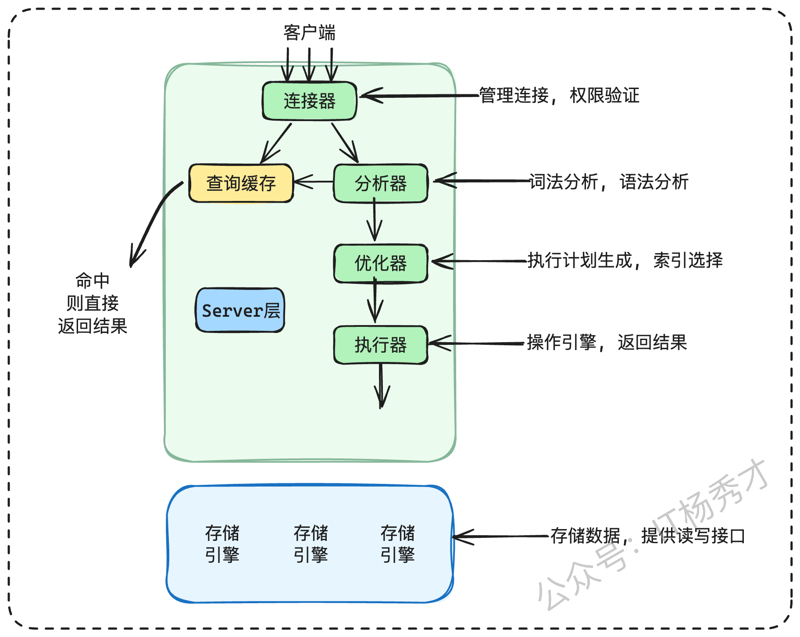

## 1. 基础面试题

### 1.1 数据库的三范式是什么？

数据库的三范式是我们在设计表结构时需要遵循的一些基本原则，主要是为了减少数据冗余，保证数据的一致性。

- **第一范式**是最基础的，它要求表里的**每一列都必须是不可再分的原子项。**比如说，一个“联系方式”字段里不能同时存手机和座机，必须拆成两个独立的字段。
- **第二范式**是建立在第一范式之上的，它**要求表里的非主键列必须完全依赖于整个主键，而不是主键的一部分。**这通常是针对联合主键的情况，防止出现部分依赖。
- **第三范式**则更进一步，要求**非主键列之间不能存在传递依赖。**也就是说，一个非主键列不能依赖于另一个非主键列。

在实际开发中，我们通常会遵守这三个范式，但有时候为了查询性能，也会做一些反范式的设计，比如增加一些冗余字段来避免复杂的表连接。

------

**传递依赖举例：**有一张表：`student`

| 学号 (stu_id) | 学生姓名 (name) | 系号 (dept_id) | 系名称 (dept_name) |
| ------------- | --------------- | -------------- | ------------------ |
| 1001          | 张三            | CS             | 计算机系           |

**解释：**学号并不是直接决定系名称，而是通过“系号”间接决定的。

### 1.2 MySQL 支持哪些存储引擎?

MySQL支持很多种存储引擎，最常用的就是InnoDB和MyISAM，此外还有Memory、Archive等。在绝大多数情况下，我们都会选择InnoDB，它现在也是MySQL的默认存储引擎了。

### 1.3 MySQL中MyISAM与InnoDB的区别是什么?

**MyISAM和InnoDB的主要区别，最核心的一点在于对事务的支持。**

- InnoDB是支持事务的，并且实现了ACID特性，这让它非常适合需要高可靠性的场景，比如在线交易。为了支持事务，InnoDB还提供了行级锁和MVCC，这在高并发读写下性能表现很好。

- 而MyISAM则不支持事务，它使用的是**表级锁，**写操作会锁住整张表，所以在**写**并发量大的时候性能会比较差，但它的**结构相对简单，读取速度很快**，所以比较适合一些**读多写少**的应用场景。


其他方面，像InnoDB支持外键，而MyISAM不支持；MyISAM曾经在全文索引上有优势，不过现在新版的InnoDB也支持了。总的来说，现在InnoDB是更主流的选择，尤其是在对数据一致性和并发性要求高的业务里。

### 1.4 MySQL 中的 varchar 和 char 有什么区别？

**char和varchar最主要的区别在于存储方式。**

- char是定长的，比如你定义了`char(10)`，那就算你只存了一个字符'a'，它在磁盘上也会占用10个字符的空间，剩下的会用空格补齐。
- varchar是变长的，它会根据你实际存储内容的长度来分配空间，同时还需要额外1到2个字节来记录内容的实际长度。

从性能上讲，因为char是定长的，处理起来会比varchar稍微快一点。所以在选择时，如果一个字段的长度是完全固定的，比如像MD5加密后的密码（32位）、或者手机号这种，用char会更合适。但对于大多数长度不确定的字段，比如用户名、地址等，用varchar会更节省存储空间。

### 1.5 MySQL中DATETIME 和 TIMESTAMP有什么区别？

- DATETIME 存储的是日期和时间的完整值，就是字面时间，**不受时区影响；**

- TIMESTAMP 存储的是 UTC 时间戳，表示自1970-01-01 00:00:01 UTC 以来的秒数，**受时区影响。**


**另外，**

- DATETIME 的默认值为 null，占用 8 个字节；
- TIMESTAMP 的默认值为当前时间——CURRENT_TIMESTAMP，占 4 个字节，实际开发中更常用，因为可以自动更新。

### 1.6 MySQL中 in 和 exists 区别？

**in和exists主要用在子查询中。**它们的执行逻辑不太一样，导致性能上在不同场景下有差异。简单来说，有一个**通用的判断法则是：小表驱动大表。**

> `IN` 是先执行子查询并把结果作为集合，再去主查询中匹配； `EXISTS` 是对主查询的每一行去子查询中判断是否存在结果。 一般遵循小表驱动大表原则，子查询小用 IN，外表小用 EXISTS。

- 如果子查询（内表）的结果集比较小，主查询（外表）的表比较大，那么用 in 的效率会比较高。因为**in会先执行子查询**，然后把结果缓存起来，再去主查询的表里匹配。


- 如果子查询的表很大，主查询的表很小，那么用exists会更好，因为exists是拿主查询表里的每一行记录，去子查询的表里做一个判断，看是否存在匹配的数据。


另外，对于`not in`和`not exists`，一般推荐使用`not exists`，因为`not in`在很多情况下无法有效利用索引，会导致全表扫描。

### 1.7 删除表的时候drop、delete与truncate的区别是什么？

这三个命令都是用来删除数据的，但它们的级别和行为完全不同。

- delete是DML语言，它是一行一行地删除记录，可以带WHERE子句只删除部分数据。因为是事务性操作，所以delete的删除是可以回滚的，并且会触发触发器。

- truncate是DDL语言，它会直接删除表里的所有数据，保留表结构，不能带WHERE子-句。它相当于重建了表，所以速度非常快，**不能回滚**，也不会触发触发器。

- drop也是DDL语言，它是最彻底的，会直接把整张表，包括表结构、数据、索引、约束等全部从数据库里删除掉，当然也**不能回滚。**


> DDL 用来定义和修改“表结构”；DML 用来操作“表中的数据”。

**下表是三种方式的一个对比：**

| 分类     | 类型 | 是否可回滚 | 删除内容                                             | 删除速度           |
| -------- | ---- | ---------- | ---------------------------------------------------- | ------------------ |
| Delete   | DML  | 可回滚     | 删除表的全部或者部分行数据，表结构还在               | 慢（需要逐行删除） |
| Truncate | DDL  | 不可回滚   | 删除表中的所有数据，表结构还在                       | 快                 |
| Drop     | DDL  | 不可回滚   | 删除表结构及所有数据，包括所有的数据行、索引和权限等 | 最快               |

### 1.8 什么是存储过程？有哪些优缺点？

**存储过程是一段预先编译好的SQL代码集合。**我们给它起一个名字，之后就可以像调用函数一样来调用它，执行这一整套SQL操作。

- **优点：**
  - **执行效率高：**因为它是预编译的，所以执行效率会比单条SQL语句高；
  - **可减少网络开销：**它可以把复杂的业务逻辑**封装在数据库层面**，减少了客户端和数据库之间的网络通信；
  - **有一定的安全性：**还能在一定程度上提高数据的安全性。例如可以通过权限控制限制用户只能调用存储过程，而不能直接操作表。

- **缺点：**
  - **可移植性很差：**在现在快速迭代的互联网项目中，存储过程的**可移植性很差**，如果换数据库，基本等于重写。
  - **业务逻辑与数据库强耦合：**业务逻辑都耦合在数据库里，对后续的扩展和版本管理都不太友好，维护和调试也比较麻烦。所以像阿里的开发手册里，是明确禁止使用存储过程的。

### 1.9 对Mysql并发操作可能带来哪些问题？

并发操作如果隔离做得不好，主要会带来几个问题。

- **脏读：**就是一个事务读到了另一个事务**还没提交的数据，**这个数据可能后面会回滚，所以是“脏”的。
- **不可重复读：**指的是在同一个事务里，**两次查询同一条数据，结果不一样**，这是因为中间有别的事务把这条数据给**修改**并提交了。
- **幻读：**跟不可重复读有点像，但它关注的是**数据条数的变化。**比如我第一次查有10条记录，第二次查就变成了11条，多出来的就像幻觉一样，这是因为中间有别的事务插入了新的数据。

### 1.10 InnoDB和MyISAM实现B-Tree索引方式的区别？

 InnoDB和MyISAM虽然都用B+树，但实现上差别很大。

- **InnoDB用的是聚集索引，**它的数据文件本身就是一棵B+树，它的聚集索引通常就是主键索引。这棵树的叶子节点直接包含了完整的行数据。所以按主键查InnoDB会非常快。它的普通索引（或者叫二级索引）的叶子节点存的不是地址，而是主键的值。所以用普通索引查询时，需要先找到主键值，再用主键值去聚集索引里找一遍数据，这个过程叫“回表”。

- **MyISAM用的是非聚集索引，**它的**索引文件和数据文件是分开的。**索引树的叶子节点存的是数据记录的物理地址，找到索引后还要根据地址再去数据文件里取数据。

------

**聚集索引和非聚集索引的区别：**

- 聚集索引：索引结构本身就是数据。一张表**只能有一个聚集索引**
- 非聚集索引：索引结构和真实数据是分开的，需要通过指针/主键再去找数据。

### 1.11 MySQL建表的约束条件有哪些？

MySQL建表时我们常用的约束主要有这么几种：

- 主键约束 (PRIMARY KEY)：保证唯一并且非空。
- 唯一约束 (UNIQUE)：只保证唯一，可以有一个NULL。
- 非空约束 (NOT NULL)：就是这列不能为空。
- 默认约束 (DEFAULT)：给一个默认值。
- 外键约束 (FOREIGN KEY)：用来关联两个表，保证数据的一致性。
- 检查约束 (CHECK)：新一点的MySQL版本也支持了，可以对值进行校验。

### 1.12 MySQL执行查询的过程？

一个查询语句在MySQL里的执行过程大概是这样的：

- **连接器：**首先，客户端发请求过来，会先经过**连接器**，做一些权限验证和连接管理。
- **解析器：**然后，解析器会做词法分析、语法分析，判断 SQL 是否符合语法规范，然后**生成一棵解析树。**
- **优化器：**之后，优化器会接管，**这是MySQL的核心部分。**它会决定是否走索引、使用哪个索引、确定表的连接顺序等等，然后生成一个它认为最高效的**执行计划。**
- **执行器：**最后，执行器会按照这个执行计划去**调用存储引擎的接口，**获取结果集，然后把数据返回给客户端。
- **存储引擎：**先查 Buffer Pool，没命中再读磁盘，然后返回数据。



## 2. 事务面试题

### 2.1 什么是数据库事务？

事务在我看来，就是一组必须作为一个整体来执行的数据库操作。这些操作要么全部成功执行，要么在任何一步出错的情况下，全部回滚到最初的状态，保证数据库不会处于一个“中间”状态。

最经典的例子就是银行转账。比如A要给B转100块钱，这个动作至少包含两个操作：A的账户减100，B的账户加100。事务就是要保证这两个操作必须同时成功，或者同时失败。绝不能出现A的钱扣了，B的钱没到账这种情况，事务就是为了保证这种业务逻辑的原子性和一致性。

### 2.2 什么是事务的ACID特性？

- **A - Atomicity (原子性)**：这是指事务是一个不可分割的整体，里面的所有操作要么全部完成，要么全部不完成。
- **C - Consistency (一致性)**：指的是事务必须使数据库从一个一致的状态转移到另一个一致的状态。在事务开始前和结束后，数据库的完整性约束没有被破坏。
- **I - Isolation (隔离性)**：这个主要是**针对并发场景的。**它保证一个事务的执行不能被其他事务干扰，**多个并发事务之间要相互隔离。**
- **D - Durability (持久性)**：指的是一个事务一旦被提交，它对数据库中数据的改变就是永久性的，**即使后面系统崩溃也不会丢失。**

### 2.3 说一下 MySQL 的四种隔离级别？

MySQL定义了四种隔离级别，用来平衡数据一致性和并发性能，从低到高分别是：

- **读未提交 (Read Uncommitted)**：这是最低的级别，一个事务可以读到另一个事务还没提交的数据，这可能会导致**脏读。**
- **读已提交 (Read Committed)**：一个事务只能读到已经提交了的数据。这个级别解决了脏读，但可能会有**不可重复读**的问题。这也是像Oracle等大多数数据库的默认级别。
- **可重复读 (Repeatable Read)**：这是MySQL InnoDB的默认级别。它保证在一个事务内，多次读取同样的数据，结果总是一样的，解决了不可重复读的问题。**理论上这个级别还会有幻读**，但InnoDB通过Next-Key Lock机制在很大程度上解决了这个问题。
- **可串行化 (Serializable)**：这是最高的级别，它会**强制事务串行执行**，完全避免了所有并发问题，但性能也是最差的。

| **隔离级别**         | **脏读 (Dirty Read)** | **不可重复读 (Non-repeatable Read)** | **幻读 (Phantom Read)** |
| -------------------- | --------------------- | ------------------------------------ | ----------------------- |
| **READ-UNCOMMITTED** | ✅                     | ✅                                    | ✅                       |
| **READ-COMMITTED**   | ❌                     | ✅                                    | ✅                       |
| **REPEATABLE-READ**  | ❌                     | ❌                                    | ✅                       |
| **SERIALIZABLE**     | ❌                     | ❌                                    | ❌                       |

### 2.4 什么是脏读？幻读？不可重复读？

这三个都是数据库并发访问时，因为隔离级别不够高而可能出现的问题。

- **脏读**：指的是一个事务A读到了另一个事务B修改过但还没有提交的数据。如果事务B最后回滚了，那事务A读到的就是**无效的“脏”数据。**
- **不可重复读**：指的是在一个事务A内部，两次执行同样的查询，返回的结果却不一样。这是因为在两次查询之间，有另一个事务B修改了这些数据并且提交了。它的**重点在于“修改”。**
- **幻读**：和不可重复读有点像，但它**重点在于“新增”或“删除”。**比如一个事务A第一次查询某个范围的数据有10条，第二次查询发现有11条了，多出来的就像“幻影”一样。这是因为中间有另一个事务B插入了符合条件的新数据并提交了。

### 2.5 什么是MVCC？

MVCC的全称是多版本并发控制。它是一种用来提升数据库并发性能的技术，特别是在**读多写少**的场景下。它的核心思想是，在进行读操作的时候不去加锁，而是通过记录数据在某个时间点的快照，来为不同的事务提供不同的数据版本。这样一来，读操作就不会阻塞写操作，写操作也不会阻塞读操作，从而大大提高了数据库的**并发处理能力。**

**MySQL的InnoDB引擎，在“读已提交”和“可重复读”这两种隔离级别下，都是通过MVCC来实现的。**

### 2.6 MVCC 的实现原理是什么？

InnoDB实现MVCC，主要是依赖于**数据记录中的三个隐藏字段和undo log。**

这三个隐藏字段是：一个记录创建时间的事务ID，一个记录删除时间的事务ID，还有一个指向undo log中历史版本的回滚指针。

当一个事务要修改某行数据时，InnoDB不会直接覆盖原始数据，而是会把原始数据拷贝一份到undo log里，然后修改原始数据，并记录下当前操作的事务ID。这样，一行数据就可能存在多个版本，通过回滚指针串成一个版本链。

当另一个事务来查询这行数据时，InnoDB会根据这个事务的ID和版本链中的事务ID进行比较，找到一个对当前事务可见的、合适的版本返回。这样就实现了在不加锁的情况下，让不同的事务看到不同版本的数据。

![img]

### 2.7 什么是快照读和当前读?

这两个概念是在InnoDB的MVCC背景下区分的：

- **快照读 (Snapshot Read)**：指的是读取数据的历史版本快照，也就是我们平时用的普通`SELECT`语句。它不会加锁，读的是事务开始时生成ReadView那一刻的数据版本，这样可以保证读写不冲突，并发性能好。
- **当前读 (Current Read)**：指的是读取数据的最新版本，并且在读取时会加锁，保证其他事务不能并发修改这行数据。像`INSERT`、`UPDATE`、`DELETE`这些写操作，以及`SELECT ... FOR UPDATE`（加写锁）、`SELECT ... LOCK IN SHARE MODE`（加读锁）都属于当前读。

简单来说，不加锁的`SELECT`就是快照读，而加锁的读和所有的写操作都是当前读。

### 2.8 MySQL是如何解决幻读的?

MySQL InnoDB在默认的可重复读（Repeatable Read）隔离级别下，是通过两种方式来解决幻读问题的：

1. **对于快照读（普通的`SELECT`）**：它通过 **MVCC** 机制来解决。在事务开始时会生成一个ReadView，整个事务期间都用这个ReadView。这样，即使其他事务在这期间插入了新的数据并提交了，因为新数据的事务ID不在这个ReadView的可见范围内，所以当前事务是读不到这些新数据的，也就避免了幻读。
2. **对于当前读（比如`SELECT ... FOR UPDATE`）**：它通过 **间隙锁（Gap Lock）和临键锁（Next-Key Lock）** 来解决。当我们执行一个范围查询并加锁时，InnoDB不仅会锁住满足条件的记录本身（记录锁），还会锁住这些记录之间的“间隙”，防止其他事务在这个间隙里插入新的数据。这样一来，也就防止了幻读的发生。

## 3. 索引面试题

### 3.1 索引能干什么?有什么好处？

索引最核心的好处就是能极大地提升查询效率，当数据量越来越大的时候，这个作用就越明显。具体来说，它可以通过避免全表扫描来快速定位数据；如果查询中有排序（`ORDER BY`）操作，并且排序列上有索引，那就可以直接利用索引的有序性，省去了额外的排序步骤。此外，像唯一索引还能保证数据的唯一性，起到约束的作用。在多表连接查询（`JOIN`）的时候，给连接字段加上索引也能显著提高查询性能。

### 3.2 Mysql索引有哪几种类型？

索引的种类可以从不同角度来看。从应用层面，也就是我们平时用得最多的，可以分为普通索引、唯一索引和复合索引。普通索引就是最基本的，没什么限制。唯一索引要求列的值必须唯一，主键就是一种特殊的唯一索引。复合索引是给多个列一起建的索引。

如果从物理存储来看，可以分为聚集索引和非聚集索引，这主要跟InnoDB的实现方式有关。另外，从底层的数据结构来看，我们最常用的是B+Tree索引，此外还有哈希索引、全文索引等。

### 3.3 哪些列上适合创建索引？创建索引有哪些开销？

一般来说，索引应该建在那些经常用作查询条件的列上，比如`WHERE`后面跟的列，或者`JOIN`连接的列。同时，这个列的区分度最好要高，像性别这种只有两三个值的列就不太适合建索引。另外，经常用于排序（`ORDER BY`）的列也可以建索引，这样可以利用索引的有序性，避免额外的排序开销。

当然，建索引不是没有代价的。它需要占用额外的磁盘空间来存储索引结构。更重要的是，每次对数据进行增、删、改的时候，不仅要操作数据，还要去更新对应的索引，这会降低写入的性能。所以索引也不是越多越好，需要权衡。

### 3.4 索引这么多优点，为什么不对表中的每一个列创建一个索引呢？

索引虽然能加快查询，但肯定不能给每一列都建。最主要的原因是维护索引的成本太高了。你每次增加、删除或者修改一条数据，数据库都得去更新这张表上所有的索引，索引一多，写入性能就会急剧下降。其次，索引本身也要占用大量的磁盘空间，甚至可能比数据本身占的空间还大。最后，索引太多也可能会让查询优化器“犯迷糊”，它需要花更多时间去评估到底用哪个索引好，甚至可能选错，反而导致查询变慢。所以，建索引是个技术活，得按需创建，不能滥用。

### 3.5. 聚簇索引和非聚簇索引的区别？

这个区别主要跟数据在磁盘上的物理存储方式有关。

**聚簇索引**，简单来说就是“索引和数据在一起”。在InnoDB中，主键索引就是聚簇索引。它的叶子节点直接存储了完整的行数据。你可以把它想象成一本字典，目录（索引）和内容（数据）是排在一起的，找到目录就直接看到了内容。因为数据是物理上连续存储的，所以一张表只能有一个聚簇索引。

**非聚簇索引**，也叫二级索引或辅助索引，它是“索引和数据分开的”。它的叶子节点存储的不是完整的行数据，而是索引列的值和对应行的主键ID。当我们用非聚簇索引查询时，如果需要获取完整的行数据，就需要先通过这个索引找到主键ID，然后再用主键ID去聚簇索引里把完整的数据捞出来，这个过程就叫“回表”。

所以，聚簇索引的查询效率通常更高，因为它不需要回表。

**分析：**

针对下面这张用户表，聚簇索引和非聚簇索引的存储结构是这样的：


```
CREATE TABLE `user` (
  `id` int COMMENT '主键ID',
  `name` varchar(10) COMMENT '姓名',
  `age` int COMMENT '年龄',
  PRIMARY KEY (`id`)
) ENGINE=InnoDB CHARSET=utf8 COMMENT='用户表';
```

聚簇索引如下图：

![img]

非聚簇索引如下图：

![img]

### 3.6 MySQL索引底层实现为什么要用B+树结构?

首先，数据库索引是持久化在磁盘上的，磁盘IO是非常耗时的操作。B+树是多叉的，并且非叶子节点只存索引，这让树的层高非常低。比如一个三四层的B+树，就能支撑千万级别的数据量，意味着我们最多只需要三四次磁盘IO就能定位到数据，效率非常高。

其次，B+树的叶子节点是用链表串联起来的，这对于数据库里非常常见的范围查询（比如`WHERE age > 20`）简直是绝配，可以直接在叶子节点上进行顺序扫描，性能很好。

最后，它的查询性能很稳定，因为每次查询都必须走到叶子节点，IO的次数是可预期的。综合这几点，B+树就成了MySQL索引最理想的数据结构。

![img]

参考：https://golangstar.cn/backend\_series/advanced\_interview/database\_index.html

### 3.7 联合索引的底层存储结构是什么样的?

联合索引，也叫复合索引，它的底层存储结构本质上也是一棵B+树。只是每个索引节点存储的不再是单个字段，而是建立联合索引的多个字段。同时这棵树在排序时会遵循“最左匹配原则”。比如我们对 `(age, name)` 两个字段建立联合索引，那么在B+树中，节点里的键值会先按照`age`字段进行排序，在`age`相同的情况下，再按照`name`字段进行排序。

所以，整个索引的键值，在逻辑上是整体有序的。

![img]

### 3.8 什么是最左匹配原则?

**回答：**

最左匹配原则，也叫最左前缀原则，它指的是在使用联合索引进行查询时，查询条件必须从索引的最左边的列开始，并且不能跳过中间的列，否则索引可能不会被完全使用，甚至完全失效。

比如说，`WHERE a=1`可以用上，`WHERE a=1 AND b=2`也能用上。但是，如果你直接`WHERE b=2`，那就用不上这个索引了，因为跳过了a。或者你`WHERE a=1 AND c=3`，那么只有a部分能用到索引，c是用不上的，因为中间断了b。还有一个要注意的是，如果遇到范围查询，比如`WHERE a=1 AND b > 2 AND c=3`，那么a和b能用到索引，但从b这个范围查询开始，后面的c就用不上了。

**分析：**

假设我们有一个订单表`orders`，并建立了一个联合索引 `idx_reg_stat_date` ON `orders` (`region`, `status`, `order_date`)。这个索引的B+树在物理上是这样排序的：首先按`region`排序，在`region`相同的情况下再按`status`排序，在前两者都相同的情况下最后按`order_date`排序。

这种结构决定了索引的查找方式，必须从索引的最左边的列开始，并且不能跳过中间的列。

- `WHERE region = '华东' AND status = '已支付'`：**能使用索引**。优化器会用'华东'定位到特定范围，再在这个范围内用'已支付'继续定位。
- `WHERE region = '华东'`：**能使用索引**。只使用了索引的第一个列。
- `WHERE status = '已支付' AND order_date = '2025-09-07'`：**无法使用索引**。因为查询条件跳过了最左边的`region`列，索引无法定位。
- `WHERE region = '华东' AND order_date = '2025-09-07'`：**只能使用索引的`region`部分**。当`region`确定后，由于`status`未知，`order_date`是无序的，所以`order_date`条件无法利用索引进行快速查找，只能在所有`region`为'华东'的记录中逐条扫描。
- `WHERE region = '华东' AND status > '待发货' AND order_date = '2025-09-07'`：**只能使用`region`和`status`部分**。当遇到范围查询（`>`、`<`、`BETWEEN`等）时，该列后续的索引列将无法再用于精确匹配。因为`status`大于'待发货'的是一个范围，在这个范围里，`order_date`是无序的。

这里有一个简化的口诀可以帮助记忆：**等值匹配，从左到右；范围中断，跳过失效**。

### 3.9 什么是覆盖索引和回表查询?

这两个概念通常是关联在一起的。

**覆盖索引**是一种查询优化的方式。当我们查询的数据列，正好在使用的那个非聚簇索引（二级索引）里都已经包含了，那就不需要再去主键索引里查找完整的行数据了。这个二级索引就“覆盖”了我们的查询需求，这就叫覆盖索引。使用覆盖索引可以避免回表，性能会好很多。

**回表查询**则正好相反。当我们通过一个二级索引找到了目标数据的主键ID，但是查询的列里还包含其他数据，而这些数据在二级索引里没有，那么数据库就必须拿着这个主key，再去聚簇索引（主键索引）里把完整的行数据查出来。这个“回头再查一次”的动作，就叫做回表。回表会增加一次额外的IO操作，所以我们应该尽量通过设计合理的索引来避免它。

![img]

### 3.10 怎么创建联合索引，查询效率最高？

要让联合索引效率最高，关键在于列的顺序。一个基本的原则是：**把区分度最高（选择性最好）的字段放在最左边**。

区分度，简单来说就是一个字段里不重复的值的比例。比如，性别字段只有男、女两种，区分度就很低；而用户ID字段，每个值都不一样，区分度就最高。

把区分度高的字段放在前面，意味着我们通过这个字段能一次性过滤掉更多的数据，大大缩小查询范围，后续的匹配效率自然就高了。

我们可以通过`SELECT COUNT(DISTINCT column_name) / COUNT(*)`来估算一个字段的区分度，值越接近1，区分度越高，越适合放在联合索引的前面。

**分析：**

比如对于一张用户表来说，生日比性别的区分度更高，更适合创建索引。可以使用下面的方式手动统计一下，每个字段的区分度，值越大，区分度越高：


```
select 
    count(distinct birthday)/count(*), 
    count(distinct gender)/count(*) 
from user;
```

![img]

对于已经创建好的索引，我们还可以使用MySQL命令查看每个索引的区分度排名：

![img]

图中**Cardinality**列表示索引的区分度排名，也被称为基数。

### 3.11 什么是索引下推？优点是什么？

索引下推（Index Condition Pushdown，简称ICP）是MySQL 5.6版本引入的一个查询优化。

在没有索引下推之前，比如我们有一个`(age, name)`的联合索引，执行`WHERE age = 18 AND name LIKE '%三'`这样的查询。MySQL会先在索引树里找到所有`age=18`的记录，然后拿着这些记录的主键ID，一条条地回表去查完整数据，最后在Server层根据`name LIKE '%三'`这个条件进行过滤。

有了索引下推之后，过程就不一样了。MySQL在索引内部就会判断`name`是否符合`LIKE '%三'`的条件，只有符合条件的记录，才会去回表。

它的**优点**非常明显：**它在索引层面就过滤掉了大量不满足条件的数据，从而大大减少了回表的次数**，提升了查询性能

![img]

### 3.12 哪些什么情况索引会失效？

1. **使用!= 或者 <> 导致索引失效**
2. **类型不一致导致的索引失效**
3. **函数导致的索引失效**

如：


```
SELECT * FROM `user` WHERE DATE(create_time) = '2025-09-10';
```

如果使用函数在索引列，是不会走索引的。

- **运算符导致的索引失效**


```
SELECT * FROM `user` WHERE age - 1 = 20;
```

如果你对列进行了（+，-，*，/，!）, 那么都将不会走索引。

- **OR引起的索引失效**


```
SELECT * FROM `user` WHERE `name` = '张三' OR height = '175';
```

OR导致索引是在特定情况下的，并不是所有的OR都是使索引失效，如果OR连接的是同一个字段，那么索引不会失效，反之索引失效。

- **模糊搜索导致的索引失效**


```
SELECT * FROM `user` WHERE `name` LIKE '%冰';
```

当`%`放在匹配字段前是不走索引的，放在后面才会走索引。

- **NOT IN、NOT EXISTS导致索引失效**

### 3.13 为什么官方建议使用自增长主键作为索引？

主要是出于性能考虑，和B+ 树的存储特点有关。主要是减少页分裂带来的性能损耗。

如果主键是自增的，那么每次插入新记录都会追加到叶子节点的最右边，这种情况下插入就是顺序写，效率非常高。最多的情况就是当前页写满了，再开辟一个新的页，继续往后写，对已有的数据几乎没有影响。

但如果主键是随机的，比如用 UUID，那么新数据可能要插到现有页的中间。这个时候存储引擎就得为了保持有序性，去搬动数据，甚至可能触发页分裂。页分裂会带来额外的开销，还容易造成数据页的碎片化，导致索引变得不紧凑，后续查询性能也会受到影响。

所以在实际设计里，一般推荐用自增 ID 作为主键，既能保证写入性能稳定，也能让索引结构更加紧凑。

插入连续的数据：

![img]

插入非连续的数据：

![img]

图片来源：https://www.javazhiyin.com/40232.html

## 4. 锁面试题

### 4.1 MySQL锁的分类有哪几种?

MySQL的锁可以从不同维度来划分：

- **按锁的粒度**：可以分为**表锁**、**页锁**和**行锁**。行锁里又可以细分为**记录锁**、**间隙锁**和**临键锁**。粒度越大，并发性越差，但开销越小；粒度越小，并发性越好，但开销和管理的复杂度就越高。
- **按锁的属性（兼容性）**：可以分为**共享锁（S锁）**，也叫读锁；和**排他锁（X锁）**，也叫写锁。读锁之间是兼容的，可以多个事务同时持有。但写锁和任何锁都不兼容，一旦一个事务拿了写锁，其他事务就必须等待。
- **按加锁的策略**：可以分为**乐观锁**和**悲观锁**。这其实是一种思想，而不是MySQL具体的锁类型。乐观锁认为冲突很少，操作时不加锁，提交更新时才去检查。悲观锁认为冲突很多，操作数据前就先加锁。

### 4.2 MySQL表锁、页面锁、行锁的作用及优缺点?

**表锁**：

- **作用**：直接锁住整张表。
- **优点**：实现简单，开销小，加锁快，而且绝对不会出现死锁。
- **缺点**：锁的粒度太大了，只要有一个事务在写，其他所有事务的读写都得等着，并发性能非常差。MyISAM引擎主要用的就是表锁。

**页锁**：

- **作用**：锁住一个数据页，粒度介于表锁和行锁之间。
- **优缺点**：开销、加锁速度和并发性能都介于表锁和行锁之间。它也会出现死锁。这个现在用得比较少了，主要是BDB存储引擎在用。

**行锁**：

- **作用**：只锁住被操作的那一行或几行数据。
- **优点**：锁的粒度最小，发生锁冲突的概率也最低，所以并发性能是最好的。
- **缺点**：实现复杂，开销比较大，加锁也比较慢。而且，行锁是可能会引发死锁的。InnoDB引擎就是通过行锁来支持高并发的。

**分析：**

我们可以使用如下方式给一个表加锁


```
-- 对user表加读锁
lock table user read;
-- 同时对user表加读锁，对order表加写锁
lock tables user read, order write;
```

另外，加表锁非常影响性能，我们一般只在以下两种情况下才会加表锁

1. 当需要更新表中的大部分数据
2. 事务涉及到多张表，业务逻辑复杂，加表锁可以避免死锁。

### 4.3 什么是记录锁(Record Locks)、间隙锁(Gap Locks)、临键锁(Next-Key Locks) ?

**回答：**

这三个都是InnoDB在行锁层面上的具体实现，都是为了解决并发问题的。

- **记录锁 (Record Lock)**：这是最简单的一种行锁，它就是精准地锁住某一条索引记录。比如`WHERE id = 1`，如果`id`是主键或唯一索引，那加的就是记录锁。
- **间隙锁 (Gap Lock)**：它锁的是一个“间隙”，也就是两个索引记录之间的一段范围，但是这个范围是开区间，不包括记录本身。比如，一个索引里有值10和20，间隙锁就可以锁住(10, 20)这个范围，防止其他事务在这个范围里插入新的数据。它的主要目的就是为了防止幻读。
- **临键锁 (Next-Key Lock)**：这个是记录锁和间隙锁的结合体。它既锁住了记录本身，也锁住了记录前面的那个间隙，是一个左开右闭的区间。比如，一个索引有10和20，临键锁可以锁住(10, 20]这个范围。InnoDB在可重复读隔离级别下，默认使用的就是临键锁，这样既能锁住记录，又能防止幻读。

**分析：**

1. **记录锁**

记录锁就是为**某行**记录加锁，是行锁最基本的表现形式，它会`封锁该行的索引记录`

![img]

举个例子：


```
-- id 列为主键列或唯一索引列
SELECT * FROM table WHERE id = 1 FOR UPDATE;
```

id 为 1 的记录行会被锁住。需要注意的是：**`id`** 列必须为**`唯一索引列`**或**`主键列`**，否则上述语句加的锁就会变成**`临键锁`**。同时查询语句必须为**`精准匹配`（`=`）**，不能为 **`>`、`<`、`like`**等，否则也会退化成**`临键锁`**

在通过 `主键索引` 与 `唯一索引` 对数据行进行 UPDATE 操作时，也会对该行数据加`记录锁`，比如


```
-- id 列为主键列或唯一索引列
UPDATE SET age = 50 WHERE id = 1;
```

- **间隙锁**

**间隙锁**基于`非唯一索引`，它`锁定一段范围内的索引记录`,仅在可重复读及以上的隔离级别下生效，主要用于防止幻读。**间隙锁**基于`Next-Key Locking` 算法，请务必牢记：**使用间隙锁锁住的是一个区间，而不仅仅是这个区间中的每一条数据**。

比如如下SQL:


```
SELECT * FROM table WHERE id BETWEN 1 AND 10 FOR UPDATE;
```

即所有在`（1，10）`区间内的记录行都会被锁住，所有id 为 2、3、4、5、6、7、8、9 的数据行的插入会被阻塞，但是 1 和 10 两条记录行并不会被锁住。

- **临键锁**

**临键锁**可以理解为一种特殊的**间隙锁**，临键锁是记录锁和间隙锁的结合体，锁住的是索引记录和索引记录之间的间隙。 每个数据行上的`非唯一索引列`上都会存在一把**临键锁**，当某个事务持有该数据行的**临键锁**时，会锁住一段**左开右闭区间**的数据。需要强调的一点是，`InnoDB` 中`行级锁`是基于索引实现的，**临键锁**只与`非唯一索引列`有关，在`唯一索引列`（包括`主键列`）上不存在**临键锁**。

![img]

假设有如下表：
**MySql**，**InnoDB**，**Repeatable-Read**：table(id PK, age KEY, name)

| **id** | **age** | **name** |
| ------ | ------- | -------- |
| 1      | 10      | Lee      |
| 3      | 24      | Soraka   |
| 5      | 32      | Zed      |
| 7      | 45      | Talon    |

该表中 age 列潜在的临键锁有：`(-∞, 10]`，`(10, 24]`，`(24, 32]`，`(32, 45]`，`(45, +∞]`。假设有个`事务 A` 中执行如下命令：


```
-- 根据非唯一索引列 UPDATE 某条记录
UPDATE table SET name = Vladimir WHERE age = 24;
-- 或根据非唯一索引列 锁住某条记录
SELECT * FROM table WHERE age = 24 FOR UPDATE;
```

不管执行了上述 SQL 中的哪一句，之后如果在`事务 B` 中执行以下命令，则该命令会被阻塞：


```
INSERT INTO table VALUES(100, 26, 'Ezreal');
```

很明显，`事务 A` 在对 `age` 为 24 的列进行 UPDATE 操作的同时，也获取了 `(24, 32]` 这个区间内的临键锁。不仅如此，在执行以下 SQL 时，也会陷入阻塞等待：


```
INSERT INTO table VALUES(100, 30, 'Ezreal');
```

所以在根据`非唯一索引` 对记录行进行 `UPDATE \ FOR UPDATE \ LOCK IN SHARE MODE` 操作时，InnoDB 会获取该记录行的 `临键锁` ，并同时获取该记录行下一个区间的`间隙锁`。即`事务 A `在执行了上述的 SQL 后，最终被锁住的记录区间为 `(10, 32)`。

最终我们会得到如下结论：

- **InnoDB** 中的`行锁`的实现依赖于`索引`，一旦某个加锁操作没有使用到索引，那么该锁就会退化为`表锁`。
- **记录锁**存在于包括`主键索引`在内的`唯一索引`中，锁定单条索引记录。
- **间隙锁**存在于`非唯一索引`中，锁定`开区间`范围内的一段间隔，它是基于**临键锁**实现的。
- **临键锁**存在于`非唯一索引`中，该类型的每条记录的索引上都存在这种锁，它是一种特殊的**间隙锁**，锁定一段`左开右闭`的索引区间。

### 4.4 什么是共享锁(又称读锁、S锁)和排他锁(又称写锁、X锁)?

**共享锁 (Shared Lock / S锁)**：

- 也叫读锁。它的作用是，一个事务获取了某行数据的S锁后，其他事务可以继续获取这行数据的S锁（也就是可以并发读），但是不能获取X锁（也就是不能写）。
- 简单说就是：“我正在读，你们也可以读，但谁都别想改”。
- 加锁方式是在`SELECT`语句后面加上`LOCK IN SHARE MODE`。

**排他锁 (Exclusive Lock / X锁)**：

- 也叫写锁。它的作用是，如果一个事务获取了某行数据的X锁，那么其他任何事务都不能再为这行数据加任何锁（无论是S锁还是X锁），直到这个锁被释放。
- 简单说就是：“我正在改，你们谁都别动，读也不行”。
- `UPDATE`、`DELETE`、`INSERT`这些操作会自动加X锁，我们也可以通过`SELECT ... FOR UPDATE`来手动加X锁。

### 4.5. 什么是乐观锁和悲观锁？作用及实现方式？

乐观锁和悲观锁其实是一种并发控制的思想，而不是数据库里具体的锁。

- **悲观锁**：
  - 总觉得数据随时会被别人修改，所以每次去操作数据之前，都会先加锁，把数据锁住，操作完了再释放。数据库里的行锁、表锁，`SELECT ... FOR UPDATE`这些都属于悲观锁的实现。
  - **适用场景**：它适合写操作多、冲突比较激烈的场景，因为先加锁可以保证数据的一致性。
- **乐观锁**：
  - 总觉得数据一般不会被别人修改，所以操作数据时不加锁，而是在最后提交更新的时候，再去检查一下，看在我操作期间数据有没有被别人改过。
  - **实现方式**：最常见的就是通过版本号（version）或者时间戳。在更新时，带上之前读到的版本号，`UPDATE ... WHERE id=... AND version=...`，如果`version`没变，就更新成功并把`version`加一；如果`version`变了，说明数据被改过了，就更新失败，然后由应用层面决定是重试还是报错。
  - **适用场景**：它适合读操作多、写操作少的场景，可以避免加锁的开销，提高吞吐量。

**分析：**

Mysql自带的锁机制就是悲观锁，没什么好分析的，这里主要分析乐观锁的实现，

1. **基于版本号**

基于版本号的乐观锁通常会在表中添加一个版本号字段，在每次更新操作时会将版本号加1。

![img]

我们通过在更新语句中增加 version = version + 1 的条件来实现版本号的更新，如下所示：


```
-- 更新用户名称，基于版本号乐观锁
UPDATE user SET name = 'new_name', version = version + 1 WHERE id = 1 AND version = 0;
```

当更新操作执行时，只有当当前的 version 值等于预期值 0 时才会更新，否则更新操作将失败。

- **基于时间戳**

基于时间戳的乐观锁通常会在表中添加一个时间戳字段，在每次更新操作时会记录当前时间戳。我们通过在更新语句中使用当前时间戳来实现时间戳的更新，如下所示：


```
-- 更新用户名称，基于时间戳乐观锁
UPDATE user SET name = 'new_name', timestamp = CURRENT_TIMESTAMP WHERE id = 1 AND timestam
```


```
p = '2025-08-31 10:00:00';
```

当更新操作执行时，只有当当前的 timestamp 值等于预期值 '2025-08-31 10:00:00' 时才会更新，否则更新操作将失败。

### 4.6 如何查看死锁日志，并解决线上MySQL死锁问题?

当线上发生死锁时，我们首先要做的是定位问题。

1. **查看死锁日志**：最直接的方法是执行 `SHOW ENGINE INNODB STATUS;`。这个命令会输出非常多的信息，我们需要找到 `LATEST DETECTED DEADLOCK` 这一段。
   - 在这段日志里，MySQL会清楚地告诉你：
     - 有两个事务（TRANSACTION 1 和 TRANSACTION 2）。
     - 每个事务分别持有了什么锁（HOLDS THE LOCK(S)）。
     - 每个事务正在等待什么锁（WAITING FOR THIS LOCK）。
     - 最后，MySQL为了解决死锁，回滚了哪个事务（WE ROLL BACK TRANSACTION ...）。
   - 通过分析这两个事务的SQL语句和它们持有、等待的锁，我们就能基本还原出死锁发生的过程。
2. **解决问题**：
   - **短期**：如果业务卡住了，可以手动 `KILL` 掉持有锁的那个MySQL线程ID，让业务先恢复。
   - **长期**：必须从根源上解决。分析死锁日志后，常见的原因和解决方案有：
     - **加锁顺序不一致**：比如两个事务都想更新A表和B表，一个先锁A再锁B，另一个先锁B再锁A，就很容易死锁。**解决方案**是规范代码，让所有需要同时锁多张表的地方，都按相同的顺序来加锁。
     - **事务过大**：一个事务里做了太多的操作，持有锁的时间太长，增加了死锁的概率。**解决方案**是拆分大事务，让事务尽可能地简短。
     - **索引问题**：如果SQL没有走索引，或者索引不合理，导致扫描了大量的行，加了不必要的锁，也容易造成死锁。**解决方案**是优化SQL，确保有合适的索引，减少锁的范围

## 5. 日志面试题

### 5.1 Mysql的日志主要有哪几种，分别有什么用？

mysql的日志主要有**undo log** ，**redo log和binlog三种**

- **undo log** 主要和事务的原子性有关。它记录的是数据修改之前的旧值，如果事务需要回滚，就可以依赖 undo log 恢复原状。另外，MVCC 里的多版本读，也会用到 undo log。
- **redo log** 是 InnoDB 存储引擎层的物理日志，它保证的是持久性。它记录了数据页做了哪些修改，即使事务已经提交但脏页还没落盘，如果这时候宕机了，MySQL 重启时也能根据 redo log 把已提交的数据恢复出来。
- **binlog** 则是 Server 层生成的日志，主要用于备份和主从复制。它记录的是逻辑操作，比如一条 SQL 更新了哪条数据。事务提交时，相关的 binlog 会统一写入日志文件，后续从库就可以通过 binlog 来重放，实现主从同步。

所以总结来说：**undo log 负责回滚，redo log 负责崩溃恢复，binlog 负责数据复制和备份**，三者各司其职。

### 5.2 redo log是什么？为什么需要redo log？

redo log是InnoDB存储引擎特有的一种日志。你可以把redo log想象成一个账本，它记录的不是完整的SQL语句，而是更底层的、关于“哪个数据页的哪个位置被修改成了什么值”这样的物理变更信息。

至于为什么需要它，这主要是为了保证MySQL的崩溃安全（Crash Safe）能力。我们知道，为了提升性能，数据库在执行更新操作时，是先修改内存（Buffer Pool）中的数据，然后再在某个合适的时机将修改后的数据刷回磁盘。但这样就会有个问题：如果数据刚写到内存，数据库就宕机了，那这部分修改就丢失了。

redo log就是为了解决这个问题而生的。在事务提交时，MySQL会确保redo log已经持久化到了磁盘上。这样一来，即使数据库突然崩溃，在重启后也可以通过读取redo log，把那些已经提交但还没来得及写入数据文件的修改给重放一遍，从而恢复数据，保证了已提交事务的**持久性**。

### 5.3 什么是WAL技术,，有什么好处？

WAL的全称是Write-Ahead Logging，也就是“预写日志”技术，它的核心思想就是“**日志先行**”。

简单来说，就是在对数据进行任何修改时，不会立刻去操作磁盘上的数据文件，因为随机I/O太慢了。而是先将这次“修改”这个事件本身，以日志的形式记录下来（也就是写入redo log），这个过程是顺序I/O，速度非常快。只要日志写成功了，那么这次内存中的修改就是安全的了。

这样做最大的好处就是**极大地提升了数据库的写入性能和响应速度**，它将耗时的随机写操作，变成了高速的顺序写操作。同时，正如上一个问题提到的，它也为数据库提供了可靠的崩溃恢复能力。

### 5.4 redo log的写入方式是怎样的？

Redo log的文件在物理上是由多个大小固定的文件组成的，它是采用循环写的方式来写入的。redo log文件是一个环形结构。在这个环形结构上有两个非常关键的指针：

- **`write pos`**：表示当前日志写到了哪个位置。
- **`check point`**：表示已经刷盘的日志的后一个位置。代表着check point**之前**的所有数据页（从缓冲池中）已经被成功刷新（写入）到磁盘了

当数据库运行时，`write pos`会随着新日志的写入而不断向前移动。同时，后台线程会不断地把`check point`位置的脏数据页刷回磁盘，刷盘完成后，`check point`也会跟着向前移动。

- write pos到check point之间的部分用来记录新日志，也就是留给新记录的空间。
- check point到write pos之间是待刷盘的记录，如果不刷盘会被新记录覆盖。

![img]

这种循环利用的机制，既保证了日志的持久化，又避免了日志文件无限增长的问题。

### 5.5 redo log的写入过程是怎样的？

redo log的写入过程并不是一步到位的，它涉及了几个层级。

首先，当有数据修改时，日志记录会先被写入内存中的一块专属区域，叫做 **`redo log buffer`**。

然后，这些在内存 `buffer` 里的日志，会在某个时机被写入到操作系统的文件系统缓存（OS Buffer）中。

最后，再通过操作系统调用 `fsync()`，才将日志从文件系统缓存真正地持久化到磁盘上的 **`redo log file`** 里。

这个从 `redo log buffer` 刷到磁盘文件的时机，可以通过参数 `innodb_flush_log_at_trx_commit` 来精确控制，这也是一个面试时经常被问到的点。它有三种策略：

- **设置为 1（默认值）**：最安全，也最符合ACID的要求。每次事务提交，都会强制把redo log从内存同步刷到磁盘，确保数据万无一失。
- **设置为 0**：性能最好，但最不安全。事务提交时，日志只留在内存的 `redo log buffer` 里，由一个后台线程大概每秒刷一次盘。如果服务器掉电，会丢失最近一秒的事务数据。
- **设置为 2**：一个折中方案。事务提交时，日志会写入到操作系统的文件缓存，但不会立刻 `fsync`。如果只是MySQL进程挂了，操作系统没问题，数据不会丢。但如果整个服务器宕机，那文件缓存里的数据就没了。

![img]

### 5.6 binlog是什么，起到什么作用？

binlog，也就是二进制日志，它是属于MySQL Server层面的日志。这意味着，无论你用的是InnoDB、MyISAM还是其他存储引擎，只要对数据库做了修改，都会产生binlog。

它的主要作用有两个：

1. **主从复制**：主库（Master）产生binlog，从库（Slave）获取并重放这些binlog，从而实现主从数据同步。
2. **数据恢复**：我们可以利用全量备份加上某个时间点之后的binlog，来实现基于时间点的精确数据恢复（Point-in-Time Recovery）。

但是，**binlog本身是不能保证crash-safe的**。因为它和InnoDB的redo log属于两个不同的系统，写入时机也不同。如果只靠binlog，在写入过程中发生崩溃，就可能出现数据不一致的情况。所以，它必须和InnoDB的redo log通过“两阶段提交”机制来配合，才能共同保证数据的崩溃安全和一致性。

### [**5.7 binlog和redolog的不同点有哪些?**](#_5-7-binlog和redolog的不同点有哪些)

**所属层面不同**：redo log是InnoDB存储引擎层特有的；而binlog是MySQL Server层实现的，所有存储引擎都可以使用。

**记录内容不同**：redo log记录的是关于数据页的物理修改，比如“在0号表空间的100号数据页的88偏移量处写入'abc'”，它是**物理日志**。而binlog记录的是逻辑操作，比如“给表T的id=1这行的c字段更新为10”，或者是原始的SQL语句，它是**逻辑日志**。

**文件形式不同**：redo log的文件大小是固定的，采用**循环写**的方式，后面的日志会覆盖掉前面已经被消费的日志。binlog则是**追加写**，一个文件写满了，会自动切换到下一个新文件，不会覆盖旧日志。

**核心作用不同**：redo log的核心使命是保证**崩溃恢复（crash-safe）**，让InnoDB引擎具备持久性。而binlog的核心使命则是用于**主从复制和数据恢复**。

### 5.8 binlog日志有哪三种格式？

binlog有三种主要的格式，分别是Statement、Row和Mixed。

- **Statement格式**：这是最古老的格式，它记录的是原始的SQL语句。优点是日志文件非常小，能节省大量的磁盘空间和网络I/O。但缺点也很致命，有些SQL语句在主库和从库上执行的结果可能不一致，比如包含`UUID()`、`NOW()`这类函数的语句，容易导致主从数据漂移。
- **Row格式**：它不记录SQL，而是记录每一行数据被修改前后的具体内容。优点是复制非常精确，绝对不会出错。缺点就是日志量会变得很大，特别是当一条`UPDATE`语句更新了几百万行数据时，binlog文件会急剧膨胀。
- **Mixed格式**：这是目前MySQL默认使用的格式，它结合了上面两者的优点。MySQL会自动判断，对于绝大多数安全的、确定性的SQL，它会使用Statement格式来记录；而对于那些可能导致主从不一致的“危险”SQL，它会自动切换成Row格式来记录。可以说是一种非常智能和平衡的选择。

### 5.9 什么是MySQL两阶段提交, 为什么需要两阶段提交?

阶段提交是MySQL内部为了保证**数据一致性**而设计的一种分布式事务协调机制，它主要用来协调InnoDB的redo log和Server层的binlog这两个独立日志的写入。它把事务的提交分成了两个阶段：

1. **准备阶段（Prepare）**：当InnoDB写完redo log后，它不直接提交事务，而是将redo log的状态设置为“prepare”。
2. **提交阶段（Commit）**：之后，由执行器去写binlog。当binlog成功写入磁盘后，执行器再通知InnoDB，将redo log的状态从“prepare”改为“commit”，完成整个事务的提交。

![img]

**为什么需要两阶段提交？**

**根本目的就是为了保证redolog和binlog这两份日志在逻辑上是绝对一致的**。

如果没有两阶段提交，万一redo log写成功了，但binlog还没写，数据库就崩了。重启后，数据通过redo log恢复了，但binlog里却没有这次操作的记录。这样一来，从库就收不到这个更新，主从数据就会不一致。两阶段提交通过将两个日志的写入“捆绑”成一个原子操作，确保了它们要么同时成功，要么同时失败，从而维护了数据在任何情况下的强一致性。

### 5.10 如果不是两阶段提交，先写redolog和先写bin log两种情况各会遇到什么问题？

- **情况一：先写redo log，再写binlog** 。如果在redo log写完后，binlog还没来得及写，数据库就崩溃了。重启后，根据redo log，这次的更新在数据库里是生效的。但是，因为binlog里没有这条记录，所以无论是用作主从复制，还是日后的数据恢复，都会**丢失这次更新**，导致数据不一致。主库比从库多了一次更新。
- **情况二：先写binlog，再写redo log。** 如果在binlog写完后，redo log还没来得及写，数据库就崩溃了。重启后，因为redo log里没有记录，InnoDB会认为这个事务没有提交，会自动回滚这次操作，数据库里的数据没有变化。但是，binlog里已经记录了这次更新。这样一来，从库会执行这次更新，或者将来用这份binlog恢复数据时，就会**多出一次主库上根本不存在的更新**，数据同样不一致。从库比主库多了一次更新。

所以，无论哪种顺序，只要不是原子操作，都会在发生故障时导致数据不一致的问题。

### 5.11 binlog刷盘机制是怎样的？

binlog的刷盘机制，主要由 `sync_binlog` 这个参数来控制。

- 当`sync_binlog`为0时，表示MySQL不控制binlog的刷新，而是由系统自行判断何时写入磁盘。选这种策略，一旦操作系统宕机，缓存中的binlog就会丢失。
- `sync_binlog`为N时，每N个事务，才会将binlog写入磁盘。。
- 当`sync_binlog`为1时，则表示每次commit，都将binlog 写入磁盘。

![img]

### 5.12 undolog是什么？它有什么用？

undo log，也叫回滚日志。它记录的是数据在被修改**之前**的旧版本。比如，我执行一条`UPDATE`把A字段的值从1改成2，那么redo log记录的是“改成2”这个事实，而undo log记录的就是“改之前它是1”这个历史信息。

它的主要作用有两个：

1. **实现事务回滚**：当一个事务执行失败或者用户手动执行`ROLLBACK`时，MySQL可以利用undo log中记录的旧值，将数据恢复到事务开始之前的状态。
2. **实现MVCC（多版本并发控制）**：这是InnoDB非常核心的一个特性。在一个事务中，当我们去读取一行数据时，如果这行数据正在被另一个未提交的事务修改，为了保证我们能读到一致性的数据（而不是别的事务改了一半的“脏数据”），InnoDB就会通过undo log，为我们构建出这行数据在那个事务开始前的“历史版本”，这就是我们常说的“快照读”。

## 6. 主从同步面试题

### 6.1 MySQL主从同步实现原理是怎样的?

主从同步的主要是基于主库的 **Binlog** 来实现的，整个过程可以分为三步：

1. **主库记录变更**：主库上所有对数据的修改操作，都会被记录到自己的Binlog（二进制日志）文件中。
2. **从库拉取日志**：从库上有一个专门的I/O线程，会连接到主库，请求主库的Binlog。主库接到请求后，会把Binlog的内容推送给从库。从库的I/O线程拿到Binlog后，会把它写入到自己的一个叫中继日志（Relay Log）的文件里。
3. **从库重放日志**：从库上还有一个SQL线程，它会去读取Relay Log里的内容，然后把那些在主库上执行过的SQL操作，在自己本地原封不动地再执行一遍，这样就保证了数据和主库一致。

![img]

### 6.2 主从同步有哪些作用？

主从同步的主要作用有这么几个：

1. **读写分离**：让主库（Master）专门负责写操作，从库（Slave）负责读操作，这样可以分摊数据库的压力，提升整体性能。
2. **高可用和容灾**：当主库发生故障时，可以快速地把一个从库提升为新的主库，保证服务的连续性。
3. **数据备份**：从库可以作为主库的一个实时备份，避免数据丢失。

### 6.3 Mysql主从同步有几种方式？

1. **全同步复制：**当主库执行完一个事务，并且所有从库都执行完该事务后，才给客户端返回成功。
2. **半同步复制：**至少有一个从库执行完成后，就给客户端返回成功。
3. **异步复制：**主库执行完后，立即返回成功，不关心从库是否执行完成。

如果对数据安全性要求没那么高，可以把同步模式改成半同步复制或者异步复制。

### 6.4 MySQL主从同步延迟有哪些原因?

常见的原因有这么几种：

1. **从库机器性能差**：有时候为了节省成本，从库的硬件配置比主库差，主库执行一个操作很快，但从库执行起来慢，时间一长延迟就累积起来了。
2. **从库压力大**：在读写分离的架构下，主库只处理写请求，而从库可能要承担大量的读请求，如果读请求占用了大量的CPU资源，就会影响到同步日志的SQL线程的执行，导致延迟。
3. **主库有大事务**：如果主库执行了一个非常大的事务，比如一次性更新或删除了几百万行数据，这个操作可能要执行几分钟。那么这个大事务的Binlog传到从库后，从库也要花同样长的时间去执行，这期间就产生了明显的延迟。
4. **网络延迟**：主库和从库之间的网络不稳定或者带宽不足，导致Binlog传输不及时，也会造成延迟。
5. **单线程复制**：在早期版本的MySQL中，从库的SQL线程是单线程的。如果主库的并发写入量很大，单线程的从库就可能跟不上主库的节奏。

### 6.5 MySQL主从同步延迟的解决方案?

1. **开启并行复制**：这是最核心的优化。通过设置`slave_parallel_workers`参数为一个大于0的值，就可以让从库的SQL线程并发地去执行Relay Log中的事务。在MySQL 5.7之后，并行复制的策略更加智能，可以做到基于库或者基于`writeset`的并行，效果更好。
2. **调整同步模式**：MySQL主从复制默认是**异步复制**，主库提交事务后就直接返回成功了，不关心从库是否同步。为了数据一致性，有时候会配置成**半同步复制**，即主库至少要等到一个从库确认收到Binlog后才返回成功。如果对数据一致性要求没那么高，但对主库的写入性能要求很高，就可以确保使用的是异步复制模式。
3. **优化从库的日志刷盘策略**：可以调整从库的两个参数来降低IO压力，从而提升性能：

- `sync_binlog = 0`：表示从库自己的binlog（如果开启了的话）不立即刷盘，由操作系统决定。
- `innodb_flush_log_at_trx_commit = 2`：表示事务提交时，redo log只写到操作系统的缓存，每秒刷一次盘。
- 这样设置会牺牲一部分数据安全性，但在从库上通常是可以接受的。

- **避免大事务**：在开发层面，要**把大的DML操作拆分成多个小事务**来执行。这不仅能缓解主从延迟，也能减少锁定的时间和范围，提高数据库的并发性能。

## 7. 性能优化面试题

### 7.1 怎样通过Explain工具分析SQL执行计划？

把它加在`SELECT`语句前面，就可以看到MySQL优化器是怎么打算执行这条SQL的。输出结果里有几个非常关键的列需要关注：

- **`id`**：查询的序列号，id越大，优先级越高，越先执行。
- **`select_type`**：查询的类型，比如`SIMPLE`（简单查询）、`JOIN`、`SUBQUERY`等。
- **`table`**：正在访问哪张表。
- **`type`**：这是最重要的一个指标，表示访问类型，也就是找到数据的方式。性能从好到差依次是：`system` > `const` > `eq_ref` > `ref` > `range` > `index` > `all`。我们优化的目标，就是尽量让`type`达到`range`或以上，最差也要避免`all`（全表扫描）。
- **`possible_keys`** ：字段表示可能用到的索引；
- **`key`**：实际用到的索引。如果`key`是`NULL`，那就要检查为什么索引没生效了。
- **`key_len`**：表示用到的索引的长度。这个值可以帮助我们判断联合索引是否被完全利用了。
- **`rows`**：MySQL估算的，为了找到结果需要扫描的行数。这个值越小越好。
- **`Extra`**：包含了很多额外的重要信息。
  - `Using index`：表示用到了覆盖索引，性能很好。
  - `Using where`：表示在存储引擎层返回数据后，又在Server层进行了过滤。
  - `Using temporary`：表示用到了临时表，通常在`GROUP BY`或`ORDER BY`时出现，性能很差，需要优化。
  - `Using filesort`：表示进行了一次外部排序，说明`ORDER BY`的字段没有索引，性能也很差。
  - `Using index condition`：表示用到了索引下推，是好的信号。

通过综合分析这些信息，我们就能知道SQL的瓶颈在哪里，从而进行针对性的优化。

### 7.2 MySQL索引失效有哪些场景?

常见的原因有这么几种：

1. **不满足最左匹配原则**：对于联合索引，查询条件没有从最左边的列开始。
2. **在索引列上做计算或用函数**：比如 `WHERE age + 10 = 30` 或者 `WHERE SUBSTRING(name, 1, 1) = '张'`，这都会导致索引失效。
3. **类型不匹配**：比如字段`phone`是字符串类型，但查询时写了`WHERE phone = 123456`，没有加引号，MySQL会做隐式类型转换，也可能导致索引失效。
4. **使用`LIKE`时以`%`开头**：比如`WHERE name LIKE '%三'`，索引就没法用了。但如果是`LIKE '张%'`，是可以走索引的。
5. **使用`OR`连接条件**：如果`OR`两边的条件列，有一个没有索引，那么整个查询的索引都可能失效。
6. **数据分布问题**：如果MySQL优化器判断走索引扫描的行数，比直接全表扫描还要多，它可能就干脆放弃索引，选择全表扫描了。比如，一个字段的值大部分都是相同的。

### 7.3 怎样优化一条慢SQL？

我一般会从以下几个方面来考虑：

1. **先看数据访问是不是合理：**比如 SQL 有没有查了多余的数据行，能不能用 `limit` 限制一下返回的行数；另外像 `select *` 这种写法，肯定要改成只查需要的字段。
2. **拆分大查询：**如果一次性要操作很多数据，比如要删一千万行，那直接跑会很慢还容易锁表。我会改成分批删，每次删一部分，中间 sleep 一下，把压力分散到更长的时间段里，这样对性能影响会小很多。
3. **索引优化：**比如建立合适的单列索引或联合索引，尽量用覆盖索引，避免回表查询，能明显提升效率。
4. **排查索引失效：**常见的坑就是在索引列上做了函数或计算，或者联合索引没有走最左匹配原则，这些都可能导致走不了索引，需要调整 SQL。
5. **分解 join 查询**。比如把多表 join 拆成多个单表查询，然后在业务层做数据聚合，或者增加一些冗余字段来减少 join 的次数。
6. **优化排序**。如果发现执行计划里出现了 filesort，就会考虑给排序字段建联合索引，因为索引本身是有序的，这样能避免额外的文件排序操作。

总体来说，我的优化思路是：**先减少不必要的数据访问，再用合适的索引，最后从查询结构上去优化**。

### 7.4 MySQL深分页问题要怎么优化?

深分页问题指的是，当用`LIMIT offset, rows`进行分页查询时，如果`offset`值非常大，查询性能会急剧下降。比如`LIMIT 1000000, 10`。

原因是MySQL需要先扫描并丢弃前面的100万条记录，然后才取10条。这个扫描和丢弃的过程开销非常大。

解决方案主要有两种思路：

1. **子查询优化（延迟关联）**：
   - 思路是先通过索引快速定位到那10条记录的主键ID，然后再用这些ID去关联原表，查出所有需要的字段。
   - SQL大概是这样：`SELECT t1.* FROM user t1 JOIN (SELECT id FROM user ORDER BY create_time LIMIT 1000000, 10) t2 ON t1.id = t2.id;`
   - 这样，在子查询里，MySQL只需要在索引上扫描，不需要回表，速度会快很多。
2. **使用“书签”或“游标”的方式**：
   - 思路是记录下上一页最后一条记录的ID或者排序字段的值，在查询下一页时，直接从这个值开始往后找。
   - 比如，上一页最后一条记录的`id`是1000000，那么下一页的查询就可以写成 `SELECT * FROM user WHERE id > 1000000 ORDER BY id LIMIT 10;`
   - 这种方法要求排序的字段是连续且有索引的，它避免了`offset`的扫描，性能非常好，但缺点是只能一页一页地往后翻，不能直接跳页。

## 8. 分库分表面试题

### 8.1 什么情况下需要分库?什么情况下需要分表?

分库和分表都是为了解决单一数据库或单一数据表的性能瓶颈，但它们解决的问题侧重点不同。

- **分库**：主要解决的是**数据库连接数和并发压力**的问题。当业务量非常大，单一数据库实例的连接数已经达到上限，或者QPS太高导致CPU、IO成为瓶颈时，我们就需要考虑分库。把不同的业务模块拆分到不同的数据库实例上，每个实例承担一部分并发压力。
- **分表**：主要解决的是**单表数据量过大**导致的问题。当一张表的数据量达到千万甚至上亿级别时，对这张表的增删改查性能都会急剧下降，索引维护的成本也会变得很高。这时候，我们就需要对这张表进行分表，把数据分散到多张小表里，来提高查询和写入的性能。

一般来说，如果单表的性能问题可以通过优化SQL、加索引等方式解决，就先不考虑分表。如果数据量实在太大了，才考虑分表。分表之后，如果整个库的并发压力还是很大，再考虑分库。

### 8.2 分库分表有哪些实习方式?

分库分表主要有两种拆分方式：**垂直拆分**和**水平拆分**。

- **垂直拆分**：
  - **垂直分库**：是按照**业务维度**来拆分。比如一个电商系统，可以把订单相关的表放到订单库，用户相关的表放到用户库，商品相关的表放到商品库。每个库负责一个独立的业务模块。
  - **垂直分表**：是针对一张表，把**字段**拆分到不同的表里。比如，把一个包含很多字段的大表，拆分成一个主表和一个扩展表。主表存放常用的核心字段，扩展表存放不常用或者比较大的字段（比如TEXT类型），这样可以提高主表的查询性能。
- **水平拆分**：
  - 也叫水平分表。这个是针对**数据行**的拆分。当单表数据量太大时，我们按照某种规则（比如取模、按范围、按时间等），把一张大表的数据分散到多个结构相同的子表中。比如，订单表可以按照用户ID取模，把一个用户的订单都落到同一张子表里。

**分析：**

垂直分库，不同的业务拆分到不同的数据库。

![img]

分表

![img]

### 8.3 分库分表会带来哪些问题？

分库分表主要会带来以下几个方面的问题

1. **跨库Join查询问题**：垂直分库后，原来可以在一个库里`JOIN`的查询，现在数据分布在不同的数据库实例里，就没法直接`JOIN`了。只能通过在应用层多次查询然后聚合数据，实现起来很复杂。
2. **分布式事务问题**：一个业务操作可能需要同时修改多个数据库，比如下单操作，既要扣减库存库的库存，又要创建订单库的订单。这就无法使用本地事务来保证原子性了，必须引入分布式事务，比如TCC、Saga或者MQ最终一致性方案，大大增加了系统的复杂度和开发成本。
3. **分页、排序和聚合函数问题**：水平分表后，数据被分散在多张表里。如果要做全局的分页、排序或者使用`COUNT`、`SUM`这类聚合函数，就需要从所有分片表中拉取数据，然后在内存中进行二次处理和计算，非常麻烦，性能也很差。
4. **全局唯一ID问题**：分表后，不能再依赖数据库的自增主键来保证ID的唯一性了。需要引入全局唯一ID的生成方案，比如雪花算法（Snowflake）、UUID或者基于Redis/ZooKeeper的ID生成器。

### 8.4 分库之后，如何解决跨库查询问题？

主要有两种方案

1. **字段冗余**：在一些表里冗余存储另一些表的信息。比如订单表里，除了存店铺ID，也把店铺名称冗余存一份，这样查订单列表时就不用再去关联店铺库了。这种方法适合冗余字段不常变的场景。
2. **应用层聚合**：就是前面说的，在代码层面，分别调用不同服务的接口获取数据，然后在内存里组装成最终的结果

比如：对于一个交易服务可能涉及到订单库，库存库还有仓储库三个数据库，这里就最好通过微服务不同的接口去调用获取结果，然后在业务代码做聚合

![img]

### 8.5 分库之后如何解决事务问题？

分库之后，要保证业务的一致性，就必须引入分布式事务来解决了，主要有以下几种方案：：

- **TCC（Try-Confirm-Cancel）**：对强一致性要求高的场景。
- **可靠消息最终一致性**：使用MQ，比如RocketMQ的事务消息，来保证上下游服务的最终数据一致性，这是电商等很多互联网场景的主流选择。
- **Seata**：使用像Seata这样的分布式事务中间件，来简化开发。

### 8.6 分表之后，怎么解决分页查询问题？

1. **选择合适的分片键**：这是最关键的。比如，用户的订单列表查询，就应该按照`user_id`来分片，这样同一个用户的所有订单都在一张表里，分页查询就和单表一样简单了。
2. **数据冗余或同步**：如果还有按商户维度的查询需求，可以考虑再冗余一份数据，按`shop_id`分片。或者通过ETL、Canal等工具，把数据同步一份到像Elasticsearch这样的搜索引擎里，利用ES来解决复杂查询和分页问题。
3. **冷热数据分离**：把近期的热数据和历史冷数据分开存储，也能有效减小单表数据量。

如果要对于非分片键做查询就比较复杂了，一般可以考虑一下几种方法：

1. **禁止跳页查询法**
2. **索引表方法**
3. **二次查询法**

这几种方法都是业界比较常见而且有效的，每种方法介绍起来篇幅较多，大家可以在这篇文章学习：
https://golangstar.cn/backend_series/advanced_interview/database_sharding.html